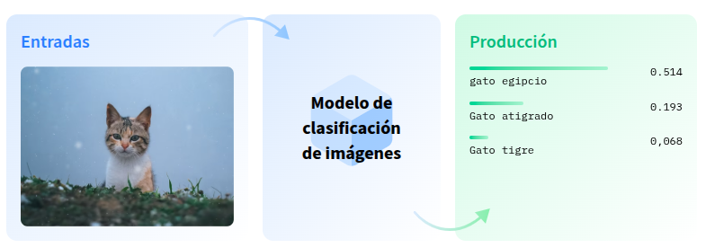

## Objetivos de la sesión
- Comprender la arquitectura Transformer
- Aprender a usar la librería Hugging Face Transformers
- Realizar tareas NLP con pipelines

# ¿Qué es un task?

Un "task" en Hugging Face describe el tipo de problema que un modelo puede resolver.
Permite buscar, probar y reutilizar modelos según la tarea (task) deseada.


*Tasks (tareas) en Hugging Face*

# Uso de Hugging Face para tareas de visión por computadora

Hugging Face también proporciona una amplia colección de modelos preentrenados para tareas de visión artificial. Con todos estos modelos alojados previamente entrenados, podemos crear aplicaciones interesantes que detectan objetos en imágenes, la edad de una persona y más. En este tema, aprenderemos a realizar las primeras cuatro tareas utilizando modelos de Hugging Face. 

## 1. Clasificación de Imágenes (Image Classification)

La clasificación de imágenes es una tarea de visión artificial que implica categorizar o etiquetar una imagen en una o varias clases o categorías predefinidas. El objetivo de la clasificación de imágenes es reconocer y asignar la etiqueta más adecuada a una imagen determinada en función de su contenido. 



### Ejemplos de aplicaciones:

- Diagnóstico médico (clasificar radiografías)
- Reconocimiento de objetos
- Clasificación de productos en e-commerce
- Moderación de contenido visual

### Modelos disponibles en Hugging Face

Hugging Face ofrece múltiples modelos preentrenados para clasificación de imágenes. Algunos destacados:

| Modelo | Arquitectura | Dataset de entrenamiento | Enlace |
|--------|--------------|---------------------------|--------|
| `google/vit-base-patch16-224` | Vision Transformer (ViT) | ImageNet | [🔗 Ver modelo](https://huggingface.co/google/vit-base-patch16-224) |
| `microsoft/resnet-50` | ResNet-50 | ImageNet | [🔗 Ver modelo](https://huggingface.co/microsoft/resnet-50) |
| `facebook/deit-base-patch16-224` | DeiT | ImageNet | [🔗 Ver modelo](https://huggingface.co/facebook/deit-base-patch16-224) |


### "Quick, Draw!" de Google


Este juego se ha creado con aprendizaje automático. Cuando dibujas algo, una red neuronal intenta adivinar qué estás dibujando. Evidentemente, no siempre funciona; pero cuanto más juegues, más aprenderá. Ya reconoce cientos de conceptos y esperamos poder añadir más en el futuro. Nuestro objetivo es mostrar un ejemplo de cómo se puede usar el aprendizaje automático de forma divertida. Mira el siguiente vídeo para saber cómo funciona y

**Características clave**

- **Juego con IA**: El juego es un experimento de aprendizaje automático. El jugador dibuja y la red neuronal intenta adivinar el dibujo en tiempo real.

- **Aprendizaje continuo**: La IA aprende de cada dibujo, mejorando su capacidad para adivinar correctamente en el futuro. Esto ayuda a Google a recopilar uno de los conjuntos de datos de garabatos más grandes del mundo para la investigación en aprendizaje automático.

- **Mecánica simple**: El juego es similar al Pictionary. Consiste en seis rondas, y en cada una se nos pide dibujar un objeto diferente en 20 segundos. Al final, podemos ver nuestros dibujos y los resultados.

- **Accesibilidad**: El juego es gratuito y se puede jugar directamente en el navegador web desde cualquier dispositivo (smartphone, tablet, ordenador, etc.). 

Podemos acceder al juego en el sitio web oficial: [Web oficial](https://quickdraw.withgoogle.com/). 

**Importancia de los datos - BigData**

Los datos recopilados en el juego "Quick, Draw!" son fundamentales en el ámbito del Big Data y el aprendizaje automático porque conforman el conjunto de datos de garabatos más grande del mundo, esencial para entrenar y mejorar los modelos de inteligencia artificial de Google. 
Su importancia radica en varios puntos clave:

- **Entrenamiento de IA**: Los millones de dibujos (actualmente más de 50 millones en 345 categorías) sirven como un vasto corpus de datos para entrenar redes neuronales, enseñándoles a reconocer e interpretar garabatos de formas muy diversas. La IA aprende a identificar patrones visuales, sin importar el estilo individual del dibujante.

- **Diversidad y variabilidad**: A diferencia de conjuntos de datos de imágenes tradicionales, los garabatos muestran una enorme variabilidad en cómo las personas de diferentes culturas y con distintas habilidades dibujan un mismo objeto. Esta diversidad es crucial para crear modelos de IA más robustos y menos sesgados que puedan funcionar globalmente.

- **Datos en tiempo real y secuenciales**: Los dibujos se capturan como series temporales de posiciones del lápiz (vectores con marca de tiempo), no solo como imágenes estáticas. Esto permite a los investigadores comprender no solo el resultado final, sino también el proceso de dibujo (qué trazo se hizo primero, en qué dirección), lo cual es valioso para desarrollar modelos de IA más avanzados, como el modelo Sketch-RNN.

- **Investigación abierta**: Google ha hecho público este conjunto de datos para que investigadores de todo el mundo puedan utilizarlo en sus propios proyectos y estudios de aprendizaje automático, fomentando la innovación en el campo.

- **Ejemplo de gamificación para la recolección de datos**: El juego es un excelente ejemplo de cómo la gamificación puede motivar a un gran número de usuarios a generar datos valiosos de forma divertida y a gran escala, un desafío común en el Big Data

[Datos de entrenamiento](https://quickdraw.withgoogle.com/data)


En esta página podemos ver, en el momento en el que se redactaban estos apuntes, 126.372 dibujos de pelotas de baloncesto hechas por personales reales...en Internet. Incluso, podemos ver los trazos que han realizado estas personas hasta que el modelo ha sido capaz de adivinar el dibujo. 
Destacar la importancia del Big Data, ya que, los datos de entrenamiento son muy importantes para cualquier modelo de aprendizaje. 

[Datos de entrenamiento para la pelota de baloncesto](https://quickdraw.withgoogle.com/data/basketball)


# Desarrollo de nuestro propio Pictionary con Gradio

Vamos a crear una aplicación web con Gradio que use el modelo creado en una sesión anterior: [​omarques/autotrain-dogs-and-cats-1527055142](https://huggingface.co/omarques/autotrain-dogs-and-cats-1527055142)

Ejemplo de aplicación Gradio con una imagen de entrada y un Label como componente de salida:


Etiquetado de la imagen de entrada:


### 2. Estimación de Profundidad (Depth Estimation)
- **Definición**: Predice la distancia de cada píxel respecto a la cámara usando solo una imagen.
- **Aplicaciones**: Robótica, realidad aumentada, vehículos autónomos, etc.
- **Modelos populares**: DPT, MiDaS

```python {hl_lines="5 7" linenums="1"} 
# Utiliza el pipeline:

from transformers import pipeline

depth = pipeline("depth-estimation", model="Intel/zoedepth-nyu-kitti")

result = depth("ruta_o_url_imagen")

```


