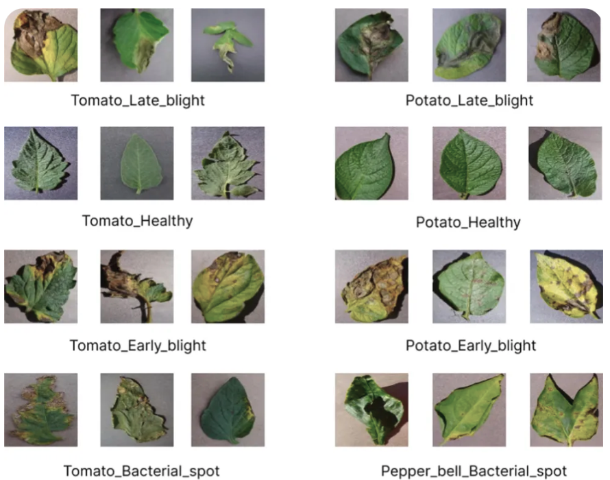

## Objetivos
- Diferenciar qué es un "task" en Machine Learning según Hugging Face.
- Aprender los conceptos y ejemplos de estimación de profundidad, clasificación y segmentación de imágenes.
- Probar ejemplos prácticos con pipelines de Hugging Face.

Hugging Face es el portal para todas las tareas de aprendizaje automático. Aquí encontraremos todo lo necesario para empezar con una tarea: demostraciones, casos de uso, modelos, conjuntos de datos y mucho más.

# ¿Qué es un task?
Un *task* en Hugging Face define el tipo de problema que un modelo está diseñado para resolver. Esta clasificación facilita la búsqueda, prueba y reutilización de modelos según la tarea específica que se desea abordar.
[**Tasks (tareas) en Hugging Face**](https://huggingface.co/tasks)


# Uso de Hugging Face para tareas de Visión por Computadora

Hugging Face también proporciona una amplia colección de modelos preentrenados para tareas de visión artificial. Con todos estos modelos alojados previamente entrenados, podemos crear aplicaciones interesantes que detectan objetos en imágenes, la edad de una persona y más. En este tema, aprenderemos a realizar las primeras cuatro tareas utilizando modelos de Hugging Face. 

## 1. Clasificación de Imágenes (Image Classification)

La clasificación de imágenes es una tarea de visión por computador que consiste en asignar una o varias etiquetas predefinidas a una imagen, según su contenido.

### Ejemplos de aplicaciones
- Diagnóstico médico: clasificación de radiografías para detectar enfermedades.
- Reconocimiento de objetos
- Clasificación de productos en e-commerce
- Moderación de contenido visual

### Modelos disponibles en Hugging Face

Hugging Face ofrece múltiples modelos preentrenados para clasificación de imágenes. Estos modelos han sido entrenados con grandes conjuntos de datos, como ImageNet, lo que les permite reconocer una amplia variedad de objetos y escenas. Algunos destacados:

| Modelo | Arquitectura | Dataset de entrenamiento | Enlace |
|--------|--------------|---------------------------|--------|
| `google/vit-base-patch16-224` | Vision Transformer (ViT) | ImageNet | [🔗 Ver modelo](https://huggingface.co/google/vit-base-patch16-224) |
| `microsoft/resnet-50` | ResNet-50 | ImageNet | [🔗 Ver modelo](https://huggingface.co/microsoft/resnet-50) |
| `facebook/deit-base-patch16-224` | DeiT | ImageNet | [🔗 Ver modelo](https://huggingface.co/facebook/deit-base-patch16-224) |

### "Quick, Draw!" de Google


[Quick, Draw!](https://quickdraw.withgoogle.com/) es un juego basado en aprendizaje automático en el que una red neuronal intenta adivinar el objeto que el usuario está dibujando. Evidentemente, no siempre funciona; pero cuanto más tiempo pasemos jugando, más aprenderá. Destacar que ya reconoce cientos de conceptos y esperan poder añadir más en el futuro. El gran objetivo de esta aplicación, es mostrar un ejemplo de cómo se puede usar el aprendizaje automático de forma divertida. 

**Características clave**

- **Juego con IA**: El juego es un experimento de aprendizaje automático. El jugador dibuja y la red neuronal intenta adivinar el dibujo en tiempo real.

- **Aprendizaje continuo**: La IA aprende de cada dibujo, mejorando su capacidad para adivinar correctamente en el futuro. Esto ayuda a Google a recopilar uno de los conjuntos de datos de garabatos más grandes del mundo para la investigación en aprendizaje automático.

- **Mecánica simple**: El juego es similar al Pictionary. Consiste en seis rondas, y en cada una se nos pide dibujar un objeto diferente en 20 segundos. Al final, podemos ver nuestros dibujos y los resultados.

Podemos acceder al juego en el sitio web oficial: [Web oficial](https://quickdraw.withgoogle.com/). 

**Importancia de los datos - BigData**

Los datos recopilados en Quick, Draw! son fundamentales para el Big Data y el aprendizaje automático, ya que constituyen el conjunto de datos de garabatos más grande del mundo, esencial para entrenar y mejorar modelos de IA. 
Su importancia radica en varios puntos clave:

- **Entrenamiento de IA**: Los millones de dibujos (actualmente más de 50 millones en 345 categorías) sirven como un vasto corpus de datos para entrenar redes neuronales, enseñándoles a reconocer e interpretar garabatos de formas muy diversas. La IA aprende a identificar patrones visuales, sin importar el estilo individual del dibujante.

- **Diversidad y variabilidad**: A diferencia de conjuntos de datos de imágenes tradicionales, los garabatos muestran una enorme variabilidad en cómo las personas de diferentes culturas y con distintas habilidades dibujan un mismo objeto. Esta diversidad es crucial para crear modelos de IA más robustos y menos sesgados que puedan funcionar globalmente.

- **Datos en tiempo real y secuenciales**: Los dibujos se capturan como series temporales de posiciones del lápiz (vectores con marca de tiempo), no solo como imágenes estáticas. Esto permite a los investigadores comprender no solo el resultado final, sino también el proceso de dibujo (qué trazo se hizo primero, en qué dirección), lo cual es valioso para desarrollar modelos de IA más avanzados, como el modelo *Sketch-RNN* (Recurrent Neural Network para Bocetos es un modelo generativo de aprendizaje automático desarrollado por David Ha y Douglas Eck en Google Brain, que es capaz de crear, completar y manipular bocetos vectoriales de objetos comunes)

- **Investigación abierta**: Google ha hecho público este conjunto de datos para que investigadores de todo el mundo puedan utilizarlo en sus propios proyectos y estudios de aprendizaje automático, fomentando la innovación en el campo.

- **Ejemplo de gamificación para la recolección de datos**: El juego es un excelente ejemplo de cómo la gamificación puede motivar a un gran número de usuarios a generar datos valiosos de forma divertida y a gran escala, un desafío común en el Big Data.

[Datos de entrenamiento](https://quickdraw.withgoogle.com/data)


En esta página podemos ver, en el momento en el que se redactaban estos apuntes, 126.372 dibujos de pelotas de baloncesto hechas por personales reales...en Internet. Incluso, podemos ver los trazos que han realizado estas personas hasta que el modelo ha sido capaz de adivinar el dibujo. 
Destacar la importancia del Big Data, ya que, los datos de entrenamiento son muy importantes para cualquier modelo de aprendizaje. 

[Datos de entrenamiento para la pelota de baloncesto](https://quickdraw.withgoogle.com/data/basketball)


### Desarrollo de nuestro propio Pictionary con Gradio

Vamos a desarrollar nuestra propia aplicación Pictionary utilizando Gradio, basada en el siguiente vídeo: [https://www.youtube.com/watch?v=LS9Y2wDVI0k](https://www.youtube.com/watch?v=LS9Y2wDVI0k)

Todos los ficheros se encuentran en el siguiente espacio de Hugging Face: [https://huggingface.co/spaces/nateraw/quickdraw](https://huggingface.co/spaces/nateraw/quickdraw)

Lo primero que debemos es, descargar los ficheros siguientes: ```class_names.txt```, ```pytorch_model.bin``` y ```app.py```

**Analizamos el código elaborado por el usuario**:

```python {linenums="1"} 
from pathlib import Path  
import torch             

import gradio as gr       
from torch import nn      

# Lee las etiquetas/clases del archivo de texto, una por línea. 
# Cada línea es una categoría que el modelo puede predecir.
LABELS = Path('class_names.txt').read_text().splitlines()

# Definimos la arquitectura de la red neuronal convolucional (CNN) ya entrenada:
model = nn.Sequential(
    # Primera capa: 1 canal de entrada, 32 filtros, tamaño de filtro 3x3
    nn.Conv2d(1, 32, 3, padding='same'),  
    # Función de activación no lineal ReLU (acelera y facilita el aprendizaje)
    nn.ReLU(),                            
    # Max Pooling: reduce la resolución espacial de las características
    #  (comprime la imagen a la vez que mantiene zonas más “activas”)
    nn.MaxPool2d(2),                      
    nn.Conv2d(32, 64, 3, padding='same'), # Segunda capa: 32→64 filtros
    nn.ReLU(),
    nn.MaxPool2d(2),
    nn.Conv2d(64, 128, 3, padding='same'),# Tercera capa: 64→128 filtros
    nn.ReLU(),
    nn.MaxPool2d(2),
    # Aplana los datos resultantes para prepararlos para las capas densas 
    # (total elementos = 128 canales * 3 * 3)
    nn.Flatten(),                         
    # Capa totalmente conectada: de 1152 (productos anteriores) a 256 neuronas
    nn.Linear(1152, 256),                 
    nn.ReLU(),
    # Capa de salida: 1 neurona por clase del archivo de etiquetas
    nn.Linear(256, len(LABELS)),          
)
# Carga los pesos entrenados previamente desde 
# el archivo binario (estado del modelo)
state_dict = torch.load('pytorch_model.bin', map_location='cpu')
model.load_state_dict(state_dict, strict=False)
# Coloca el modelo en modo "solo inferencia" 
# (no entrenamiento): no calcula gradientes ni actualiza pesos
model.eval() 

# Función de predicción principal: toma una imagen (array) 
# y devuelve las top-5 categorías con su probabilidad
def predict(im):
    # Convierte el array de la imagen en un tensor, escala los valores a rango [0,1] 
    # y añade dimensiones de batch y canal
    x = torch.tensor(im, dtype=torch.float32).unsqueeze(0).unsqueeze(0) / 255.

    # Desactiva el cálculo de gradientes (más rápido, no entrena)
    with torch.no_grad():            
        # Hacemos pasar la imagen por el modelo (forward pass)
        out = model(x)               

    # Calcula las probabilidades (softmax)
    probabilities = torch.nn.functional.softmax(out[0], dim=0)  

    # Obtiene las 5 clases más probables
    values, indices = torch.topk(probabilities, 5)              

    # Devuelve un diccionario {clase: probabilidad} para las 5 mejores
    return {LABELS[i]: v.item() for i, v in zip(indices, values)}

# Creamos la interfaz web con Gradio:
#   - predict: función a ejecutar al recibir la entrada.
#   - inputs: 'sketchpad', una zona para que el usuario dibuje a mano alzada.
#   - outputs: 'label', salida tipo clasificación de etiquetas.
#   - live=True: muestra predicciones en tiempo real mientras dibujas.
interface = gr.Interface(predict, inputs='sketchpad', outputs='label', live=True)

interface.launch(debug=True)

```


### ¿Qué es una red neuronal convolucional (CNN)?
Una **red neuronal convolucional** (CNN, por sus siglas en inglés, *Convolutional Neural Network*) es un tipo de red neuronal artificial especialmente diseñada para procesar datos que tienen una estructura en forma de cuadrícula, como imágenes, audio o vídeo.

### Características principales
- **Inspiración biológica:**: Las CNNs se inspiran en la corteza visual de los mamíferos. Primero detectan reglas simples (líneas, bordes) y después patrones más complejos (formas, objetos).

- **Arquitectura en capas:**  
  Una CNN está compuesta por diferentes capas conectadas:
    - **Capas convolucionales:** Aplican filtros o “kernels” para extraer patrones y características locales (bordes, texturas, esquinas).
    - **Capas de activación (ReLU):** Introducen no linealidad, permitiendo que la red aprenda funciones más complejas.
    - **Capas de agrupamiento (pooling):** Reducen la resolución espacial y la cantidad de computación, logrando robustez ante desplazamientos.
    - **Capas totalmente conectadas:** Integran toda la información para tomar decisiones y realizar la predicción final.

- **Aprendizaje jerárquico:**  
  Las CNNs aprenden jerarquías de características: Las primeras capas detectan elementos simples, las siguientes combinan estos elementos y las últimas reconocen patrones complejos y abstractos.

- **Campos receptivos y parámetros compartidos:** Los filtros se aplican en toda la imagen usando los mismos parámetros, lo que permite detectar el mismo patrón en distintas posiciones. Así, el número de parámetros y el coste de memoria disminuyen en comparación con una red completamente conectada.
### Aplicaciones típicas
- **Reconocimiento y clasificación de imágenes:** Detección de objetos, diagnóstico médico, moderación de contenido, etc.
- **Visión por computador:** Conducción autónoma, videovigilancia, análisis de tráfico.
- **Procesamiento de vídeo:** Reconocimiento de acciones, seguimiento de objetos en secuencias de imágenes, análisis deportivo.

### Ejemplo didáctico sencillo

Cuando pasas una imagen por una CNN:

- Las primeras capas detectan bordes y formas sencillas.
- Las siguientes detectan partes más grandes (ruedas, patas, ojos).
- Al final, la red puede identificar el objeto completo (ej. “bicicleta”, “gato”, “persona”) en la imagen.

Como hemos comprobado en el ejemplo, el código desarrollado por el usuario no funciona actualmente, por lo que debemos realizar algunas mejoras para que el código original funcione. A continuación podemos visualizar la solución final:

```python {linenums="1"}
from pathlib import Path
from PIL import Image
from torch import nn

import torch
import gradio as gr
import numpy as np

# Leemos las etiquetas de clases (categorías) desde un fichero de texto
LABELS = Path('class_names.txt').read_text().splitlines()

# Definimos la arquitectura de la red neuronal convolucional (CNN) ya entrenada:
model = nn.Sequential(
    # Primera capa: 1 canal de entrada, 32 filtros, tamaño de filtro 3x3
    nn.Conv2d(1, 32, 3, padding='same'),  
    # Función de activación no lineal ReLU (acelera y facilita el aprendizaje)
    nn.ReLU(),                            
    # Max Pooling: reduce la resolución espacial de las características 
    # (comprime la imagen a la vez que mantiene zonas más “activas”)
    nn.MaxPool2d(2),                      
    nn.Conv2d(32, 64, 3, padding='same'), # Segunda capa: 32→64 filtros
    nn.ReLU(),
    nn.MaxPool2d(2),
    nn.Conv2d(64, 128, 3, padding='same'),# Tercera capa: 64→128 filtros
    nn.ReLU(),
    nn.MaxPool2d(2),
    # Aplana los datos resultantes para prepararlos para las capas
    # densas (total elementos = 128 canales * 3 * 3)
    nn.Flatten(),                         
    # Capa totalmente conectada: de 1152 (productos anteriores) 
    # a 256 neuronas
    nn.Linear(1152, 256),                 
    nn.ReLU(),
    # Capa de salida: 1 neurona por clase del archivo de etiquetas
    nn.Linear(256, len(LABELS)),          
)
# Cargamos los pesos previamente entrenados del modelo
state_dict = torch.load('pytorch_model.bin', map_location='cpu')
model.load_state_dict(state_dict, strict=False)
# Ponemos el modelo en modo inferencia (no entrenamiento)
model.eval()  

# Función principal de predicción, procesará el dibujo 
# de Gradio y calculará su clase
def predict(img):   
    # Si no hay dibujo o la clave 'composite' no existe o está vacía, avisamos:
    if img is None or "composite" not in img or img["composite"] is None:
        return {"Por favor, dibuja algo": 1.0}
    # Extraemos la imagen resultado del canvas, canal RGBA
    # Array con forma (ej. [800, 800, 4]), tipo uint8
    arr = img["composite"]        
    # Convertimos de RGBA a escala de grises (Quick Draw es gris)
    arr_gray = arr[..., :3].mean(axis=2)
    # Convertimos a uint8 por si PIL lo necesita
    arr_gray_uint8 = arr_gray.astype("uint8")
    # Redimensionamos a 28x28 píxeles (tamaño de entrada del modelo)
    arr_img = Image.fromarray(arr_gray_uint8)
    arr_resized = np.array(arr_img.resize((28, 28), resample=Image.BILINEAR))
    # Escalamos a rango [0,1]
    arr_normalized = arr_resized / 255.0
    # Añadimos dimensiones de batch y canal: (1, 1, 28, 28)
    x = torch.tensor(arr_normalized, dtype=torch.float32).unsqueeze(0).unsqueeze(0)
    # Ejecutamos inferencia sin calcular gradientes (más eficiente)
    with torch.no_grad():
        out = model(x)
    # Calculamos probabilidades con softmax
    probabilities = torch.nn.functional.softmax(out[0], dim=0)
    # Obtenemos las 5 clases más probables (top-5)
    values, indices = torch.topk(probabilities, 5)
    # Devolvemos un diccionario: categoría : probabilidad (~confianza)
    return {LABELS[i]: v.item() for i, v in zip(indices, values)}

# Creamos la interfaz Gradio:
# - El input es un sketchpad (zona para dibujar)
# - El output son etiquetas: las categorías predecidas
# - live=True: actualiza la predicción en tiempo real al dibujar
demo = gr.Interface(
    predict,     
    inputs='sketchpad',
    outputs='label', 
    live=True)

demo.launch(share=True)
```


---
La función *softmax* de *torch* (*PyTorch*) es una operación matemática que transforma un vector de valores reales —normalmente llamados "logits"— en una distribución de probabilidades sobre diferentes clases, donde todos los elementos resultantes están entre 0 y 1 y la suma es exactamente 1. Por ejemplo, si tu modelo clasifica imágenes en tres clases, la salida softmax será un vector con tres valores que representan la probabilidad atribuida a cada clase.​

En PyTorch, podemos usar esta función tanto como capa de activación en la salida de nuestro modelo, como directamente llamando torch.nn.functional.softmax() sobre un tensor de logits. Es común utilizar softmax en la inferencia para obtener probabilidades interpretables, mientras que durante el entrenamiento suele usarse CrossEntropyLoss, que incorpora la softmax de forma interna y más eficiente.​

Aplicaciones comunes:

- Clasificación multiclase: transforma las salidas del modelo en probabilidades para cada categoría.​
- Visualización de la confianza del modelo en cada posible resultado.
En resumen, softmax convierte los resultados numéricos en probabilidades útiles para tomar decisiones y analizar resultados en *Deep learning*.

---

## 📝 **Actividad 1. Usar un Space de Hugging Face**  

Basándote en lo aprendido a partir de los casos de uso de [Hola Spaces](https://aitor-medrano.github.io/iabd/hf/hf.html#hola-spaces) y [Hola Spaces 2.0](https://aitor-medrano.github.io/iabd/hf/hf.html#hola-spaces-20) trabajadas en una sesión anterior, mediante *Gradio* en *Hugging Face* crea un nuevo espacio público en tu cuenta que permita probar la aplicación del *pictionary* desarrollada de forma local en un Space de Hugging Face. 

Entrega la url del espacio y algunas capturas de pantalla usando la aplicación. 

## 2. Detección de objetos 


La detección de objetos predice la distancia de cada píxel respecto a la cámara usando solo una imagen. Es una técnica fundamental en visión computacional que permite identificar y localizar instancias de objetos definidos dentro de imágenes. Es ampliamente utilizada en aplicaciones como **conducción autónoma**, **seguimiento de objetos en deportes**, **búsqueda de imágenes** y **conteo de objetos en diferentes escenarios**. 

Hugging Face alberga varios modelos que han sido entrenados previamente para detectar objetos en imágenes. Podemos ver una lista de modelos en [https://huggingface.co/models?pipeline_tag=object-detection&sort=trending](https://huggingface.co/models?pipeline_tag=object-detection&sort=trending) 

En la figura siguiente podemos visualizar un listado de la categoría *Object Detection*:


Ejemplo de uso del modelo [**facebook/detr-resnet-50**](https://huggingface.co/facebook/detr-resnet-50) para la detección de objetos:


Podemos probar el modelo directamente utilizando la API de inferencia alojada en Hugging Face. Para ello, usaremos una imagen de una oficina con algunas mujeres:


Fuente: [https://en.wikipedia.org/wiki/Office#/media/File:Good_Smile_Company_offices_ladies.jpg](https://en.wikipedia.org/wiki/Office#/media/File:Good_Smile_Company_offices_ladies.jpg) 

Al arrastrar y soltar la imagen en la sección "Inference API" alojada en la página del modelo en Hugging Face, veremos la lista de objetos detectados, así como sus probabilidades correspondientes:


Al pasar el ratón por encima del nombre de un objeto detectado, la imagen resalta el cuadro delimitador del objeto seleccionado.

### Algunos modelos disponibles en Hugging Face

Hugging Face ofrece modelos preentrenados que permiten realizar detección de objetos sin necesidad de entrenamiento adicional.

| Modelo | Arquitectura | Dataset | Enlace |
|--------|--------------|---------|--------|
| `facebook/detr-resnet-50` | DETR (DEtection TRansformer) | COCO | 🔗 [Ver modelo](https://huggingface.co/facebook/detr-resnet-50) |
| `hustvl/yolos-small` | YOLOS (Vision Transformer) | COCO | 🔗 [Ver modelo](https://huggingface.co/hustvl/yolos-small) |

### Principales Aplicaciones

- **Conducción autónoma:** Los coches sin conductor usan la detección de objetos para reconocer peatones, bicicletas, semáforos y señales de tráfico, ayudando a la toma de decisiones en tiempo real.
- **Seguimiento en deportes:** En partidos de fútbol o tenis se rastrea el balón o los jugadores para mejorar el arbitraje y el análisis estadístico.
- **Búsqueda de imágenes:** Los teléfonos inteligentes permiten buscar lugares u objetos directamente en internet mediante la detección de entidades en fotos.
- **Conteo de objetos:** La detección ayuda a contar existencias en almacenes, tiendas, o personas en eventos.

### Métricas de Evaluación

- **Precisión media promedio (AP):** Área bajo la curva de precisión versus recall para cada clase.
- **mAP (mean Average Precision):** Promedio de AP en todas las clases.
- **APα:** Precisión promedio según el umbral de IoU (por ejemplo, AP50 muestra AP cuando el IoU es >0,5).

### Ejemplo de uso con Gradio

Vamos a crear una aplicación web con Gradio que use un objeto *pipeline* del modelo ```facebook/detr-resnet-50```.

Así es como se carga: 
```python
from transformers import pipeline

detection = pipeline("object-detection", model="facebook/detr-resnet-50")
```
Una vez que hayamos creado el objeto tipo pipeline (detección en este caso), podemos pasar directamente la imagen (en formato PIL) al pipeline y obtener el resultado: 

```python
results = detection(image)
results
```
Debemos tener en cuenta que el objeto de tipo pipeline (detección) también puede incluir una URL de una imagen, no solo un objeto de imagen tipo PIL. Es decir, también podemos llamar al objeto pipeline de la siguiente manera: 

```python
results = detection('http://bit.ly/46xv3sL')
```
```python
# Si no funcionara, prueba a descargar el fichero y ejecutarlo de forma local:
results = detection('Good_Smile_Company_offices_ladies.jpg')
```
Debemos instalar la librería ```timm``` (PyTorch Image Models) para Python. Es una extensa colección de modelos de visión por computadora de última generación (SOTA, por sus siglas en inglés). Está diseñada para ser utilizada con el framework PyTorch y es muy apreciada en la comunidad de aprendizaje profundo por su flexibilidad y la gran cantidad de modelos preentrenados que ofrece.
```bash
pip install timm
```
El resultado impreso se vería así:
```json
[{'score': 0.9179903864860535,
  'label': 'person',
  'box': {'xmin': 549, 'ymin': 145, 'xmax': 564, 'ymax': 165}},
 {'score': 0.9960624575614929,
  'label': 'tv',
  'box': {'xmin': 317, 'ymin': 212, 'xmax': 416, 'ymax': 299}},
 {'score': 0.9425505995750427,
  'label': 'chair',
  'box': {'xmin': 508, 'ymin': 306, 'xmax': 661, 'ymax': 429}},
 {'score': 0.9753392338752747,
  'label': 'person',
  'box': {'xmin': 673, 'ymin': 135, 'xmax': 705, 'ymax': 174}},
 {'score': 0.962176501750946,
  'label': 'person',
  'box': {'xmin': 703, 'ymin': 115, 'xmax': 722, 'ymax': 140}},
 {'score': 0.9881888628005981,
  'label': 'person',
  'box': {'xmin': 454, 'ymin': 142, 'xmax': 497, 'ymax': 202}},
 {'score': 0.9871691465377808,
  'label': 'keyboard',
  'box': {'xmin': 344, 'ymin': 276, 'xmax': 445, 'ymax': 346}},
 {'score': 0.9371852874755859,
  'label': 'tv',
  'box': {'xmin': 309, 'ymin': 194, 'xmax': 374, 'ymax': 237}},
 {'score': 0.9975801706314087,
  'label': 'person',
  'box': {'xmin': 395, 'ymin': 152, 'xmax': 446, 'ymax': 216}},
 {'score': 0.9986708164215088,
  'label': 'person',
  'box': {'xmin': 237, 'ymin': 174, 'xmax': 308, 'ymax': 264}},
 {'score': 0.9173707365989685,
  'label': 'person',
  'box': {'xmin': 720, 'ymin': 112, 'xmax': 737, 'ymax': 131}},
 {'score': 0.9895991086959839,
  'label': 'potted plant',
  'box': {'xmin': 124, 'ymin': 211, 'xmax': 230, 'ymax': 330}},
 {'score': 0.9996592998504639,
  'label': 'person',
  'box': {'xmin': 369, 'ymin': 226, 'xmax': 535, 'ymax': 427}},
 {'score': 0.9821581840515137,
  'label': 'tv',
  'box': {'xmin': 491, 'ymin': 181, 'xmax': 530, 'ymax': 223}},
 {'score': 0.9970135688781738,
  'label': 'person',
  'box': {'xmin': 516, 'ymin': 177, 'xmax': 628, 'ymax': 318}}]
```
El resultado es una lista de diccionarios para cada objeto detectado. Para dibujar la etiqueta y el cuadro delimitador de cada objeto, utilizaremos el siguiente fragmento de código: 

```python {linenums="1"}
import random
from PIL import Image, ImageDraw
import requests
import torch

draw = ImageDraw.Draw(image)

for object in results:
    box = [i for i in object['box'].values()]
    print(
        f"Detected {object['label']} with confidence "
        f"{(object['score'] * 100):.2f}% at {box}"
    )

    r = random.randint(0, 255)
    g = random.randint(0, 255)
    b = random.randint(0, 255)
    color = (r, g, b)

    draw.rectangle(box,
                   outline=color,
                   width=2)

    draw.text((box[0], box[1]-10),
              object['label'],
              fill='white')

display(image)
```
La imagen sería idéntica a la que se muestra anteriormente pero con los cuadrados correspondientes. Con el objeto pipeline, también podemos obtener una lista de etiquetas directamente mediante el atributo ```model.config.id2label```: 
```python
detection.model.config.id2label
```

### Actividad guiada

Desarrollar con Gradio un template similar es este: 

Resultado final:


Define:

- Una función llamada *predict*
- Interface Gradio que envíe una imagen y muestre la imagen con los objetos detectados

Código final en Gradio:
```python {linenums="1"}
import gradio as gr
from PIL import Image, ImageDraw
from transformers import pipeline
import random 

def predict(image):    

    detection = pipeline("object-detection", model="facebook/detr-resnet-50")

    results = detection(image)       

    draw = ImageDraw.Draw(image) 
    
    for object in results: 
        box = [i for i in object['box'].values()] 
        print( 
            f"Detected {object['label']} with confidence "   
            f"{(object['score'] * 100):.2f}% at {box}"   
        ) 
        
        r = random.randint(0, 255) 
        g = random.randint(0, 255) 
        b = random.randint(0, 255) 
        color = (r, g, b) 
        
        #Dibuja un cuadro delimitador alrededor del objeto.
        draw.rectangle(box,  
                    outline=color,  
                    width=2)  
        #Muestra la etiqueta del objeto
        draw.text((box[0], box[1]-10),  
                object['label'],  
                fill='white')  

    return image


demo = gr.Interface(
    predict, 
    inputs=gr.Image(type="pil"), 
    outputs="image")

demo.launch()
```
## 📝 **Actividad 2: Comparativa práctica de Detección de Objetos con Hugging Face y Ultralytics YOLO11** 

## Contexto

Hemos trabajado en clase con modelos de detección de objetos, usando ejemplos como `facebook/detr-resnet-50` [](https://huggingface.co/facebook/detr-resnet-50) en Hugging Face ([ver ejemplo y recursos de clase](https://jmperez-profesor.github.io/iabd/hf/Tasks_vc/#2-deteccion-de-objetos)).  
En esta actividad, irás un paso más allá probando la herramienta Ultralytics YOLO11, consultando su [documentación oficial de integración con Gradio](https://docs.ultralytics.com/es/integrations/gradio/).

## Objetivos
- Investigar y comprender el funcionamiento de la familia YOLO (en especial YOLO11).
- Probar distintos códigos y ejemplos reales usando YOLO11 y Gradio.
- Comparar los resultados con los de `facebook/detr-resnet-50` en velocidad, facilidad de uso y precisión.
- Reflexionar sobre ventajas e inconvenientes de cada enfoque en distintos escenarios reales.

### 1. Lectura e investigación inicial
- Lee la documentación de [Ultralytics YOLO11](https://docs.ultralytics.com/es/#what-are-the-licensing-options-available-for-ultralytics-yolo) y familiarízate con su API y flujo de trabajo.
- Consulta y ejecuta el ejemplo de integración con Gradio: [docs oficiales](https://docs.ultralytics.com/es/integrations/gradio/).

### 2. Implementación y pruebas
- Ejecuta la demo básica de YOLO11+Gradio incluida en la documentación.
- Realiza anotaciones sobre el input, formato de resultados y velocidad tras varias ejecuciones con imágenes reales o ejemplos propios.

### 3. Comparativa objetiva con Hugging Face
- Utiliza el modelo `facebook/detr-resnet-50` desde Hugging Face (ya visto en clase) para detectar objetos en al menos dos imágenes iguales a las usadas en YOLO11.
- Rellena la tabla comparativa:

| Imagen            | Modelo                 | Objetos detectados | Tiempo de inferencia | Falsos positivos/negativos | Facilidad de integración | Observaciones             |
|-------------------|------------------------|--------------------|----------------------|----------------------------|-------------------------|---------------------------|
| (insertar nombre) | YOLO11                 |                    |                      |                            |                         |                           |
| (insertar nombre) | detr-resnet-50 (HF)    |                    |                      |                            |                         |                           |

- Comenta los resultados en términos de:
    - Exactitud y número/calidad de predicciones.
    - Consumo de recursos y tiempo de ejecución (compara si es posible en CPU y GPU).
    - Facilidad de uso/grado de documentación o número de líneas de código para uso en Gradio.

## Entrega

- Un archivo `.py` con el código empleado y comentarios.
- Las imágenes o capturas de pantalla de las pruebas realizadas.
- Rellena y agrega la tabla comparativa.
---
## 3. Segmentación de imágenes (Image segmentation)

La segmentación de imágenes es una técnica de visión por computador que divide una imagen en segmentos o regiones, cada una correspondiente a un objeto de interés. Con la segmentación de imágenes, podemos analizar una imagen y extraer información valiosa de ella. 


Algunos de sus usos son: 

- **Imágenes médicas**: se utilizan para identificar y segmentar tumores en resonancias magnéticas o tomografías computarizadas 
- **Detección y reconocimiento de objetos**: al igual que la detección de objetos que hemos visto anteriormente, también podemos utilizar la segmentación de imágenes para identificar y localizar objetos en una imagen 
- **Procesamiento de documentos**: se utiliza para segmentar regiones de texto en documentos escaneados 
- **Biometría**: se utiliza para identificar y localizar rostros en imágenes o fotogramas de vídeo 

Hugging Face incluye varios modelos de segmentación de imágenes que podemos usar. Uno de ellos es el modelo SegFormer ["SegFormer model fine-tuned on ADE20k"](https://huggingface.co/nvidia/segformer-b0-finetuned-ade-512-512), optimizado con ADE20k.

La siguiente imagen muestra el modelo SegFormer *fine-tuned* (optimizado) por el modelo ADE20k en la web de Hugging Face:


Para probar el modelo de segmentación, usaremos una imagen del Taj Mahal. La arrastraremos y la soltaremos en la sección de "**Hosted inference API**" alojada en la página de Hugging Face:

Imagen del **Taj Mahal** 

Fuente: [https://mng.bz/5vzD](https://mng.bz/5vzD)

Resultado de la segmentación de imágenes utilizando una imagen del Taj Mahal:


Como podemos ver en el resultado, el modelo puede detectar diferentes objetos en la imagen (edificios, cielos, árboles, etcétera) y resaltar los diversos segmentos en dicha imagen. De hecho, podemos pasar el ratón sobre las diversas etiquetas segmentadas y la imagen resaltará dicha etiqueta seleccionada. 
### Uso del modelo con pipeline
Como es habitual, usaremos el modelo mediante programación. Primero, cargamos el modelo y luego verificamos cuántos objetos puede detectar el modelo. La forma más fácil de usar el modelo es usar un pipeline  de la librería ```transformers```: 
```python {linenums="1"}
from transformers import pipeline 
  
segmentation = pipeline("image-segmentation",  
               model="nvidia/segformer-b0-finetuned-ade-512-512") 
  
print(segmentation.model.config.id2label)
```
Estos son los primeros y últimos cinco objetos que puede detectar (el modelo puede detectar un total de 150 objetos): 
```json
{0: 'wall', 
 1: 'building', 
 2: 'sky', 
 3: 'floor', 
 4: 'tree', 
 ... 
 145: 'shower', 
 146: 'radiator', 
 147: 'glass', 
 148: 'clock', 
 149: 'flag'} 
```
Para este ejemplo, usaremos una imagen donde vemos a un hombre y a un avión que vuela por encima, para así descubrir los distintos segmentos de dicha imagen: 

 

Fuente: [https://unsplash.com/photos/EC_GhFRGTAY](https://unsplash.com/photos/EC_GhFRGTAY)

Para detectar los distintos segmentos de la imagen, pasamos la dirección URL de una imagen al objeto *pipeline*. Antes, de nada, tendremos que instalar mediante PIP la librería PIL para el procesamiento de imágenes:
```bash
pip install Pillow
``` 
Una vez instalada, probamos el siguiente código:
```python {hl_lines="5 6" linenums="1"} 
from transformers import pipeline 
from PIL import Image
import requests

segmentation = pipeline("image-segmentation",  
               model="nvidia/segformer-b0-finetuned-ade-512-512") 
  
url = 'https://bit.ly/46iDeJQ'
results = segmentation(url)
print(results)
```
La salida de la variable *results* es una lista de diccionarios que contiene detalles de cada uno de los segmentos detectados en la imagen: 
```json
[{'score': None,
  'label': 'wall',
  'mask': <PIL.Image.Image image mode=L size=1587x2381>},
 {'score': None,
  'label': 'building',
  'mask': <PIL.Image.Image image mode=L size=1587x2381>},
 {'score': None,
  'label': 'sky',
  'mask': <PIL.Image.Image image mode=L size=1587x2381>},
 {'score': None,
  'label': 'person',
  'mask': <PIL.Image.Image image mode=L size=1587x2381>},
 {'score': None,
  'label': 'airplane',
  'mask': <PIL.Image.Image image mode=L size=1587x2381>}]
```
En particular, el elemento *mask* contiene la máscara del segmento detectado. Para ver cada una de las máscaras detectadas, recorremos la variable *results*: 

```python {hl_lines="2 3" linenums="1"} 
for result in results:
    print(result['label'])
    result['mask'].show()
``` 
Por pantalla visualizamos las etiquetas encontradas:
```bash
wall
building
sky
person
airplane
```
La figura siguiente muestra las máscaras detectadas para *person* (persona) y *airplane* (avión):


La parte blanca de la máscara representa la parte de la imagen que contiene el segmento de interés. Podemos aplicar la máscara sobre la imagen original mediante el siguiente fragmento de código: 

```python {hl_lines="8 10" linenums="1"} 
image = Image.open(requests.get(url, stream=True).raw) 
  
for result in results: 
    base_image = image.copy() 
    mask_image = result['mask'] 
     
    # Aplica la máscara sobre la imagen original
    base_image.paste(mask_image, mask=mask_image) 
    #Imprime la etiqueta del segmento
    print(result['label']) 
    result['mask'].show()
``` 
La figura siguiente muestra las máscaras de *person* (persona) y *airplane* (avión) aplicadas sobre la imagen original:


Cuando aplicamos la máscara sobre la imagen, observaremos que el segmento de interés está en blanco. Sería más natural invertir esto, es decir, el segmento de interés debería mostrarse mientras que el resto debería estar en blanco. Para hacerlo, podemos invertir la máscara usando la función ```invert()``` de la clase ```ImageOps``` en el paquete ```PIL```. Los siguientes cambios invierten la máscara y, a continuación, la aplican sobre la imagen original: 

```python {hl_lines="8 10" linenums="1"} 
from PIL import ImageOps 
  
for result in results: 
    base_image = image.copy() 
    mask_image = result['mask'] 
     
    mask_image = ImageOps.invert(mask_image)  #Invierte la máscara 
    base_image.paste(mask_image, mask=mask_image)  #Aplica la máscara sobre la imagen original 
    print(result['label'])  #Imprime la etiqueta del segmento
    display(base_image) 
```
La figura siguiente muestra las máscaras invertidas para *person* (persona) y *airplane* (avión)aplicadas en la imagen original. 


## 📝 **Actividad 3: Gradio para segmentación de imágenes** 

Crea un prototipo mediante Gradio haciendo uso de la clase Interface que te permita probar el modelo de segmentación basándote en el siguiente prototipo: 


Pasamos una foto y en el campo Label especificamos el objeto a buscar, por ejemplo, person: 


Resultados: 
Detección de *person*


Detección de *airplane*

Pasos:  

- Definir la interfaz de Gradio con los componentes de entrada y de salida similares al prototipo de la imagen 
- Crea una función “segmentation” que reciba los parámetros de entrada correspondientes. Dentro de dicha función 
- Cuando el modelo devuelva el resultado, iterará a través del resultado y buscará la etiqueta especificada por el usuario (en el parámetro label). 
- A continuación, la función invierte la máscara correspondiente, la aplica a la imagen y la devuelve automáticamente. 
> CONSEJO: Dentro de la función deberías de imprimir los labels que te devuelve el modelo para saber que etiquetas ha detectado el modelo   

Realiza algunas pruebas con imágenes diferentes y adjunta en este documento los resultados. 

Entrega el fichero py y las imágenes que hayas utilizado. 

## 4. Modelo de clasificación de imágenes sin entrenamiento previo (Zero-shot Image Classification)

La clasificación de imágenes sin entrenamiento previo (Zero-shot) es una tarea de visión artificial que consiste en clasificar imágenes de una o de varias clases, sin ningún entrenamiento previo ni conocimiento de dichas clases.  


--- 
### Pero, ¿qué es eso del aprendizaje zero-shot (Zero-Shot learning)?

El **aprendizaje zero-shot (ZSL)** es un enfoque de machine learning en el que un modelo es capaz de reconocer o clasificar categorías para las que no ha visto ningún ejemplo etiquetado durante el entrenamiento. En lugar de aprender directamente a partir de ejemplos de esas clases, se apoya en conocimiento auxiliar (descripciones textuales, atributos, embeddings, etc.) y en lo que ya ha aprendido sobre otras clases relacionadas.​

#### Idea básica
En el aprendizaje supervisado clásico (y en few-shot/one-shot) el modelo ve ejemplos etiquetados de todas las clases que luego tendrá que reconocer. En zero-shot, el modelo nunca ve ejemplos etiquetados de las clases “no vistas”, pero puede inferirlas gracias a información semántica sobre esas clases (por ejemplo, descripciones, atributos o relaciones con clases conocidas).​

**Un ejemplo intuitivo**: un niño puede aprender qué es un “pájaro” leyendo una descripción (tiene plumas, pico, alas…) y luego reconocer un pájaro sin haber visto antes fotos etiquetadas como “pájaro”.​

### Zero-shot vs. few-shot y generalizado zero-shot
- **Few-shot** / **one-shot**: el modelo recibe unos pocos ejemplos etiquetados (p. ej. 1, 5 o 10) de las nuevas clases para adaptarse.​
- **Zero-shot**: no hay ejemplos etiquetados de las nuevas clases; solo información auxiliar.​

En muchos escenarios reales, el modelo debe clasificar datos que pueden pertenecer tanto a clases ya vistas como a clases nuevas: esto se llama aprendizaje generalizado zero-shot (GZSL). En GZSL hay un problema adicional: el modelo tiende a sesgarse hacia las clases vistas, así que se necesitan técnicas específicas para reducir ese sesgo.​

### Papel de la información auxiliar y las incrustaciones (embeddings)

Como no hay ejemplos etiquetados de las clases nuevas, los métodos ZSL suelen usar información auxiliar como:​
- Descripciones de texto de las clases (por ejemplo, “oso polar: parecido a un oso pardo pero con pelaje blanco”).​
- Atributos semánticos (color, forma, “insecto volador amarillo a rayas”, etc.).​
- Embeddings vectoriales (representaciones numéricas) de palabras, imágenes u otras modalidades.​

Una estrategia común es representar tanto las muestras como las clases como vectores en un espacio de incrustación conjunta y luego clasificar midiendo la similitud (coseno, distancia euclídea, etc.) entre la muestra y cada clase. Si la incrustación de una muestra está más cerca de la incrustación de la clase “abeja” que de otras, se clasifica como “abeja”, aunque nunca se hayan visto ejemplos etiquetados de abejas.​ La palabra rei está más cerca de reina que la de manzana. Pero también debemos pensar que mantequilla y tostada suelen estar "cerca" semánticamente ya que aparecen juntas en muchos textos.

### Relación con modelos preentrenados y aprendizaje por transferencia
ZSL suele apoyarse en aprendizaje por transferencia: se reutilizan modelos ya entrenados (por ejemplo, **BERT** para texto, **ResNet** o **ViT** para imágenes) para obtener buenas representaciones sin empezar desde cero. Estos modelos preentrenados generan *embeddings* útiles que luego se pueden combinar con información auxiliar para hacer clasificación zero-shot.​

Los grandes modelos de lenguaje (LLM) son especialmente interesantes para ZSL porque, al estar entrenados en enormes *corpus* de texto, capturan el significado de las palabras y las etiquetas, y pueden razonar sobre clases que no han visto etiquetadas explícitamente.​

### Variantes y métodos generativos
Además de los métodos basados en incrustaciones, existen enfoques generativos que usan modelos como **VAE**, **GAN** o modelos de IA generativa para sintetizar ejemplos de las clases no vistas a partir de sus descripciones. Una vez generados y etiquetados esos ejemplos sintéticos, el problema se convierte en un aprendizaje supervisado clásico.​

> “Ejemplos sintéticos” son datos creados artificialmente por un modelo o algoritmo, en lugar de venir de casos reales observados.​
En el contexto de zero-shot, significa que el modelo genera “falsos ejemplos” de una clase nueva (por ejemplo, textos que describen o simulan esa clase) usando su conocimiento previo y descripciones auxiliares; después, esos ejemplos generados se tratan como si fueran datos de entrenamiento normales para entrenar o ajustar otro modelo

En resumen, **el aprendizaje zero-shot permite que un modelo generalice a categorías nuevas utilizando conocimiento semántico y modelos preentrenados, reduciendo la necesidad de grandes conjuntos de datos etiquetados para cada nueva clase que se quiera reconocer**.

---
Volviendo a la visión por computador, la clasificación de imágenes sin entrenamiento previo funciona transfiriendo el conocimiento aprendido durante el entrenamiento de un modelo para clasificar clases nuevas que no estaban presentes en los datos de entrenamiento. Por lo tanto, se trata de una variante del aprendizaje por transferencia. Por ejemplo, **un modelo entrenado para diferenciar coches de aviones puede utilizarse para clasificar imágenes de barcos**.

### Aprendizaje con pocos ejemplos
El aprendizaje con pocos ejemplos es un método en el que los sistemas aprenden a reconocer nuevos objetos utilizando solo un pequeño número de ejemplos. Por ejemplo, si le mostramos a un modelo algunas imágenes de un pingüino, un pelícano y un frailecillo (este pequeño grupo se llama el "conjunto de soporte"), aprende cómo son estos pájaros. 

Más tarde, si le mostramos al modelo una nueva imagen, como un pingüino, compara esta nueva imagen con las de su conjunto de soporte y elige la coincidencia más cercana. Cuando es difícil reunir una gran cantidad de datos, este método es beneficioso porque el sistema aún puede aprender y adaptarse con solo unos pocos ejemplos.


### Aprendizaje Zero-shot
Tal y como hemos comentado, el aprendizaje zero-shot es una forma de que las máquinas reconozcan cosas que nunca han visto antes sin necesidad de ejemplos de ellas. Utiliza información semántica, como descripciones, para ayudar a establecer conexiones.

Por ejemplo, si una máquina ha aprendido sobre animales como gatos, leones y caballos comprendiendo características como "pequeño y esponjoso", "gran felino salvaje" o "cara larga", puede utilizar este conocimiento para identificar un nuevo animal, como un tigre. Incluso si nunca ha visto un tigre antes, puede utilizar una descripción como "un animal parecido a un león con rayas oscuras" para identificarlo correctamente. Esto facilita que las máquinas aprendan y se adapten sin necesidad de muchos ejemplos.


### Aprendizaje por transferencia (Transfer learning)
El **aprendizaje por transferencia** es un paradigma de aprendizaje en el que un modelo utiliza lo que ha aprendido de una tarea para ayudar a resolver una tarea nueva similar. Esta técnica es especialmente útil cuando se trata de tareas de visión artificial como la detección de objetos, la clasificación de imágenes y el reconocimiento de patrones. 

Por ejemplo, en visión artificial, un modelo preentrenado puede reconocer objetos generales, como animales, y luego ajustarse mediante el aprendizaje por transferencia para identificar objetos específicos, como diferentes razas de perros. Al reutilizar el conocimiento de tareas anteriores, el aprendizaje por transferencia facilita el entrenamiento de **modelos de visión artificial** en conjuntos de datos más pequeños, lo que ahorra tiempo y esfuerzo.


### Aplicaciones en el mundo real de varios paradigmas de aprendizaje

#### Diagnóstico de enfermedades raras con aprendizaje de pocos ejemplos
El aprendizaje con pocos ejemplos ha cambiado las reglas del juego para el sector de la salud, especialmente en imágenes médicas. Puede ayudar a los médicos a diagnosticar enfermedades raras utilizando solo unos pocos ejemplos o incluso descripciones, sin necesidad de grandes cantidades de datos. Esto es especialmente útil cuando los datos son limitados, lo que suele ser el caso porque la recopilación de grandes conjuntos de datos para afecciones raras puede ser un desafío.

Por ejemplo, [SHEPHERD](https://www.medrxiv.org/content/10.1101/2022.12.07.22283238v3.full) utiliza el aprendizaje con pocos ejemplos y grafos de conocimiento biomédico para diagnosticar trastornos genéticos raros. Mapea la información del paciente, como los síntomas y los resultados de las pruebas, en una red de genes y enfermedades conocidos. Esto ayuda a identificar la causa genética probable y a encontrar casos similares, incluso cuando los datos son limitados. 


#### Mejora de la detección de enfermedades de plantas con aprendizaje zero-shot
En agricultura, la identificación rápida de enfermedades en las plantas es esencial porque los retrasos en la detección pueden provocar daños generalizados en los cultivos, la reducción de los rendimientos y pérdidas financieras significativas. Los métodos tradicionales a menudo se basan en grandes conjuntos de datos y conocimientos especializados, que no siempre son accesibles, especialmente en áreas remotas o con recursos limitados. Aquí es donde entran en juego los avances en IA, como el aprendizaje zero-shot.

Supongamos que un agricultor cultiva tomates y patatas y observa síntomas como hojas amarillentas o manchas marrones. El aprendizaje cero puede ayudar a identificar enfermedades como el tizón tardío sin necesidad de grandes conjuntos de datos. Utilizando descripciones de los síntomas, el modelo puede classify enfermedades que no ha visto antes. Este método es rápido, escalable y permite a los agricultores detectar diversos problemas de las plantas. Les ayuda a controlar la salud de los cultivos de forma más eficaz, tomar medidas a tiempo y reducir las pérdidas.



#### Vehículos autónomos y aprendizaje por transferencia
Los vehículos autónomos a menudo necesitan adaptarse a diferentes entornos para navegar de forma segura. El aprendizaje por transferencia les ayuda a utilizar el conocimiento previo para adaptarse rápidamente a nuevas condiciones sin comenzar su entrenamiento desde cero. Combinadas con la visión artificial, que ayuda a los vehículos a interpretar la información visual, estas tecnologías permiten una navegación más fluida en diferentes terrenos y condiciones climáticas, lo que hace que la conducción autónoma sea más eficiente y fiable.

Un buen ejemplo de ello es un [sistema de gestión de aparcamientos](https://docs.ultralytics.com/es/guides/parking-management/#what-is-parking-management-system) que utiliza [YOLO11 Ultralytics](https://ultralytics.com/) para controlar las plazas de aparcamiento. YOLO11, un modelo de detección de objetos preentrenado, puede ajustarse mediante aprendizaje por transferencia para identificar plazas de aparcamiento vacías y ocupadas en tiempo real. Al entrenar el modelo en un conjunto de datos más pequeño de imágenes de aparcamientos, aprende a detectar con precisión plazas abiertas, plazas llenas e incluso zonas reservadas.


‍
Integrado con otras tecnologías, este sistema puede guiar a los conductores hasta la plaza disponible más cercana, ayudando a reducir el tiempo de búsqueda y la congestión del tráfico. El aprendizaje por transferencia lo hace posible basándose en las capacidades de detección de objetos existentes de YOLO11, lo que le permite adaptarse a las necesidades específicas de la gestión de aparcamientos sin empezar de cero. Este enfoque ahorra tiempo y recursos al tiempo que crea una solución altamente eficiente y escalable que mejora las operaciones de aparcamiento y mejora la experiencia general del usuario.

Los datos en este paradigma de aprendizaje consisten en:

- **Datos vistos**: imágenes y sus etiquetas correspondientes.
- **Datos no vistos**: solo etiquetas y sin imágenes.
- **Información auxiliar**: información adicional proporcionada al modelo durante el entrenamiento que conecta los datos vistos y no vistos. Esto puede ser en forma de descripción textual o incrustaciones de palabras.

Tradicionalmente, la clasificación de imágenes ha requierdo entrenar un modelo con un conjunto específico de imágenes etiquetadas, y este modelo aprende a «asignar» ciertas características de las imágenes a las etiquetas. Cuando es necesario utilizar dicho modelo para una tarea de clasificación que introduce un nuevo conjunto de etiquetas, es necesario realizar un fine-tunning (ajuste fino) para «recalibrar» el modelo.

Por el contrario, los modelos de clasificación de imágenes de vocabulario abierto o sin entrenamiento previo suelen ser modelos multimodales que se han entrenado con un gran conjunto de datos de imágenes y descripciones asociadas. Estos modelos aprenden representaciones alineadas de visión y lenguaje que pueden utilizarse para muchas tareas posteriores, incluida la clasificación de imágenes sin entrenamiento previo.

Se trata de un enfoque más flexible de la clasificación de imágenes que permite a los modelos generalizar a categorías nuevas y desconocidas sin necesidad de datos de entrenamiento adicionales y permite a los usuarios consultar imágenes con descripciones de texto de formato libre de sus objetos de destino.

Hugging Face proporciona herramientas y procesos para implementar la clasificación de imágenes sin entrenamiento previo utilizando modelos multimodales preentrenados como **CLIP** (Contrastive Language–Image Pre-training), que se entrenan con grandes conjuntos de datos de imágenes emparejadas con descripciones en lenguaje natural. Estos modelos aprenden a comprender la relación entre el contenido visual y el lenguaje, lo que los hace muy eficaces para tareas sin entrenamiento previo. **Por ejemplo**, un modelo entrenado en categorías de objetos comunes puede clasificar una imagen de un barco comparando sus características visuales con la incrustación semántica de la palabra «barco».

## 🧰 Modelos disponibles en Hugging Face

| Modelo | Arquitectura | Característica | Enlace |
|--------|--------------|---------------|--------|
| `openai/clip-vit-base-patch32` | CLIP (ViT + Transformer) | Texto + Imagen | [🔗 Ver modelo](https://huggingface.co/openai/clip-vit-base-patch32) |
| `laion/CLIP-ViT-B-32-laion2B-s34B-b79K` | CLIP | Entrenado en LAION | [🔗 Ver modelo](https://huggingface.co/laion/CLIP-ViT-B-32-laion2B-s34B-b79K) |

---

## 🧪 Cómo usar la tarea en Python

Hugging Face proporciona la tarea mediante `pipeline`. Para poder ejecuarlo necesitamos instalar previamente las librerías `transformers`, `torch` y `PIL` (CLIPImageProcessor require la librería PIL):

```bash
pip install transformers torch pillow
```
A continuación probamos un ejemplo sencillo en el que pasamos una imagen al pipeline y mostramos el resulado por la consola.


> La imagen la podéis descargar desde esta url [https://unsplash.com/photos/g8oS8-82DxI/download?ixid=MnwxMjA3fDB8MXx0b3BpY3x8SnBnNktpZGwtSGt8fHx8fDJ8fDE2NzgxMDYwODc&force=true&w=640](https://unsplash.com/photos/g8oS8-82DxI/download?ixid=MnwxMjA3fDB8MXx0b3BpY3x8SnBnNktpZGwtSGt8fHx8fDJ8fDE2NzgxMDYwODc&force=true&w=640)

```python
from transformers import pipeline

classifier = pipeline("zero-shot-image-classification", model="openai/clip-vit-base-patch32")

image_path = "./images/jevgeni-fil-g8oS8-82DxI-unsplash.jpg"
candidate_labels = ["fox", "bear", "seagull", "owl"] #["zorro", "oso", "gaviota", "búho"]

results = classifier(image_path, candidate_labels)
print(results)
```
Predicciones:
```bash
Using a slow image processor as "use_fast" is unset and a slow processor was saved with this model. 
"use_fast=True" will be the default behavior in v4.52, even if the model was saved with a slow processor. 
This will result in minor differences in outputs. You'll still be able to use a slow processor with "use_fast=False".
Device set to use cpu
[
 {'score': 0.9991915822029114, 'label': 'owl'}, 
 {'score': 0.00041212819633074105, 'label': 'seagull'}, 
 {'score': 0.00024944543838500977, 'label': 'bear'}, 
 {'score': 0.00014685299538541585, 'label': 'fox'}
]
```
> Es posible que veamos una advertencia del `transformers` indicando que el `image processor`se guardó con el modelo más lento (“slow”), y que en una versión futura (v4.52) el valor por defecto será `use_fast=True`.

Para eliminar la advertencia instalamos las librerías `accelerate` y `torchvision`:
```bash
pip install accelerate torchvision
```
Y retocamos el código anterior realizando los siguientes ajustes:
```python
from transformers import pipeline, AutoImageProcessor

model_name = "openai/clip-vit-base-patch32"

# Forzamos el uso del procesador "fast"
image_processor = AutoImageProcessor.from_pretrained(model_name, use_fast=True)

classifier = pipeline(
    task="zero-shot-image-classification",
    model=model_name,
    image_processor=image_processor,  # usamos el procesador rápido
    device_map="auto"  # si tenemos GPU configurada, la usa. Si no, usa la CPU normal
)

image_path = "./images/jevgeni-fil-g8oS8-82DxI-unsplash.jpg"
candidate_labels = ["fox", "bear", "seagull", "owl"]

results = classifier(image_path, candidate_labels)
print(results)
```
Resultado (ya no se muestra la advertencia):
```bash
Device set to use cpu
[
    {'score': 0.9991913437843323, 'label': 'owl'}, 
    {'score': 0.0004113616014365107, 'label': 'seagull'}, 
    {'score': 0.00025038630701601505, 'label': 'bear'}, 
    {'score': 0.00014685996575281024, 'label': 'fox'}
]
```
## 📝 **Actividad 4: Clasificación Zero-Shot con CLIP usando Gradio** 

Crea una interfaz interactiva con Gradio que permita subir una imagen, introducir etiquetas personalizadas y mostrar las probabilidades para cada etiqueta.


**Requisitos:**
- Usar el modelo `openai/clip-vit-base-patch32`.
- Implementar la interfaz con Gradio.
- Mostrar las etiquetas ordenadas por score.

## 🧩 Extensiones posibles (Optativas)
- Añadir visualización de la imagen con la etiqueta más probable superpuesta.
- Integrar con una API para obtener etiquetas dinámicas.
- Comparar resultados con otro modelo CLIP entrenado en LAION.