# Sesión 2  - Creación de un agente en Mistral AI

## 1. Contexto de la sesión

En la sesión anterior (LLM01) vimos:

- Qué es un LLM y cómo funciona a alto nivel.
- Conceptos de **tokens**, **ventana de contexto**, **system prompt** y **alucinaciones**.
- Un primer ejemplo de interacción tipo chatbot.

En esta sesión damos un paso más: vamos a crear y utilizar un **agente** en Mistral AI, apoyándonos en la API de Agents y Conversations.

La idea clave es pasar de **“hablar con un modelo”** a **“definir un asistente con rol, memoria y comportamiento propios”**.

---

## 2. Objetivos de la sesión

Al finalizar esta sesión, el alumnado será capaz de:

- Explicar la diferencia entre **modelo**, **agente** y **conversación** en Mistral AI.
- Crear un agente básico en la plataforma de Mistral con instrucciones adaptadas al curso.
- Invocar ese agente desde Python usando el cliente oficial de Mistral.
- Observar cómo cambia la experiencia frente a un simple chatbot directo sobre el modelo.

---

## Agentes IA

Los agentes IA son entidades artificiales que pueden percibir y actuar de forma autónoma sobre el entorno circundante para lograr objetivos específicos.

- Los *agentes IA* no es algo nuevo
- Los antiguos agentes funcionaban con reinforcement learning (aprendizaje por refuerzo)
- Agentes poco flexibles, estados y acciones predefinidas

**Ejemplo**: Un agente que aprende a moverse en una cuadrícula para alcanzar un objetivo evitando obstáculos.

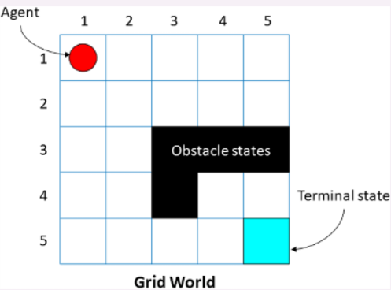

## Agentes LLM

Son agentes que usan LLMs como el cerebro. Se puede ver como una forma de **extender los LLMs permitiéndoles interactuar con herramientas y entornos externos**.

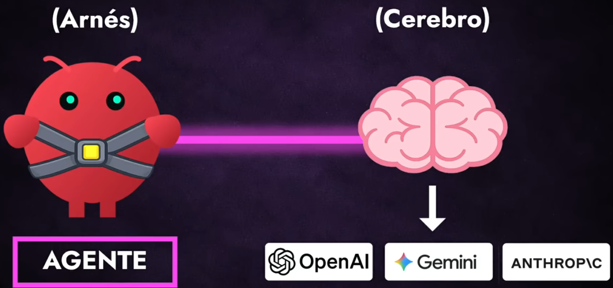

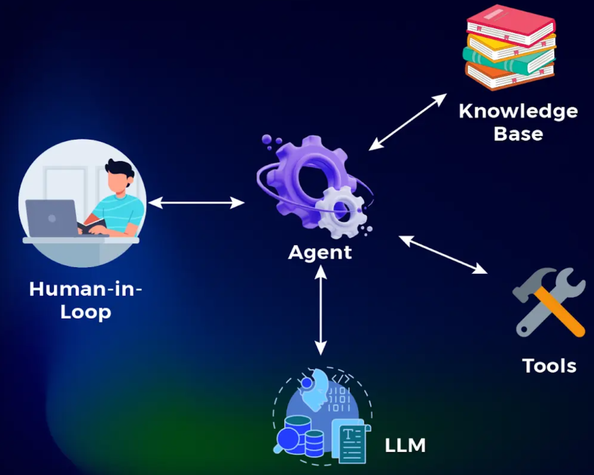

**Arquitectura interna de un Agente LLM:**

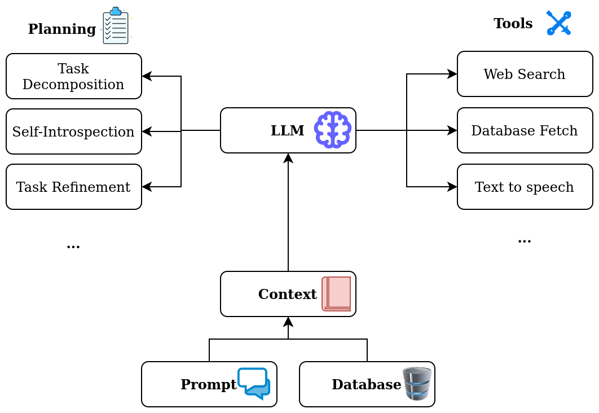

Tienen tres componentes:

- **Planificación**:
    - **Subobjetivos y descomposición**: El agente divide las tareas grandes en subobjetivos más pequeños y manejables, lo que permite una gestión eficiente de tareas complejas.
    - **Reflexión y perfeccionamiento**: El agente puede autocriticarse y reflexionar sobre sus acciones pasadas, aprender de sus errores y perfeccionarlos para los pasos futuros, mejorando así la calidad de los resultados finales.
- **Memoria**:
    - **Memoria a corto plazo**: utiliza la memoria a corto plazo del modelo para aprender.
    - **Memoria a largo plazo**: Esto proporciona al agente la capacidad de retener y recordar información (infinita) durante períodos prolongados, a menudo aprovechando un almacenamiento vectorial externo y una recuperación rápida (RAG).
- **Percepción y acción (uso de herramientas - tools)**: 
    - El agente aprende a llamar a API externas para obtener información adicional que falta en los pesos del modelo (que a menudo son difíciles de cambiar después del preentrenamiento), incluyendo **información actual, capacidad de ejecución de código, acceso a fuentes de información propietarias y más**.

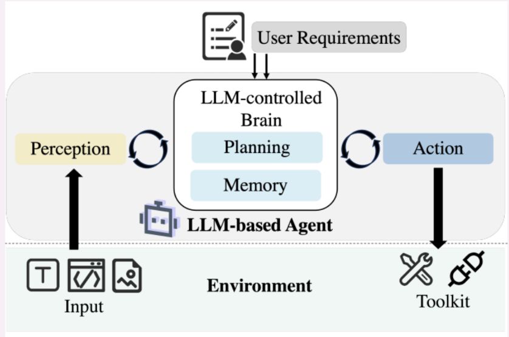

**Descripción general de un sistema de agente autónomo basado en LLM:**

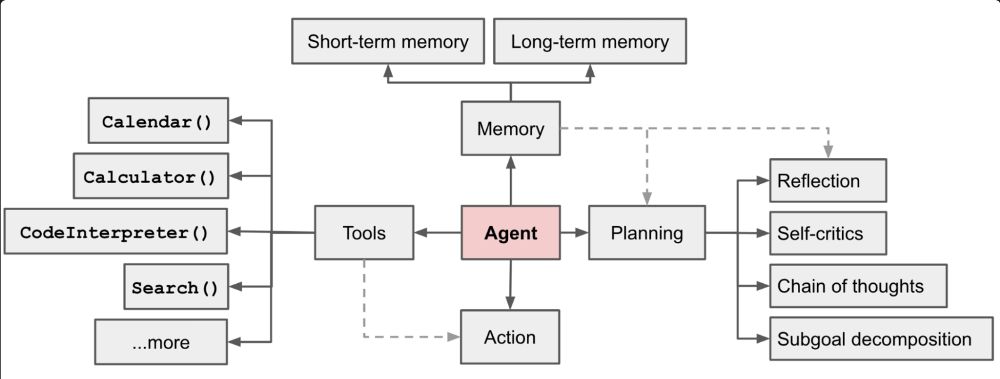

##### Un ejemplo es el agente de GitHub Copilot:

- Usa un LLM como motor principal (se puede seleccionar el LLM).
- Percibe el contexto: ficheros del proyecto actual e incluso puede estar conectado con herramientas externas.
- Actúa sugiriendo líneas, funciones completas o tests.

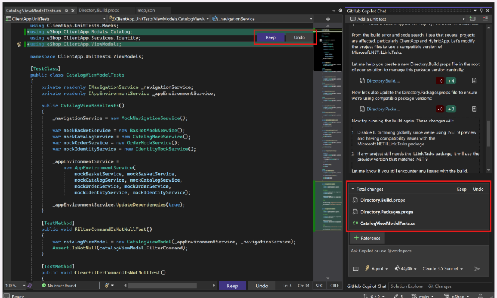


## Patrones *agénticos*

Los patrones agénticos organizan cómo interactúan esos tres componentes (plan,
memoria y percepción/acción).

Vamos a ver los más usados:

- **ReAct (Reason and Action)**: el LLM genera trazas de **thought, action y observation**
- **CodeAct**: es como ReAct, pero las acciones son **llamadas programáticas a APIs**. Como funciones de Python (smolagents)
- **Planning first**: primero se genera un plan completo explícito y se ejecuta poco a poco

### ReAct

ReAct es una estrategia muy sencilla e intuitiva. Dada una ***user request***, el sistema sigue un bucle que genera:

- **Thought**: razonamiento interno
- **Action**: llamada a una herramienta
- **Observation**: resultado devuelto por la herramienta hasta que la respuesta final es obtenida.

La plantilla de indicaciones de ReAct incorpora pasos explícitos para que LLM piense, con un formato aproximado como:

```bash
Thought: ...
Action: ...
Observation: ...
... (Repeated many times)
```
Ejemplos de trayectorias de razonamiento para tareas intensivas en conocimiento (por ejemplo, HotpotQA, FEVER) y tareas de toma de decisiones (por ejemplo, AlfWorld Env, WebShop):

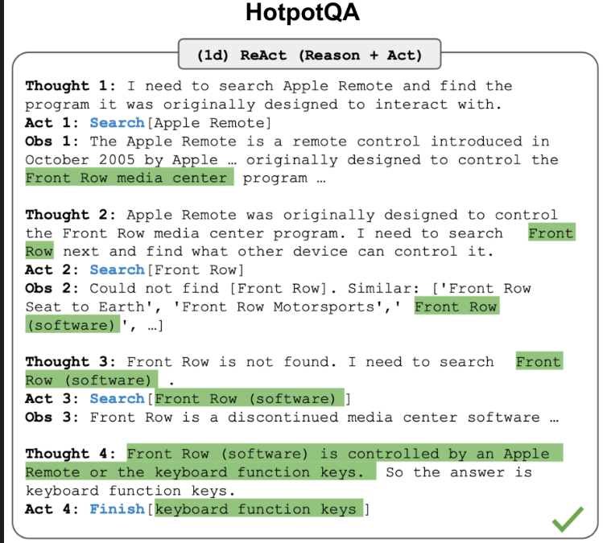


#### ReAct: ejemplo

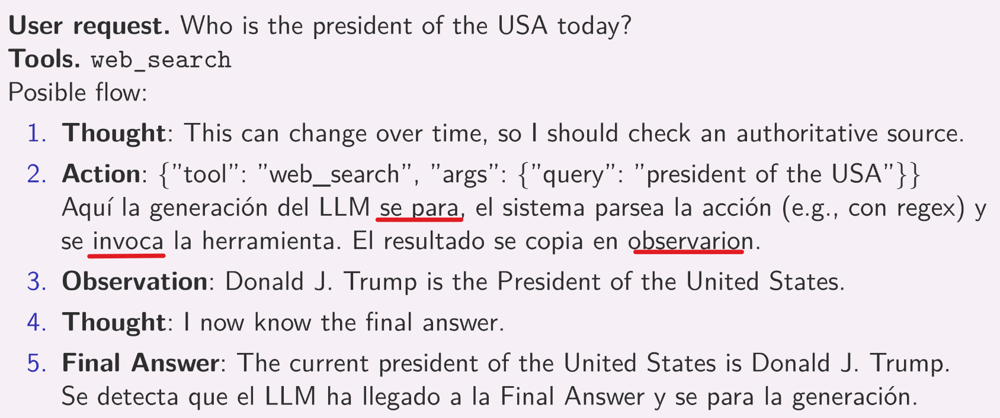

#### Ejemplo de consulta a un agente pidiendo información actual donde la información no está actualizada:

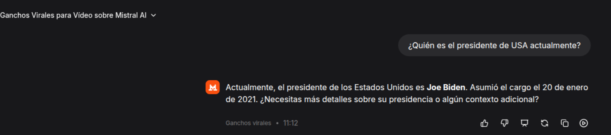

## 3. Conceptos clave en Mistral AI

### 3.1. Modelo vs. Agente

- **Modelo**: red neuronal entrenada para completar texto, traducir, razonar, etc.  
- **Agente** (en Mistral AI): configuración reutilizable que envuelve un modelo y añade:

    - Instrucciones (system prompt persistente).
    - Parámetros (temperatura, estilo, etc.).
    - Opcionalmente, tools o integraciones adicionales.

Trabajar directamente con el modelo es suficiente para un **chatbot simple**, pero repetir siempre las mismas instrucciones y parámetros en cada llamada no es práctico.  
Un **agente** permite centralizar esa configuración y reutilizarla.

### 3.2. Conversación

En Mistral, una **conversación** (Conversation) es la entidad que:

- mantiene el historial de mensajes,
- guarda el contexto,
- y representa el diálogo entre usuario y asistente.

Características:

- Las conversaciones se pueden iniciar **a partir de un agente** (usando `agent_id`) o directamente con un modelo.
- Cada mensaje nuevo se añade como una entrada (entry) en la conversación.

### 3.3. Entradas (Entries)

Una **entrada** representa una acción dentro de la conversación:

- mensajes del usuario,
- respuestas del asistente,
- o actualizaciones generadas por otras operaciones.

El API de Mistral permite:

- crear una conversación inicial con una lista de entradas,
- añadir nuevas entradas,
- recuperar el estado de la conversación.

---

## 4. Crear un agente a través de Mistra AI

En Mistral AI disponemos de una API de Agentes y chats (conversaciones) la cual permite a los desarrolladores crear dichos agentes, aprovechando múltiples funciones como:

- Múltiples modelos multimodales, tanto de **texto como de visión**.
- Estado persistente entre conversaciones.
- Capacidad para mantener conversaciones con modelos base, un solo agente y múltiples agentes.
- Herramientas de conexión integradas para la **ejecución de código, búsqueda web, generación de imágenes y biblioteca de documentos** listas para usar.
- Capacidad de transferencia de información para utilizar diferentes agentes como parte de un flujo de trabajo, lo que permite a los agentes llamar a otros agentes.
- También se admiten las funciones compatibles a través de nuestro punto final de finalización de chat, tales como:
    - **Resultados estructurados**
    - **Comprensión del documento**
    - **Uso de herramientas**
    - **Citas**


## 4.1 Personalizar un Agente a través de Mistral Studio

Vamos a crear un agente personalizado en (Le chat) con sus propias instrucciones, herramientas y base de conocimientos. Debemos:

- Escribir un mensaje del sistema para definir el comportamiento del agente.
- Adjuntar documentos como fuente de conocimiento.
- Habilitar herramientas como la búsqueda web, el intérprete de código y Canvas.
- Habilitar en Le Chat el agente.

#### Requisitos previos

- Una cuenta de Le Chat (plan gratuito, Pro o para equipos).
- Opcionalmente, un documento para usar como fuente de conocimiento (PDF, TXT, DOCX).

### Paso 1: Iniciar un nuevo agente

**1.-**  En la página principal hacemos clic en "Agentes" 

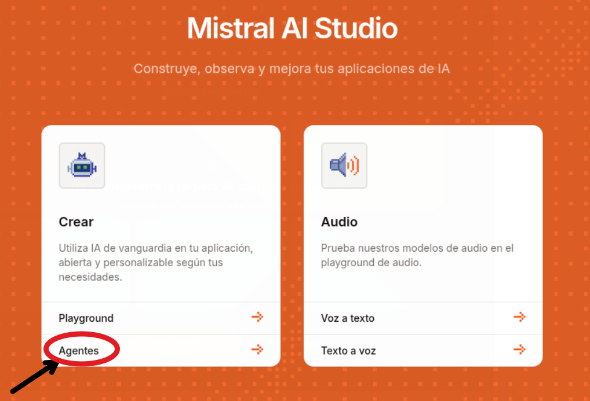

También podemos bajando al apartado de **"Crear un agente"**:

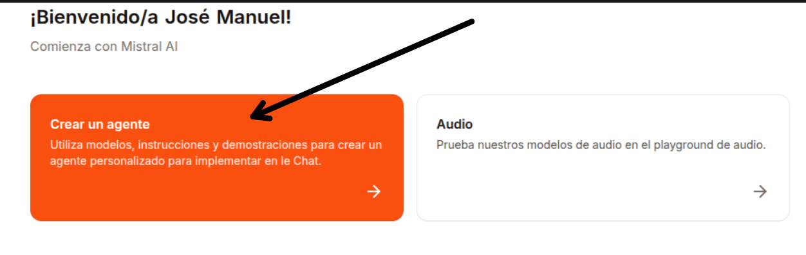

**2.-** Le damos el nombre al agente, por ejemplo de **Meeting Summarizer**. Añadimos una pequeña descripción para saber qué hace el agente (útil por si tenemos un listado de agentes bastante grande).

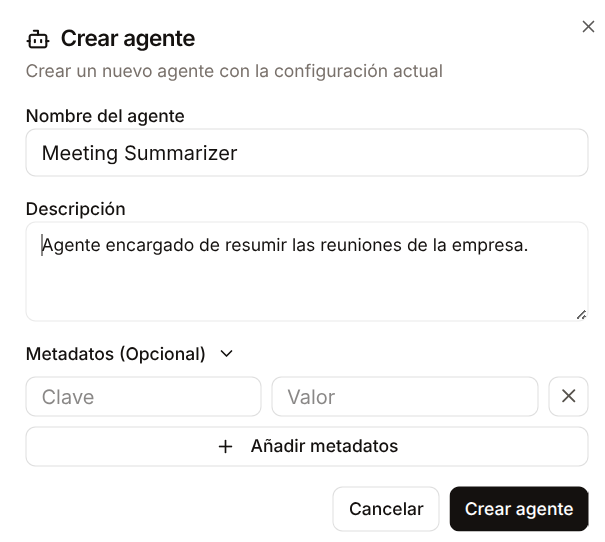

**3.-** Después de crear el agente, veremos el idenficador único para poder utilizar como API en aplicaciones externas y el código en Python, Typescript o descargar vía cURL:

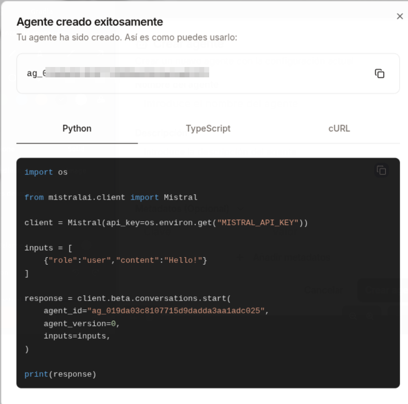

Más adelante usaremos el agente en modo API junto a una aplicación.

### Paso 2: Elegir el modelo, temperatura y las instrucciones

**1.-** Por defecto, Mistra IA Studio elige el modelo "Mistral Medium". Es una buena opción predeterminada.

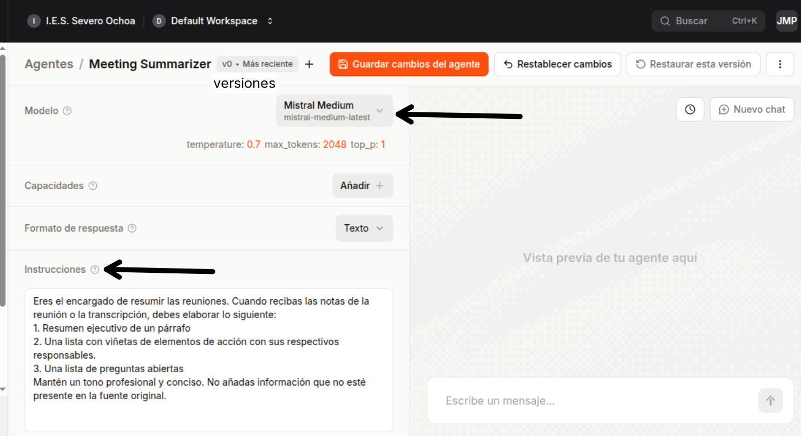


**2.-** Establecer la **Temperatura, max_tokens y top_p**: 

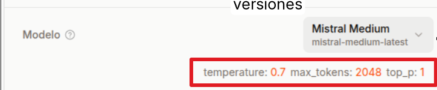

- **Temperatura**: Usaremos 0.2 para obtener resultados consistentes y deterministas o 0.7 para respuestas más creativas.
- **`max_tokens`**: Recuento de tokens incluye tanto los tokens de entrada como los de salida. 
- **`top_p`**: sirve para controlar la diversidad, creatividad y aleatoriedad de las respuestas generadas.
    - **`top_p` bajo (ej. 0.1 - 0.3)**: El modelo solo considerará el conjunto mínimo de palabras altamente probables (respuestas directas, precisas y más coherentes, ideales para tareas técnicas, resumen de datos o respuestas fácticas)
    - **`top_p` alto (ej. 0.8 - 1.0)**: El modelo considera un conjunto mucho más amplio de palabras, incluyendo opciones menos probables (aumenta la creatividad, variabilidad y diversidad en el texto, ideal para escritura creativa o lluvia de ideas)

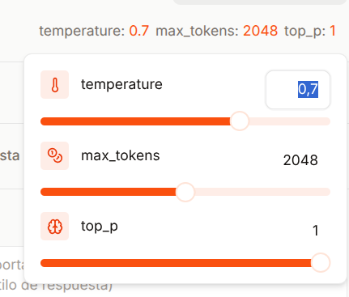

Las instrucciones determinan el comportamiento del agente en cada conversación. Debemos ser específicos sobre la tarea, el formato y el tono.

#### Ventana de contexto (Context window)

| Modelo | Max context length | 
|--------|--------------------|
| **Mistral Small** | 32,768 tokens | 
| **Mistral Medium** | 32,768 tokens | 
| **Mistral Large** | 131,072 tokens | 
| **Codestral** | 32,768 tokens | 
| **Ministral 3B / 8B** | 131,072 tokens | 
| **Pixtral Large** | 131,0728 tokens | 

- Las solicitudes que superan el período de tiempo permitido por el modelo generan un `400 Bad Request error`.
- El recuento de tokens incluye tanto los tokens de entrada como los de salida. Debemos planificar adecuadamente la variable `max_tokens`.

**3.-** En el campo **Instrucciones**, escribimos un mensaje del sistema. Por ejemplo:

```
Eres el encargado de resumir las reuniones. Cuando recibas las notas de la reunión o la transcripción, debes elaborar lo siguiente:
1. Resumen ejecutivo de un párrafo
2. Una lista con viñetas de elementos de acción con sus respectivos responsables.
3. Una lista de preguntas abiertas
Mantén un tono profesional y conciso. No añadas información que no esté presente en la fuente original.
```

Unas buenas instrucciones definen qué debe hacer el agente, el formato de salida y qué debe evitar. Lo ideal sería probar con algunos ejemplos de conversaciones y perfeccionar el proceso.

### Capacidades (herramientas)

Las capacidades (herramientas) mejoran al agente más allá de la generación de texto.

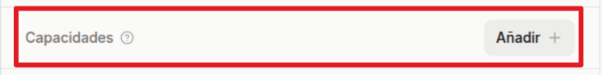

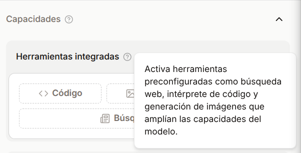

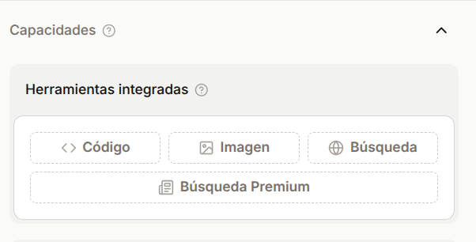

Desplázate hasta **Capacidades (tools)** y activa las funciones que necesites:
- **Código**: ejecuta código Python para cálculos, gráficos y análisis de datos.
- **Imagen**: permite que el modelo genere imágenes.
- **Búsqueda**: buscar información actualizada en internet.
- **Búsqueda Premium**: buscar información actualizada y verificada en internet.

Por ahora no vamos a utilizar ninguna herramienta (capacidad). 

### Funciones propias 

Podemos definir funciones personalizadas las cuales el modelo puede llamar a interactuar con APIs externas o realizar tareas específicas.

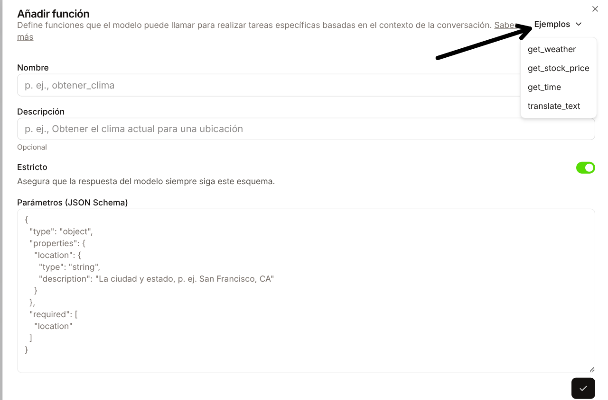

Ejemplo de función **`get_weather`**. Ojo debemos seguir el formato de respuesta aunque se puede modificar.

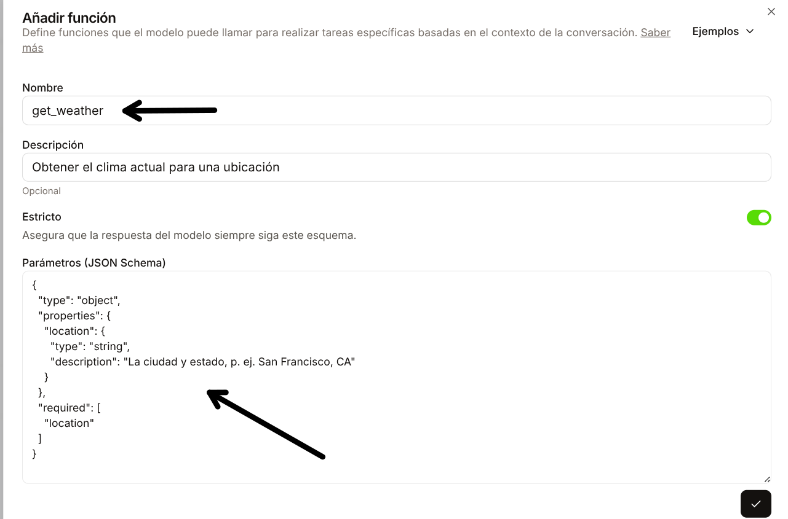

### Paso 5: Probar y compartir en "Le Chat"

**1.-** Podemos probar iniciando una conversación directamente con el agente: copiar y pegar este ejemplo de una reunión ficticia y vericamos que el resultado coincida con las instrucciones especificadas:

```text
Reunión mensual de marketing – VivaCloud
Fecha: 15 de abril de 2026
Hora: 10:00–11:30
Asistentes:
- Laura Gómez (Directora de Marketing)
- Marcos Pérez (Performance Marketing)
- Ana Ruiz (Content & Social Media)
- Diego Martín (Product Marketing)
- Carla López (CRM & Email Marketing)
- Sergio Díaz (Data Analyst, invitado)

Laura: Buenos días a todos. El objetivo de hoy es revisar resultados del primer trimestre, definir el foco del Q2 y acordar las campañas clave. Me gustaría que empezáramos por una foto general de performance y luego bajamos a contenido, producto y CRM.

Sergio: Perfecto, empiezo yo. A nivel global, en el Q1 hemos aumentado un 18% los registros de prueba frente al Q4, pero el coste por lead (CPL) ha subido un 12%. El canal que mejor se ha comportado es paid search, sobre todo en campañas de marca y long tail. Social de pago ha generado mucho tráfico pero con tasa de conversión bastante baja.

Laura: ¿Tenemos identificado por qué social convierte tan poco?

Sergio: Principalmente porque la segmentación ha sido demasiado amplia y los mensajes no están alineados con las páginas de destino. Vemos muchos clics curiosos, pero la gente se cae en la landing porque no entiende bien la propuesta de valor.

Marcos: Sí, ahí asumo la parte de responsabilidad. Hemos ido demasiado agresivos en alcance con creatividades muy generales. Para Q2 propongo reducir audiencias, centrarnos en dos o tres segmentos clave y alinear mejor mensajes con las landings.

Laura: Bien. Quiero que en Q2 prioricemos calidad de lead sobre volumen. Prefiero un crecimiento más moderado pero con mejor conversión a cliente. Marcos, luego te pido un plan concreto, pero sigamos con la visión general.

Carla: Por la parte de CRM, hemos enviado tres grandes campañas de email nurture para los leads de prueba: una serie de onboarding, una serie de casos de éxito y un reengagement para cuentas inactivas. La tasa de apertura media está en torno al 38%, pero la tasa de clic ha bajado en la última serie.

Laura: ¿Alguna hipótesis?

Carla: Creo que hemos mezclado demasiado contenido de producto con mensajes comerciales directos. Cuando el email es muy “vendedor”, la gente hace menos clic. Funcionan mejor los correos que llevan a un contenido útil, como guías y checklists, y desde ahí plantean el CTA de demo o upgrade.

Ana: Esto se ve también en social. Los posts que son pura promo no se comparten nada; los que son educativos, con tips o plantillas, generan bastante más interacción.

Laura: Ok, entonces mensaje para todos: en Q2 reforzamos contenido educativo y de valor en todos los canales, y el empuje comercial lo dejamos como siguiente paso, no como gancho inicial.
```

Copiar el texto en el chat y probar el funcionamiento:
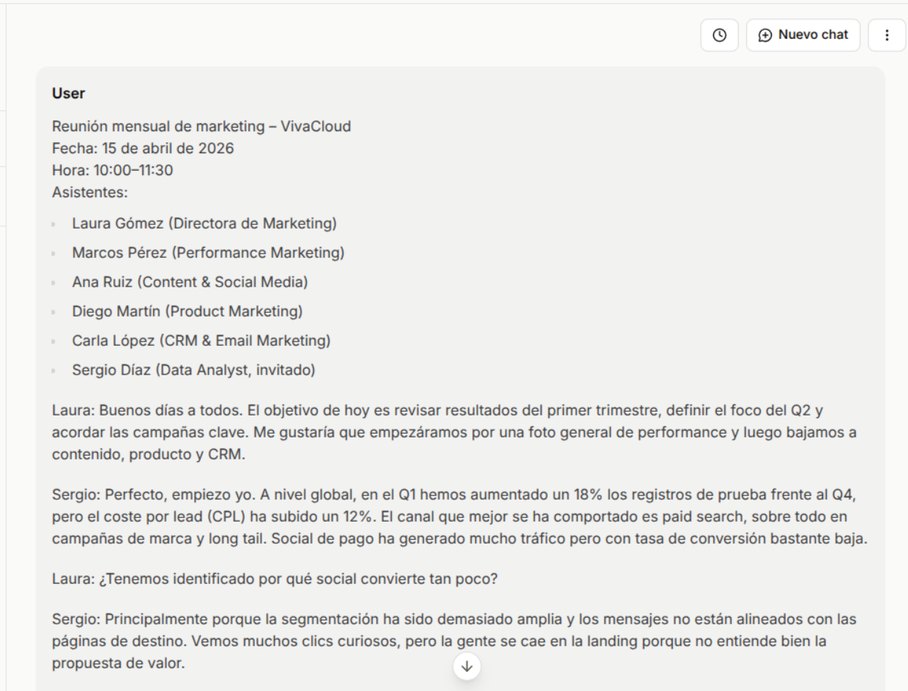

Parte del resultado: 

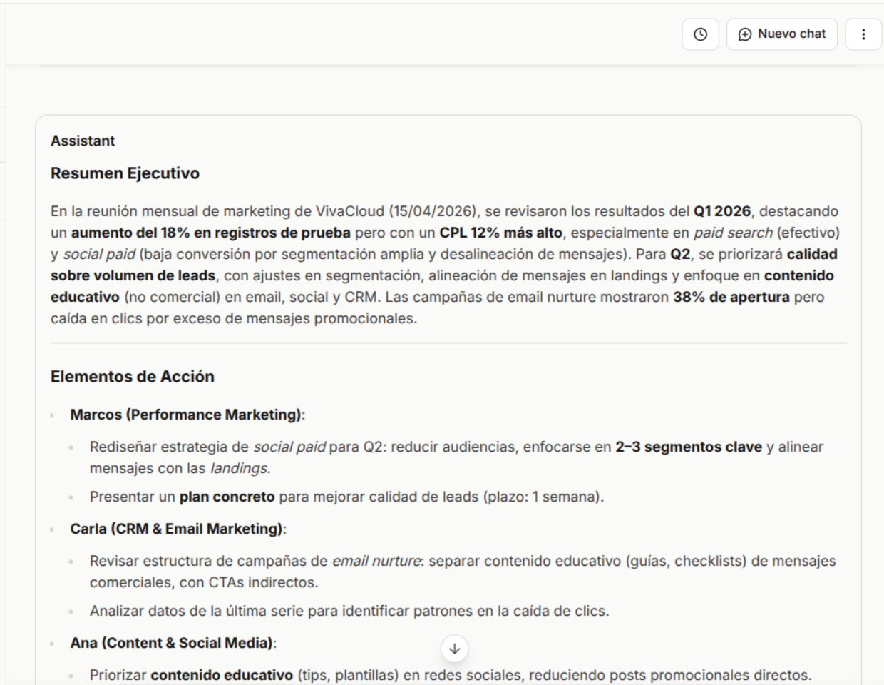

**Podemos comprobar como no funciona para datos actualizados:**

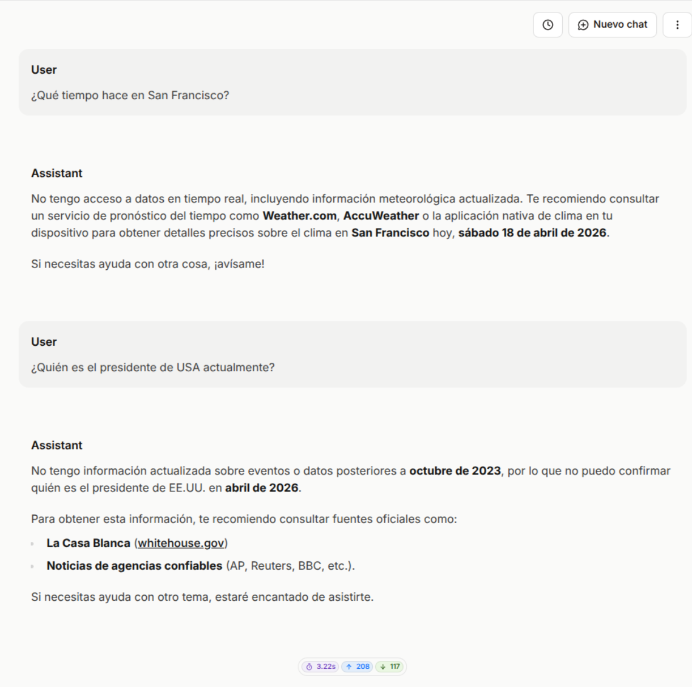

**3.-** Para compartir con la organización:

Hacemos clic en el menú de tres puntos del agente.

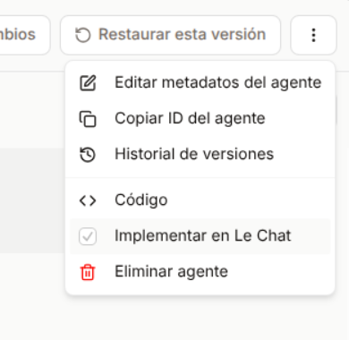


Seleccionamos **"Implementar en Le Chat"**


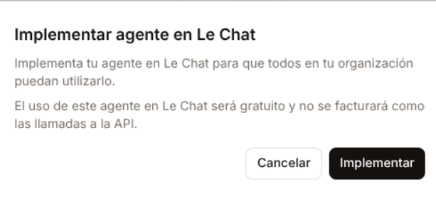

Accedemos a Le Chat para probar el agente:

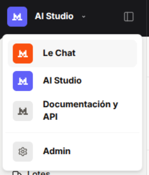

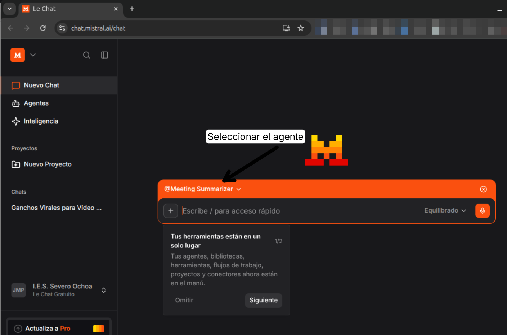

Los miembros de la organización pueden usar el agente desde su propia barra lateral de Le Chat sin necesidad de ver ni modificar las instrucciones.

Hacemos una prueba subiendo un pdf de una reunión de marketing de una empresa ficticia:

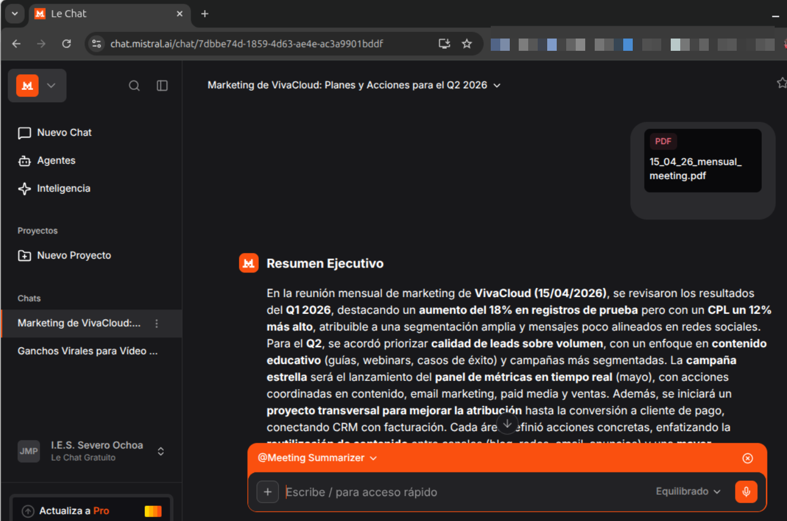

**Ejemplo de respuesta del agente a un dato que sí tiene en su base de conocimientos:**
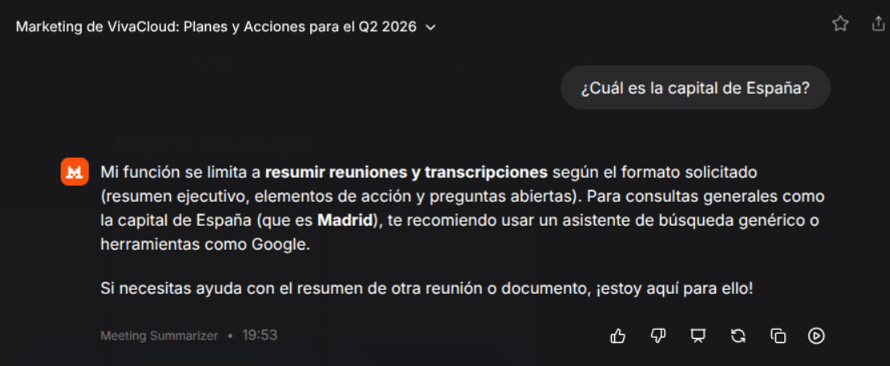


---

## Actividad: Crear dos Agentes en el playground de Mistral AI

En esta actividad, usando el playground de Mistral AI Studio, vas crear **dos agentes distintos**, los probarás con varias preguntas y analizarás cómo cambian sus respuestas según:

- el **rol** y las **instrucciones** del agente,
- el tipo de tarea (técnica vs creativa),
- y pequeños ajustes de parámetros de generación. 

### Objetivos

- Crear y configurar dos agentes sencillos en el playground de Mistral
- Diferenciar el comportamiento de un agente técnico y uno creativo
- Explicar, con tus palabras, cómo afectan las instrucciones y la temperatura a las respuestas.

---

## 1. Agente A – Tutor técnico de Flask

### 1.1. Crea el agente

Crea un agente con las siguientes características:

- Nombre sugerido: `TutorFlask-FP`.
- Rol: ayudante de programación especializado en Flask para alumnado de FP superior.

Instrucciones orientativas (puedes adaptarlas ligeramente, pero mantén la idea):

```text
Eres un ayudante de programación especializado en Flask para estudiantes de FP superior.

- Respondes siempre en castellano.
- Explicas los conceptos de forma clara, precisa y breve.
- Si el usuario pega código, explicas qué hace y señalas posibles errores.
- Si la pregunta no está clara, pides aclaración antes de responder.
- No inventas funciones ni comportamiento del código.
- Cuando expliques algo, intenta incluir un ejemplo sencillo.
```

---

## 2. Agente B – Generador creativo de ideas

### 2.1. Crea el agente

Crea un segundo agente con estas características:

- Nombre sugerido: `CreativoRedes-FP`.
- Rol: generador de ideas y textos breves para redes sociales relacionadas con programación / proyectos de clase.

Instrucciones orientativas:

```text
Eres un generador creativo de ideas para redes sociales y contenidos breves.

- Respondes siempre en castellano.
- Tu tono es cercano, dinámico y original.
- Si el usuario pide ideas, generas varias opciones distintas.
- Si el usuario pide un texto breve, intentas que sea atractivo y fácil de leer.
- Puedes ser creativo, pero mantienes claridad.
- Evitas respuestas demasiado técnicas salvo que el usuario lo pida.
```

---

## 3. Pruebas obligatorias (en el playground)

Realiza las siguientes pruebas usando el playground y anotando brevemente tus observaciones.

### 3.1. Prueba técnica

En **ambos agentes**, usa este prompt:

```text
Explícame qué hace este código Flask:

@app.route('/')
def home():
    return 'Hola mundo'
```

Preguntas:

- ¿Qué agente responde de forma más clara y precisa?
- ¿Alguno introduce información irrelevante o poco útil?

---

### 3.2. Prueba creativa

En **ambos agentes**, usa este prompt:

```text
Genera 5 ideas de publicaciones para redes sociales para promocionar una miniwebapp hecha con Flask por estudiantes.
```

Preguntas:

- ¿Qué agente genera ideas más variadas y creativas?
- ¿Cuál se adapta mejor a un contexto de redes sociales?

---

### 3.3. Prueba ambigua

En **ambos agentes**, usa este prompt:

```text
Ayúdame con mi proyecto.
```

Preguntas:

- ¿Algún agente pide más contexto antes de responder?
- ¿Cuál gestiona mejor la falta de información?

---

### 3.4. Prueba de adaptación al nivel

En **ambos agentes**, usa este prompt:

```text
Explícame Flask como si yo fuera un principiante absoluto.
```

Preguntas:

- ¿Qué agente adapta mejor el lenguaje a un nivel inicial?
- ¿Cuál se parece más a cómo te gustaría que te explicaran algo a ti?

---

## 4. Afinado rápido de temperatura

El playground permite ajustar la **temperatura**. Realiza el siguiente experimento:

1. En el agente `TutorFlask-FP`, pon una temperatura baja (por ejemplo, 0.2) y repite la **prueba técnica**.  
2. Sube la temperatura (por ejemplo, 0.8) y repite la misma prueba.  
3. En el agente `CreativoRedes-FP`, haz lo mismo con la **prueba creativa**.

Preguntas:

- ¿Con temperatura baja el agente técnico responde mejor?
- ¿Con temperatura alta el agente creativo genera respuestas más variadas?
- ¿En qué caso la temperatura alta empeora la calidad?

---

## 5. Micro cambio en las instrucciones

Elige **uno de los dos agentes** y añade una línea a sus instrucciones, por ejemplo:

```text
Responde siempre en formato de lista numerada.
```

o

```text
Da una respuesta breve en un máximo de 5 líneas.
```

Repite una de las pruebas anteriores.

Preguntas:

- ¿Cómo ha cambiado el formato de la respuesta?
- ¿Ha mejorado la claridad o la ha empeorado?

---

