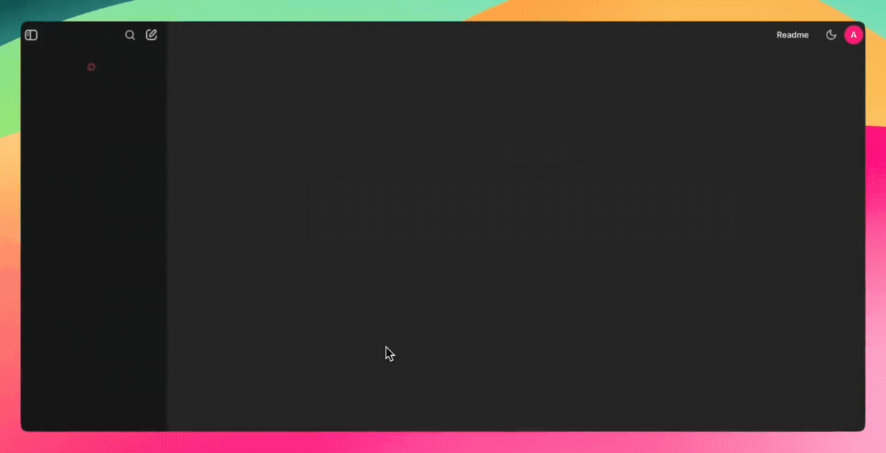
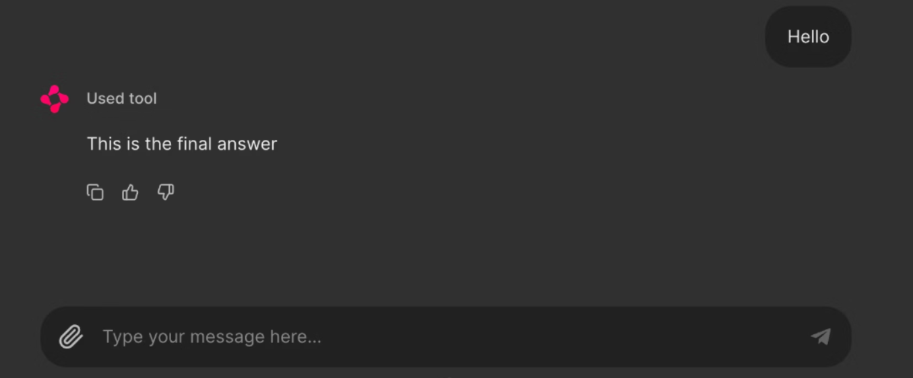

# Chainlit: framework de Python para crear **interfaces de chat interactivas**

## 1. ¿Qué es Chainlit?



Chainlit nos ayuda a crear frontends para chatbots de IA, herramientas y flujos de trabajo LLM. Abstrae la complejidad del front-end y nos permite centrarnos en la lógica de Python, a la vez que proporciona soporte para añadir botones, controles deslizantes, soporte para subir archivos o incluso conectarnos a herramientas que utilicen el **protocolo de contexto de modelo (MCP)**. 

Chainlit es ideal para:

- Prototipos de aplicaciones basadas en LLM
- Crear herramientas internas
- Construir demostraciones educativas
- Conectar tus modelos a herramientas o API externas

Ideas clave:

- Está pensado para **prototipos rápidos**, demos educativas y herramientas internas.  
- Se integra bien con otras librerías como **LangChain** o clientes de LLM (por ejemplo, Ollama). 
- Gestiona por nosotros elementos típicos de una UI de chat:
    - mensajes,
    - acciones (botones, etc.),
    - streaming de respuestas,
    - persistencia de sesiones. 

---

## Componentes de Chainlit

Todas las aplicaciones de Chainlit se basan en unas pocas características esenciales:

1. **Hooks del ciclo de vida del chat**: permiten controlar lo que ocurre en las distintas fases de un chat. Por ejemplo:

    - **`@cl.on_chat_start`** se ejecuta cuando se inicia un chat.
    - **`@cl.on_message`** se ejecuta cuando el usuario envía un mensaje.
    - **`@cl.on_chat_end`** se ejecuta cuando finaliza el chat.
    - **`@cl.step`** los asistentes basados ​​en LLM realizan varios pasos para procesar la solicitud del usuario, formando una cadena de pensamiento. A diferencia de un mensaje, un step tiene un tipo, una entrada/salida y un inicio/fin.

2. **Acciones del IU**: Chainlit permite añadir botones con **`cl.Action`** y manejarlos con **`@cl.action_callback`**. Son perfectas para crear interfaces de usuario limpias e interactivas sin necesidad de que el usuario introduzca texto.

3. **Transmisión de mensajes**: Con los **LLM que admiten la transmisión de tokens**, podemos transmitir respuestas en tiempo real utilizando **`stream=True`**, haciendo que nuestra aplicación parezca más dinámica y receptiva.

4. **Configuración con `config.toml`**: Este archivo permite activar funciones como la persistencia del chat, la carga de archivos, la personalización del tema y los ajustes de usabilidad, todo ello sin modificar tu código Python.

## 2. Instalación y requisitos

Requisitos básicos son:

- Python 3.8 o superior.  
- Instalar Chainlit desde `pip`: 

```bash
pip install chainlit
```

Para el ejemplo con **Ollama + LangChain**, se añaden: 

```bash
#pip install chainlit langchain langchain-community
pip install chainlit langchain-ollama

```

---

## 3. Conceptos básicos de Chainlit

Todas las apps de Chainlit se apoyan en unos pocos conceptos fundamentales. 

### 3.1. Hooks del ciclo de vida del chat

Chainlit proporciona **decoradores** que se ejecutan en distintos momentos de la conversación: 

- **`@cl.on_chat_start`**: se lanza al empezar un chat.  
- **`@cl.on_message`**: se lanza cuando el usuario envía un mensaje.  
- **`@cl.on_chat_end`**: se lanza al terminar una sesión.  


#### Construir con **`@cl.on_chat_start`**

Este hook se ejecuta cuando se inicia una nueva sesión de chat. Podemos utilizarlo, por ejemplo, **para saludar al usuario, mostrar un mensaje de bienvenida o inicializar el estado de la sesión**.

```python
import chainlit as cl

@cl.on_chat_start
def on_chat_start():
    print("A new chat session has started!")
```


#### Construir con `@cl.on_message`

Este hook de mensaje se ejecuta cuando el usuario envía un nuevo mensaje. Lo utilizamos para procesar la entrada del usuario, llamar a un LLM o devolver una respuesta.

```python
import chainlit as cl

@cl.on_message
async def on_message(msg: cl.Message):
    print("The user sent:", msg.content)
    await cl.Message(content=f"You said: {msg.content}").send()
```


Explicación del código: 
```python
@cl.on_message
async def on_message(msg: cl.Message):
```

- **`@cl.on_message`** es un **decorador** de hook: le dice a Chainlit que esta función se debe ejecutar cada vez que la interfaz reciba un mensaje nuevo del usuario.

- **`async def`** indica que la función es **asíncrona**, porque dentro va a hacer operaciones de E/S (enviar mensajes de vuelta) que Chainlit gestiona con **`await`**.

- El parámetro **`msg: cl.Message`** es el objeto **mensaje** que llega desde la UI; tiene atributos como **`content (texto que ha escrito el usuario)`**, **`author`**, **`created_at`**, etc.

```python
await cl.Message(content=f"You said: {msg.content}").send()
```

- Aquí creamos un nuevo mensaje de respuesta hacia la UI usando la clase **`cl.Message`**.
- Le pasamos el texto de respuesta en el parámetro `content`, usando una **`f-string`** para incluir lo que escribió el usuario:
    - Si el usuario pone **`“hola”`**, la respuesta será **`“You said: hola”`**.

- **`.send()`** envía ese mensaje a la interfaz de Chainlit, y como es una operación **asíncrona**, necesitas **`await`**.

#### Construyendo con `@cl.on_stop`

El hook **`on_stop`** se ejecuta cuando el usuario pulsa el botón de parada (⏹) durante una tarea en ejecución. Sirve para cancelar operaciones de larga duración o limpiar sesiones interrumpidas.

```python
import chainlit as cl
import asyncio

@cl.on_chat_start
async def start():
    await cl.Message("Type anything and I'll pretend to work on it.").send()

@cl.on_message
async def on_message(msg: cl.Message):
    await cl.Message("Working on it... you can press Stop").send()
    try:
        # Simulamos una tarea larga de 10 segundos
        await asyncio.sleep(10)
        await cl.Message("Task complete!").send()
    except asyncio.CancelledError:
        print("Task was interrupted!")
        # Opcional, tan solo para los logs del servidor
        raise

@cl.on_stop
async def on_stop():
    print("The user clicked Stop!")
```
Cuando el usuario envía un mensaje, Chainlit simula una tarea con **`asyncio.sleep(10)`**. Si el usuario pulsa el botón de parada (⏹), la tarea se cancela y se activa **`@cl.on_stop`** para registrar la interrupción.


#### Construir con **`@cl.on_chat_end`**

Este hook se activa cuando finaliza la sesión, ya sea porque el usuario actualiza, cierra la pestaña o inicia una nueva sesión. **Suele utilizarse para registrar desconexiones o guardar el estado**.

```python
import chainlit as cl

@cl.on_chat_start
async def on_chat_start():
    await cl.Message("Welcome! Feel free to leave anytime").send()

@cl.on_chat_end
async def on_chat_end():
    print("The user disconnected!")
```

Una vez abierto el **`localhost`**, podemos trabajar con él. Cuando cerremos la pestaña o la ventana de localhost, el terminal mostrará lo siguiente:


#### Pasos con **`@cl.step`**

Los asistentes basados ​​en LLM realizan varios pasos para procesar la solicitud del usuario, formando una cadena de pensamiento. A diferencia de los Message, un paso tiene un tipo, una entrada/salida y un inicio/fin.

Dependiendo de la configuración de `config.ui.cot`, se puede mostrar toda la cadena de pensamiento completa, ocultarla o mostrar solo las llamadas a la herramienta.
​
**Un ejemplo sencillo de cómo llamar a una herramienta.**

Veamos un ejemplo sencillo de una cadena de pensamiento que toma el mensaje de un usuario, lo procesa y envía una respuesta.

```python
import chainlit as cl

@cl.step(type="tool")
async def tool():
    # Simulate a running task
    await cl.sleep(2)

    return "Response from the tool!"


@cl.on_message
async def main(message: cl.Message):
    # Call the tool
    tool_res = await tool()

    # Send the final answer.
    await cl.Message(content="This is the final answer").send()
```


#### Acciones de IU (botones)

Chainlit nos permite añadir botones interactivos directamente en la interfaz de nuestro chatbot. Cada botón se define como una acción y se conecta a una **función de llamada de retorno de Python**. Podemos enviar botones como parte de un **Mensaje** utilizando el argumento **acciones**:

```python
import chainlit as cl

@cl.on_chat_start
async def start():
    actions = [
        cl.Action(
            name="hello", #nombre del callback
            label="👋 Say Hello",
            icon="smile",
            payload={"value": "hi"}
        )
    ]
    await cl.Message("Click a button!", actions=actions).send()
```

Así es como podemeos gestionar la pulsación de un botón:

```python
@cl.action_callback("hello")
async def on_hello(action: cl.Action):
    await cl.Message("Hello there! 👋").send()
```

El decorador **`@cl.action_callback("hello")`** indica a Chainlit que escuche los clics en un botón con el nombre **`"hola"`**. Cuando se pulsa, envía un mensaje amistoso al usuario en la interfaz de chat.


**Consejo**: podemos personalizar la carga útil con cualquier dato que quieras enviar al servidor.

#### Transmisión de mensajes 

**Chainlit** admite la transmisión en tiempo real de las respuestas LLM. Esto significa que podemos enviar contenido al usuario de forma incremental a medida que se genera.

```python
@cl.on_message
async def on_message(message: cl.Message):
    await cl.Message(content="Pensando...").send()
    async for chunk in llm.astream(message.content):
        await cl.Message(content=chunk, author="LLM", stream=True).send()
```

**Vamos a desglosarlo:**

- En primer lugar, muestra inmediatamente un mensaje "Pensando..." para que el usuario sepa que la aplicación está funcionando.
- Después, envía el mensaje del usuario a un **LLM compatible con streaming**.
- A medida que el modelo genera resultados, transmite cada **fragmento (chunk)** a la interfaz de usuario en tiempo real.
- El parámetro **`stream=True`** garantiza que cada trozo aparezca de forma incremental en lugar de esperar a la respuesta completa.

**Nota**: Esto funciona mejor con los modelos que admiten **streaming**.


#### Configuración de Chainlit (config.toml)

Para desbloquear potentes funciones como la **persistencia del chat**, **la subida de archivos**, la **tematización** y mucho más, podemos personalizar nuestra aplicación Chainlit utilizando el archivo **`config.toml`**. Este archivo reside en la raíz del directorio de nuestro proyecto (en la carpeta **`.chainlit`** ) y nos permite ajustar el comportamiento en tiempo de ejecución sin modificar el código.

##### Persistencia
Este parámetro permite a Chainlit persistir el historial de chat y el estado de la sesión. Activa el *hook* **`@cl.on_chat_resume`**, por lo que es ideal para aplicaciones en las que los usuarios pueden desconectarse y volver más tarde.

```bash
[persistence]
enabled = true
```

##### Carga de archivos

Este ajuste permite a los usuarios subir archivos en la interfaz del chat. Podemos restringir los tipos y tamaños de archivo permitidos para garantizar la seguridad y el rendimiento.

```bash
[features.spontaneous_file_upload]
enabled = true
accept = ["*/*"] 
max_files = 5
max_size_mb = 500
```
Ejemplos de algunos tipos de archivos que acepta Chainlit.

```json
# 1. For specific file types:
    # accept = ["image/jpeg", "image/png", "application/pdf"]
# 2. For all files of a certain type:
    #    accept = ["image/*", "audio/*", "video/*"]
# 3. For specific file extensions:
    #    accept = { "application/octet-stream" = [".xyz", ".pdb"] }
```

Esto permite adaptar las cargas para **casos de uso de seguridad, rendimiento o específicos del dominio**.

##### Personalización de la IU

Esta personalización cambia el nombre del asistente en el parámetro de la IU y activa la **Cadena de Pensamiento (CoT)**(dar las instrucciones adecuadas para facilitar al modelo la realización de tareas complejas que requieran razonamiento o resolución de problemas) en el modo de representación, que es útil para razonar paso a paso o depurar.

```json
[UI]
name = "Assistant"
cot = "full"
```

##### Ajustes de usabilidad
Mejoran la experiencia del usuario desplazando automáticamente los mensajes nuevos a la vista y permitiendo la edición de mensajes.

```json
[features]
user_message_autoscroll = true
edit_message = true
```

Los ajustes de usabilidad anteriores permiten al usuario activar las funciones de desplazamiento automático y edición de mensajes dentro de la interfaz de usuario.


## 4. Primer ejemplo: chatbot “Sorpréndeme” estático (sin LLM)

Ahora que conocemos los componentes básicos de Chainlit, vamos a crear una sencilla aplicación basada en una interfaz de usuario que utilice botones para mostrar datos divertidos predefinidos o mensajes de motivación para programadores.

**bot_surprise_sin_llm.py**

```python
import chainlit as cl
import random

FUN_FACTS = [
    "💡 ¿Sabías que Chainlit admite la subida de archivos y temas personalizados?",
    "💡 ¡Puedes añadir botones, controles deslizantes e imágenes directamente en la interfaz de usuario de tu chatbot!",
    "💡 ¡Chainlit admite la ejecución de herramientas en tiempo real con LangChain y LLM!",
    "💡 ¡Puedes personalizar el aspecto de tu chatbot con solo un archivo CSS!",
    "💡 ¡Chainlit te permite conectarte a herramientas utilizando el Protocolo de Contexto de Modelo (MCP)!"
]
SURPRISES = [
    "🎉 ¡Sorpresa! ¡Lo estás haciendo genial!",
    "🚀 ¡Sigue así, estás haciendo un progreso increíble!",
    "🌟 Dato curioso: alguien ahí fuera acaba de sonreír gracias a ti. ¿Por qué no hacer que sean dos?",
    "👏 ¡Bravo! ¡Acabas de desbloquear +10 XP de desarrollador imaginario!",
    "💪 Recuerda: ¡incluso los errores temen tus habilidades de depuración!"
]

@cl.on_chat_start
async def start():
    actions = [
        cl.Action(
            name="surprise_button",
            label="🎁 Sorpréndeme",
            icon="gift",
            payload={"value": "surprise"}
        ),
        cl.Action(
            name="fact_button",
            label="💡 ¿Los sabías?",
            icon="lightbulb",
            payload={"value": "fact"}
        )
    ]
    await cl.Message(content="Elige una acción:", actions=actions).send()

@cl.action_callback("surprise_button")
async def on_surprise(action: cl.Action):
    suprise = random.choice(SURPRISES)
    await cl.Message(content=suprise).send()

@cl.action_callback("fact_button")
async def on_fact(action: cl.Action):
    fact = random.choice(FUN_FACTS)
    await cl.Message(content=fact).send()
```

El código anterior define dos listas: **`"FUN_FACTS"`** para consejos interesantes de Chainlit y **`"SUPRISES"`** para mensajes motivadores.

- Cuando se inicia un nuevo chat, se muestran dos botones: **"Sorpréndeme"** y **"¿Lo sabías?"** utilizando **`cl.Action`**
- Al hacer clic en **"Sorpréndeme"** se activa **`@cl.action_callback("surprise_button")`**, el cual envía un mensaje sorpresa aleatorio.
- Al hacer clic en **"¿Lo sabías?"** se activa **`@cl.action_callback("fact_button")`**, que envía un hecho divertido aleatorio.

Esto crea un chatbot sencillo e interactivo mediante botones que no requiere LLM y es perfecto para aprender cómo funcionan las acciones y las llamadas de retorno de Chainlit.

Para ejecutar esta aplicación, simplemente ejecuta el siguiente comando en el terminal:

```bash
chainlit run bot_surprise_sin_llmain.py
```

Veremos botones interactivos en la interfaz de usuario que activan datos o mensajes divertidos.


## 5. Proyecto: Bot Sorpréndeme Powered by Ollama

Ahora, vamos a automatizar este proceso y a generar los mensajes de sorpresa y de hecho utilizando un LLM local a través de Ollama.

**bot_surprise_ollama.py**

```python
import chainlit as cl
from langchain_ollama import OllamaLLM
import random

#OLLAMA DEL SERVIDOR DE CLASE
llm = OllamaLLM(
    model="phi4-mini-reasoning:3.8b",
    base_url="http://192.168.1.80:11434",
    temperature=0.7
)

# Reusable action buttons
def get_action_buttons():
    return [
        cl.Action(
            name="surprise_button",
            label="🎁 Sorpréndeme",
            icon="gift",
            payload={"value": "surprise"}
        ),
        cl.Action(
            name="fact_button",
            label="💡 ¿Los sabías?",
            icon="lightbulb",
            payload={"value": "fact"}
        )
    ]

@cl.on_chat_start
async def start():
    await cl.Message(content="Elige una acción a continuación para ver algo divertido:").send()
    await cl.Message(content="", actions=get_action_buttons()).send()

@cl.action_callback("surprise_button")
async def on_surprise(action: cl.Action):
    prompt = "Envía un mensaje sorpresa breve y motivador a un desarrollador. ¡Hazlo divertido!"

    try:
        surprise = llm.invoke(prompt).strip()
    except Exception:
        surprise = "🎉 ¡Sorpresa! ¡Lo estás haciendo genial!"
    
    await cl.Message(content=surprise).send()
    await cl.Message(content="", actions=get_action_buttons()).send()  

@cl.action_callback("fact_button")
async def on_fact(action: cl.Action):
    prompt = "Dame un dato divertido y útil sobre los LLM o Chainlit."
    
    try:
        fact = llm.invoke(prompt).strip()
    except Exception:
        fact = "💡 ¿Sabías que puedes añadir controles deslizantes y botones a Chainlit con tan solo unas pocas líneas de código?"
    
    await cl.Message(content=fact).send()
    await cl.Message(content="", actions=get_action_buttons()).send()  
```
Esta app de Chainlit integra un LLM local (a través de Ollama con el modelo Mistral) para generar dinámicamente respuestas basadas en las interacciones del usuario.

- Define dos botones **`cl.Action`**: **"Sorpréndeme"** y **"¿Lo sabías?"** utilizando una función reutilizable **`get_action_buttons()`**.
- Al inicializar el chat (**`@cl.on_chat_start`**) envía un mensaje con estos botones interactivos.
- Cuando el usuario pulsa el botón **"Sorpréndeme"**, el gestor **`@cl.action_callback`** envía un mensaje al LLM solicitando un mensaje breve y edificante de los programadores. La respuesta se limpia con la función **`.strip()`** y se devuelve al chat.
- Del mismo modo, al hacer clic en **"¿Sabías que...?"** se invoca el LLM con una pregunta que solicita un dato informativo sobre Chainlit o los LLM.
- Si el LLM falla, se devuelven respuestas estáticas de emergencia.
- Después de cada interacción, los botones se reenvían para mantener el bucle conversacional.

Esto demuestra cómo **combinar `Chainlit UI` con la generación de contenidos basada en LLM**, ofreciendo una base modular y extensible para aplicaciones de chat locales potenciadas por IA.

Ejecuta el siguiente comando en el terminal:

```bash
chainlit run bot_surprise_ollama.py
```

Ahora tenemos un asistente de IA local y en directo que genera mensajes automatizados.


---

## 6. Casos de uso recomendados

- **Prototipos de aplicaciones LLM**: probar ideas de agentes o chatbots sin tener que construir un frontend completo.  
- **Herramientas internas**: interfaces de chat para equipos (por ejemplo, asistentes de documentación, bots internos de soporte).  
- **Demos educativas**: mostrar cómo funcionan LLMs, LangChain u otras librerías con una UI amigable.  
- **Conexión con APIs y herramientas externas**: crear interfaces de chat que llamen a APIs, bases de datos u otros servicios.  

---

## Probar funciones propias en Mistral Studio

### Usar la herramienta integrada "búsqueda" en el Agente Meeting Summarizer


## Actividad guiada: Crear un agente con herramientas personalizadas


En esta actividad vamos a usar modelo de Mistral que acceda a funciones externas y que pueda llamar durante una conversación.

* Definir un esquema de herramienta que describa su función.
* Enviar un mensaje que active una llamada a la herramienta
* Ejecutar la función localmente y devuelve el resultado al modelo.

Este patrón funciona con cualquier fuente de datos: API, bases de datos o servicios internos.

### Paso 1: Definir la función

Definir la función que el modelo va a llamar. Este ejemplo crea una `get_weather` herramienta que acepta el nombre de una ciudad.

```bash
pip install mistralai dotenv
```


```python
import json
import os
from mistralai.client import Mistral
from dotenv import load_dotenv

load_dotenv()

client = Mistral(api_key=os.environ["MISTRAL_API_KEY"])

# Definir el esquema de la herramienta.
tools = [
    {
        "type": "function",
        "function": {
            "name": "get_weather",
            "description": "Obtiene la temperatura actual de una ciudad dada.",
            "parameters": {
                "type": "object",
                "properties": {
                    "city": {
                        "type": "string",
                        "description": "Nombre de la ciudad, e.g. 'Madrid'."
                    }
                },
                "required": ["city"]
            }
        }
    }
]
```
### Paso 2: Enviar una solicitud con la herramienta

Hacer al modelo una pregunta que requiera la herramienta. El modelo devuelve una respuesta de tipo `tool_calls` en lugar de una respuesta de texto.

```python
messages = [
    {"role": "user", "content": "¿Qué tiempo hace en Madrid hoy?"}
]

response = client.chat.complete(
    model="mistral-medium-latest",
    messages=messages,
    tools=tools,
)

tool_call = response.choices[0].message.tool_calls[0]
print(f"El modelo va a invocar a: {tool_call.function.name}")
print(f"Con los argumentos: {tool_call.function.arguments}")
```

### Paso 3: Ejecutar la función y devolver el resultado.

Ejecutar la función con los argumentos del modelo y, a continuación, devolver el resultado para que el modelo pueda generar una respuesta en lenguaje natural.

```python
# Simular la función (reemplazar con una llamada a la API real)
def get_weather(city: str) -> dict:
    return {"city": city, "temperature": "27°C", "condition": "Soleado"}

# Ejecutar la llamada a la herramienta
args = json.loads(tool_call.function.arguments)
result = get_weather(**args)

# Devuelve el resultado al modelo
messages.append(response.choices[0].message)
messages.append({
    "role": "tool",
    "name": tool_call.function.name,
    "content": json.dumps(result),
    "tool_call_id": tool_call.id,
})

final_response = client.chat.complete(
    model="mistral-medium-latest",
    messages=messages,
    tools=tools,
)

print(final_response.choices[0].message.content)
# "Hoy hace 25ºC en Madrid y está soleado."
```

**Código completo:**

```python
import json
import os
from mistralai.client import Mistral
from dotenv import load_dotenv

load_dotenv()

client = Mistral(api_key=os.environ["MISTRAL_API_KEY"])

# Definir el esquema de la herramienta.
tools = [
    {
        "type": "function",
        "function": {
            "name": "get_weather",
            "description": "Obtiene la temperatura actual de una ciudad dada.",
            "parameters": {
                "type": "object",
                "properties": {
                    "city": {
                        "type": "string",
                        "description": "Nombre de la ciudad, e.g. 'Madrid'."
                    }
                },
                "required": ["city"]
            }
        }
    }
]

messages = [
    {
        "role": "system",
        "content": "Eres un asistente útil. Usa la herramienta get_weather cuando el usuario pregunte por el tiempo."
    },
    {
        "role": "user",
        "content": "¿Qué tiempo hace en Madrid?"
    }
]

response = client.chat.complete(
    model="mistral-medium-latest",
    messages=messages,
    tools=tools,
)

tool_call = response.choices[0].message.tool_calls[0]
print(f"El modelo va a invocar a: {tool_call.function.name}")
print(f"Con los argumentos: {tool_call.function.arguments}")

# Simular la función (reemplazar con una llamada a la API real)
def get_weather(city: str) -> dict:
    return {"city": city, "temperature": "25°C", "condition": "Soleado"}

# Ejecutar la llamada a la herramienta
args = json.loads(tool_call.function.arguments)
result = get_weather(**args)

# Devuelve el resultado al modelo
messages.append(response.choices[0].message)
messages.append({
    "role": "tool",
    "name": tool_call.function.name,
    "content": json.dumps(result),
    "tool_call_id": tool_call.id,
})

final_response = client.chat.complete(
    model="mistral-medium-latest",
    messages=messages,
    tools=tools,
)

print(final_response.choices[0].message.content)
# "Hoy hace 25ºC en Madrid y está soleado."
```
#### Paso 4: Verificar

Una ejecución exitosa imprime una respuesta en lenguaje natural que incluye el valor de retorno de la herramienta. El modelo:

* Detectó que la solicitud requería datos externos.
* `tool_calls` generó una solicitud estructurada
* Incorporó el resultado de nuestra función en una respuesta conversacional.

Podemos configurar la opción `tool_choice: "any"` para forzar al modelo a llamar siempre a una herramienta, o podemos utilizar `tool_choice: "auto"` (opción predeterminada) para dejar que el modelo decida.

### Paso 5: Añadir una llamada a una API que devuelve el tiempo

**Importamos la librería `requests`:**

```python
import requests
```

**Modificamos la función/herramienta `get_weather`**

```python
def get_weather(city: str) -> dict:
    # 1) Geocodificación
    geo_url = "https://geocoding-api.open-meteo.com/v1/search"
    geo_resp = requests.get(geo_url, params={"name": city, "count": 1, "language": "es", "format": "json"}, timeout=20)
    geo_resp.raise_for_status()
    geo_data = geo_resp.json()

    results = geo_data.get("results", [])
    if not results:
        return {
            "city": city,
            "error": f"No se encontró la ciudad '{city}'."
        }

    place = results[0]
    latitude = place["latitude"]
    longitude = place["longitude"]
    resolved_name = place["name"]
    country = place.get("country", "")

    # 2) Tiempo actual
    weather_url = "https://api.open-meteo.com/v1/forecast"
    weather_resp = requests.get(
        weather_url,
        params={
            "latitude": latitude,
            "longitude": longitude,
            "current": "temperature_2m,weather_code",
            "timezone": "auto"
        },
        timeout=20
    )
    weather_resp.raise_for_status()
    weather_data = weather_resp.json()

    current = weather_data.get("current", {})
    temp = current.get("temperature_2m")
    code = current.get("weather_code")

    code_map = {
        0: "Despejado",
        1: "Mayormente despejado",
        2: "Parcialmente nuboso",
        3: "Cubierto",
        45: "Niebla",
        48: "Niebla con escarcha",
        51: "Llovizna ligera",
        53: "Llovizna moderada",
        55: "Llovizna densa",
        61: "Lluvia ligera",
        63: "Lluvia moderada",
        65: "Lluvia intensa",
        71: "Nieve ligera",
        73: "Nieve moderada",
        75: "Nieve intensa",
        80: "Chubascos ligeros",
        81: "Chubascos moderados",
        82: "Chubascos violentos",
        95: "Tormenta"
    }

    return {
        "city": resolved_name,
        "country": country,
        "temperature_c": temp,
        "condition": code_map.get(code, f"Código meteorológico {code}"),
        "latitude": latitude,
        "longitude": longitude
    }
```

**Comprobamos que funciona correctamente:**


## Actividad guiada: Chainlit+agente con herramientas personalizadas

### Documentación paso a paso de `on_message` en Chainlit con Mistral

Esta función implementa el **bucle principal de conversación** entre Chainlit, el modelo de Mistral y las herramientas externas o *tools*. Chainlit ejecuta `@cl.on_message` cada vez que el usuario envía un mensaje desde la interfaz, y Mistral soporta llamadas asíncronas con herramientas mediante `chat.complete_async(..., tools=..., tool_choice="auto")`. 

#### Función completa

```python
@cl.on_message
async def on_message(message: cl.Message):
    messages = cl.user_session.get("messages", [])
    messages.append({"role": "user", "content": message.content})

    final_answer = None

    for _ in range(5):
        response = await client.chat.complete_async(
            model=MODEL,
            messages=messages,
            tools=TOOLS,
            tool_choice="auto",
        )

        assistant_message = response.choices[0].message

        assistant_payload = {
            "role": "assistant",
            "content": assistant_message.content or ""
        }

        tool_calls = getattr(assistant_message, "tool_calls", None)

        if tool_calls:
            assistant_payload["tool_calls"] = [
                {
                    "id": tool_call.id,
                    "type": "function",
                    "function": {
                        "name": tool_call.function.name,
                        "arguments": tool_call.function.arguments,
                    },
                }
                for tool_call in tool_calls
            ]

        messages.append(assistant_payload)

        if not tool_calls:
            final_answer = assistant_message.content or "No tengo respuesta."
            break

        for tool_call in tool_calls:
            function_name = tool_call.function.name
            function_args = json.loads(tool_call.function.arguments)

            if function_name not in AVAILABLE_TOOLS:
                tool_result = json.dumps(
                    {"error": f"Herramienta no implementada: {function_name}"},
                    ensure_ascii=False
                )
            else:
                tool_result = await AVAILABLE_TOOLS[function_name](**function_args)

            messages.append(
                {
                    "role": "tool",
                    "name": function_name,
                    "tool_call_id": tool_call.id,
                    "content": tool_result,
                }
            )

    cl.user_session.set("messages", messages)

    await cl.Message(
        content=final_answer or "No he podido generar una respuesta final."
    ).send()
```

#### 1. Decorador y firma

```python
@cl.on_message
async def on_message(message: cl.Message):
```

- `@cl.on_message` indica a Chainlit que esta función debe ejecutarse cada vez que el usuario envía un mensaje desde la interfaz. 
- La palabra clave `async` convierte la función en asíncrona, lo que permite hacer llamadas HTTP o a APIs sin bloquear la aplicación. 
- El parámetro `message: cl.Message` representa el mensaje recibido y su contenido textual está disponible en `message.content`. 

#### 2. Recuperar el historial y añadir el nuevo mensaje

```python
messages = cl.user_session.get("messages", [])
messages.append({"role": "user", "content": message.content})
```

- `cl.user_session.get("messages", [])` recupera el historial guardado para ese usuario y devuelve una lista vacía si todavía no existe. Chainlit documenta `user_session` precisamente para mantener estado por conversación. 
- Después se añade el nuevo mensaje del usuario al historial con el formato esperado por las APIs de chat: un diccionario con `role` y `content`. 
- Gracias a esto, el modelo recibe contexto acumulado y no solo el último mensaje aislado. 

#### 3. Preparar la variable de respuesta final

```python
final_answer = None
```

- Esta variable se usa para almacenar la respuesta final que se mostrará al usuario al terminar el proceso. 
- Se inicializa con `None` porque todavía no se sabe si el modelo responderá directamente o si antes necesitará llamar a una herramienta.

#### 4. Bucle de iteración controlado

```python
for _ in range(5):
```

- Este bucle permite repetir el ciclo de **modelo -> tool -> modelo** varias veces. 
- El límite de 5 iteraciones actúa como medida de seguridad para evitar bucles infinitos si el modelo sigue solicitando tools sin cerrar la respuesta.

#### 5. Llamada al modelo de Mistral

```python
response = await client.chat.complete_async(
    model=MODEL,
    messages=messages,
    tools=TOOLS,
    tool_choice="auto",
)
```

- `client.chat.complete_async(...)` realiza una llamada asíncrona al modelo de Mistral. El cliente Python oficial documenta este patrón para chat completions. 
- `model=MODEL` indica el nombre del modelo que se quiere usar. 
- `messages=messages` envía el historial completo al modelo. 
- `tools=TOOLS` registra las herramientas que el modelo puede invocar. 
- `tool_choice="auto"` deja que el modelo decida si necesita o no usar una herramienta. 

#### 6. Extraer el mensaje del asistente

```python
assistant_message = response.choices[0].message
```

- La API devuelve una lista de posibles respuestas en `choices`, y aquí se toma la primera.
- `assistant_message` contiene el mensaje generado por el asistente, incluyendo tanto texto natural como posibles `tool_calls`. 

#### 7. Crear la estructura base del mensaje del asistente

```python
assistant_payload = {
    "role": "assistant",
    "content": assistant_message.content or ""
}
```

- Se construye un diccionario que representa el mensaje del asistente dentro del historial.
- `role` vale `"assistant"` porque ese mensaje proviene del modelo. 
- `assistant_message.content or ""` evita problemas si el contenido viene vacío porque el modelo solo ha devuelto llamadas a herramientas. 

#### 8. Comprobar si el modelo ha pedido herramientas

```python
tool_calls = getattr(assistant_message, "tool_calls", None)
```

- `getattr(...)` intenta leer el atributo `tool_calls` y devuelve `None` si no existe. 
- Si el modelo necesita información externa, `tool_calls` contendrá una lista de llamadas a herramientas con nombre y argumentos. 

#### 9. Guardar las tool calls en el historial

```python
if tool_calls:
    assistant_payload["tool_calls"] = [
        {
            "id": tool_call.id,
            "type": "function",
            "function": {
                "name": tool_call.function.name,
                "arguments": tool_call.function.arguments,
            },
        }
        for tool_call in tool_calls
    ]
```

- Si existen llamadas a tools, se añaden al mensaje del asistente para que el historial refleje exactamente lo que el modelo ha pedido hacer.
- Cada llamada incluye un `id`, el tipo `function`, el nombre de la herramienta y los argumentos serializados en JSON.
- Ese `id` es importante porque luego se utilizará para vincular la respuesta de la tool con la llamada original.

#### 10. Añadir el mensaje del asistente al historial

```python
messages.append(assistant_payload)
```

- En este punto el historial ya incluye la intervención del asistente, tanto si es una respuesta normal como si es una petición de tools. 
- Mantener este historial consistente es clave para que el siguiente turno del modelo entienda lo que ya ha ocurrido en la conversación. 

#### 11. Salida temprana si no hay tools

```python
if not tool_calls:
    final_answer = assistant_message.content or "No tengo respuesta."
    break
```

- Si `tool_calls` está vacío o es `None`, significa que el modelo ya ha generado una respuesta final y no necesita herramientas adicionales. 
- Esa respuesta se guarda en `final_answer` y se interrumpe el bucle con `break`. 
- Este es el caso más simple: usuario pregunta, modelo responde directamente. 

#### 12. Recorrer cada llamada a herramienta

```python
for tool_call in tool_calls:
    function_name = tool_call.function.name
    function_args = json.loads(tool_call.function.arguments)
```

- Si el modelo ha pedido tools, se recorre cada llamada en un bucle.
- `function_name` extrae el nombre de la herramienta solicitada. 
- `tool_call.function.arguments` llega como texto JSON y `json.loads(...)` lo convierte en un diccionario Python listo para usar. 

#### 13. Verificar si la herramienta existe y ejecutarla

```python
if function_name not in AVAILABLE_TOOLS:
    tool_result = json.dumps(
        {"error": f"Herramienta no implementada: {function_name}"},
        ensure_ascii=False
    )
else:
    tool_result = await AVAILABLE_TOOLS[function_name](**function_args)
```

- `AVAILABLE_TOOLS` es un diccionario que relaciona nombres de herramientas con funciones Python reales. 
- Si la herramienta pedida por el modelo no existe, se genera una respuesta de error en JSON. 
- Si la herramienta sí existe, se ejecuta con `await`, pasando los argumentos con `**function_args`. 
- Esta es la parte donde el backend realmente ejecuta lógica externa; el modelo solo decide qué función quiere usar, pero no la ejecuta por sí mismo.

#### 14. Guardar el resultado de la tool en el historial

```python
messages.append(
    {
        "role": "tool",
        "name": function_name,
        "tool_call_id": tool_call.id,
        "content": tool_result,
    }
)
```

- El resultado de la herramienta se añade al historial como un mensaje con `role: "tool"`. 
- `tool_call_id` enlaza este resultado con la llamada original hecha por el modelo. 
- En la siguiente iteración del bucle, Mistral verá este resultado y podrá generar una respuesta final basada en esos datos. 

#### 15. Guardar el historial actualizado en la sesión

```python
cl.user_session.set("messages", messages)
```

- Cuando termina el bucle, el historial completo se guarda otra vez en la sesión del usuario.
- Esto permite que la conversación continúe en mensajes posteriores manteniendo todo el contexto previo. 

#### 16. Enviar la respuesta final a Chainlit

```python
await cl.Message(
    content=final_answer or "No he podido generar una respuesta final."
).send()
```

- Se construye un mensaje de salida para la interfaz de Chainlit y se envía con `.send()`. 
- Si `final_answer` tiene contenido, eso es lo que verá el usuario. Si no, se muestra un mensaje de error controlado. 

#### Resumen conceptual

Esta función implementa el siguiente flujo de trabajo: Chainlit recibe el mensaje del usuario, recupera el historial, consulta a Mistral, detecta si el modelo quiere usar herramientas, ejecuta esas herramientas en Python, añade los resultados al historial y vuelve a consultar al modelo hasta obtener una respuesta final. Ese patrón corresponde al flujo estándar de *tool calling* documentado por Mistral y puede integrarse de forma natural en los hooks de Chainlit. 

#### Esquema mental

Puede explicarse en seis pasos: 

1. Chainlit recibe un mensaje del usuario.
2. Se añade ese mensaje al historial de conversación.
3. Se pregunta a Mistral si puede responder o si necesita una tool.
4. Si pide una tool, el backend ejecuta la función Python correspondiente.
5. El resultado de la tool se devuelve al historial como `role="tool"`.
6. Mistral genera la respuesta final y Chainlit la muestra en pantalla.

### Otro ejemplo de la documentación de Chainlit 

A continuación podemos ver un caso de uso donde un modelo usa dos funciones personalizadas **`get_current_weather`** y **`get_home_town`** externa para obtener información y mostrar un resultado.


**Fuente**: documentación de Mistral

```python
import os
import json
import asyncio
import chainlit as cl
from dotenv import load_dotenv

from mistralai.client import Mistral

load_dotenv()

mai_client = Mistral(api_key=os.getenv("MISTRAL_API_KEY", "").strip())

@cl.step(type="tool", name="get_current_weather")
async def get_current_weather(location):
    # Make an actual API call! To open-meteo.com for instance.
    return json.dumps(
        {
            "location": location,
            "temperature": "29",
            "unit": "celsius",
            "forecast": ["sunny"],
        }
    )


@cl.step(type="tool", name="get_home_town")
async def get_home_town(person: str) -> str:
    """Get the hometown of a person"""
    if "Napoleon" in person:
        return "Ajaccio, Corsica"
    elif "Michel" in person:
        return "Caprese, Italy"
    else:
        return "Paris, France"


"""
JSON tool definitions provided to the LLM.
"""
tools = [
    {
        "type": "function",
        "function": {
            "name": "get_home_town",
            "description": "Get the home town of a specific person",
            "parameters": {
                "type": "object",
                "properties": {
                    "person": {
                        "type": "string",
                        "description": "The name of a person (first and last names) to identify.",
                    }
                },
                "required": ["person"],
            },
        },
    },
    {
        "type": "function",
        "function": {
            "name": "get_current_weather",
            "description": "Get the current weather in a given location",
            "parameters": {
                "type": "object",
                "properties": {
                    "location": {
                        "type": "string",
                        "description": "The city and state, e.g. San Francisco, CA",
                    },
                },
                "required": ["location"],
            },
        },
    },
]


async def run_multiple(tool_calls):
    """
    Execute multiple tool calls asynchronously.
    """
    available_tools = {
        "get_current_weather": get_current_weather,
        "get_home_town": get_home_town,
    }

    async def run_single(tool_call):
        function_name = tool_call.function.name
        function_to_call = available_tools[function_name]
        function_args = json.loads(tool_call.function.arguments)

        function_response = await function_to_call(**function_args)
        return {
            "tool_call_id": tool_call.id,
            "role": "tool",
            "name": function_name,
            "content": function_response,
        }

    # Run tool calls in parallel.
    tool_results = await asyncio.gather(
        *(run_single(tool_call) for tool_call in tool_calls)
    )
    return tool_results


@cl.step(type="run", tags=["to_score"])
async def run_agent(user_query: str):
    messages = [{"role": "user", "content": f"{user_query}"}]

    number_iterations = 0
    answer_message_content = None

    while number_iterations < 5:
        completion = mai_client.chat.complete(
            model="mistral-large-latest",
            messages=messages,
            tool_choice="auto",
            tools=tools,
        )
        message = completion.choices[0].message
        messages.append(message)
        answer_message_content = message.content

        if not message.tool_calls:
            break

        tool_results = await run_multiple(message.tool_calls)
        messages.extend(tool_results)

        number_iterations += 1

    return answer_message_content


@cl.set_starters
async def set_starters():
    return [
        cl.Starter(
            label="What's the weather in Napoleon's hometown",
            message="What's the weather in Napoleon's hometown?",
        ),
        cl.Starter(
            label="What's the weather in Paris, TX?",
            message="What's the weather in Paris, TX?",
        ),
        cl.Starter(
            label="What's the weather in Michel-Angelo's hometown?",
            message="What's the weather in Michel-Angelo's hometown?",
        ),
    ]

@cl.on_message
async def main(message: cl.Message):
    """
    Main message handler for incoming user messages.
    """
    answer_message = await run_agent(message.content)
    await cl.Message(content=answer_message).send()
```


## Actividad: Migrar agentes de Mistral Studio a una app Chainlit con funciones propias

### Contexto

En la sesión anterior (LLM2) creaste en **Mistral Studio AI** dos agentes en el playground:

- **Agente A – Tutor técnico de Flask**  
- **Agente B – Generador creativo de ideas**

Aquella actividad se centraba en definir bien el **rol**, las **instrucciones** y el **tono** de cada agente, pero **sin usar herramientas (tools)** ni funciones propias del agente.

En esta sesión vamos a dar un paso más: vas a construir una **aplicación propia** en Python usando **Chainlit** como interfaz de chat, reutilizando la idea de los dos agentes, pero añadiendo **funciones personalizadas** que el modelo pueda llamar cuando lo necesite, siguiendo el patrón de integración oficial entre Chainlit y Mistral. 

---

### Objetivo de la actividad

Construir una aplicación llamada, por ejemplo, `llm3-chainlit-agentes`, que:

- use **Chainlit** como interfaz de chat, 
- se conecte a **Mistral AI** desde Python, 
- implemente **dos agentes lógicos** (A y B) con instrucciones distintas,  
- y añada **funciones personalizadas (tools)** que el modelo pueda invocar mediante *function calling*, para tareas como obtener el tiempo, la hora o el precio de una acción. 

---

### Definición de los agentes

Puedes mantener los nombres originales, pero se recomienda actualizar ligeramente el rol del agente A para encajarlo mejor con el uso de tools:

- **Agente A – Planificador práctico / consultor técnico**  
  - Ayuda a planificar tareas, proyectos o pequeñas “rutas” (por ejemplo, un mini plan de estudio, una ruta de viaje sencillo, etc.).  
  - Se centrará más en **información factual y estructurada** y en usar tools como `get_time` o `get_weather`.  

- **Agente B – Generador creativo de ideas**  
  - Genera ideas de contenido, propuestas creativas, textos breves o variaciones de un mismo concepto.  
  - Puede apoyarse en `get_stock_price` u otras tools si quieres que genere ideas de contenido financiero/tecnológico.  

Las instrucciones (prompt del agente) de A y B pueden reutilizar y adaptar lo que ya definiste en Mistral Studio, ajustando ahora las descripciones para mencionar que el agente **puede llamar a funciones auxiliares cuando lo considere útil**.

---

### Funciones personalizadas (tools)

Debes implementar al menos **tres funciones propias** en Python que el modelo pueda usar como herramientas. Algunas funciones recomendadas son:

- `get_weather(location, date_range)`  
  - Devuelve un tiempo simulado o consultado vía API (puede ser una respuesta inventada pero coherente, o una llamada real a una API de clima si quieres). 
- `get_time(city_or_timezone)`  
  - Devuelve la hora local de una ciudad o zona horaria.  
- `get_stock_price(symbol)`  
  - Devuelve el precio simulado de una acción (o real, si integras una API sencilla). 

Puedes añadir otras funciones si te interesa, siempre que:

- tengan parámetros bien definidos,  
- devuelvan datos estructurados,  
- y sean razonablemente útiles para alguno de los dos agentes. 

El patrón a seguir es similar al del que hemos visto en el apartado **Mistral + Chainlit**, donde se definen tools como `get_home_town` y `get_current_weather` con un decorador `@cl.step(type="tool")` y un bloque `tools = [...]` con el esquema JSON que se pasa al modelo. 

---

### Requisitos mínimos de la aplicación

Tu aplicación deberá cumplir, como mínimo, los siguientes puntos:

1. **Interfaz en Chainlit**  
   - La app se ejecuta con `chainlit run app.py`.  
   - Al abrirla en el navegador puedes escribir mensajes y recibir respuestas. 

2. **Selección de agente**  
   - Debes poder elegir si hablas con el **Agente A** o con el **Agente B**.  
   - Esto puede hacerse de varias formas:
     - mediante un comando inicial (`/agenteA` o `/agenteB`),  
     - mediante un selector en el arranque,  
     - o detectando el modo por el primer mensaje.  

3. **Uso de Mistral con tools**  
   - El código debe llamar a la API de Mistral con una lista de `tools` (funciones) definidas en JSON, siguiendo el modelo de *function calling*. 
   - Cuando el modelo decida usar una tool, tu backend debe:
     - leer el `tool_call` devuelto,  
     - ejecutar la función Python correspondiente,  
     - y devolver el resultado al modelo para que este construya la respuesta final.  

4. **Integración de las funciones personalizadas**  
   - Las funciones `get_weather`, `get_time`, `get_stock_price` (u otras que definas) deben estar realmente implementadas en el código y ser invocadas por el agente. 
   - El comportamiento debe ser observable en la conversación (por ejemplo, Chainlit puede mostrar un paso tipo “tool” cuando se ejecuta la función, usando `@cl.step(type="tool")`).

5. **Demostraciones de uso**  
   - Debes probar la app con varios ejemplos, de forma que:
     - en algunos casos el agente responda sin tools,  
     - y en otros casos el agente necesite llamar a una o varias tools para completar la respuesta. 

---

### Pasos guiados (recomendados)

1. **Paso 1: App Chainlit mínima**  
   - Crea un `app.py` que use Chainlit y un modelo de Mistral, sin tools.  
   - Comprueba que puedes enviar y recibir mensajes.   

2. **Paso 2: Añadir un solo tool sencillo**  
   - Implementa `get_time` como función Python.  
   - Define el tool JSON y pásalo al modelo.  
   - Comprueba, con algún prompt tipo “¿Qué hora es en Londres?”, que el modelo decide llamar a la función. 

3. **Paso 3: Añadir `get_weather` y `get_stock_price`**  
   - Implementa estas funciones y añádelas a la lista de tools. 
   - Diseña prompts donde tenga sentido usarlas (tiempo en una ciudad, precio de una acción, etc.).  

4. **Paso 4: Instrucciones de los agentes A y B**  
   - Adapta en el código los prompts de sistema / instrucciones que ya diseñaste en Mistral Studio para el Tutor Flask y el Generador creativo.   
   - Ajusta el rol de A hacia algo más práctico/planificador, y deja B como creativo.  

5. **Paso 5: Selector de agente**  
   - Añade un mecanismo sencillo para indicar con qué agente hablas (por ejemplo, guardando una variable en la sesión de usuario de Chainlit). 
   - Asegúrate de que las tools se comportan de forma coherente con cada agente (el A usará más `get_time`/`get_weather`, el B quizá use `get_stock_price` para ideas financieras, etc.).  

---

### Entrega mínima (para esta actividad)

Para la actividad asociada a esta sesión se pedirá, como mínimo:

- El fichero `app.py` (o equivalente) con la integración de Chainlit + Mistral + tools.  
- Un breve `README.md` (o texto en la entrega) que explique:
  - cómo arrancar la app,  
  - qué hace el agente A,  
  - qué hace el agente B,  
  - qué funciones personalizadas se han implementado,  
  - y cómo probarlas (ejemplos de prompts). 

En sesiones posteriores se podrá ampliar esta base para incluir **RAG** y otras capacidades más avanzadas, pero en esta actividad el foco está en **migrar los agentes del playground a una app propia y darles herramientas mediante function calling**. 

