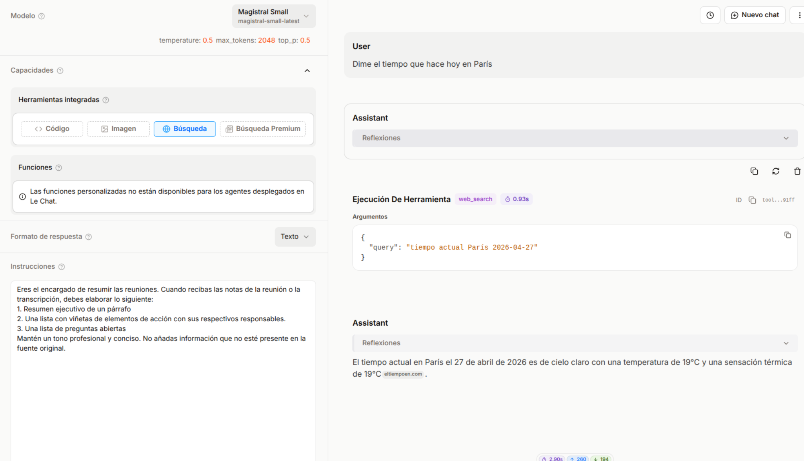
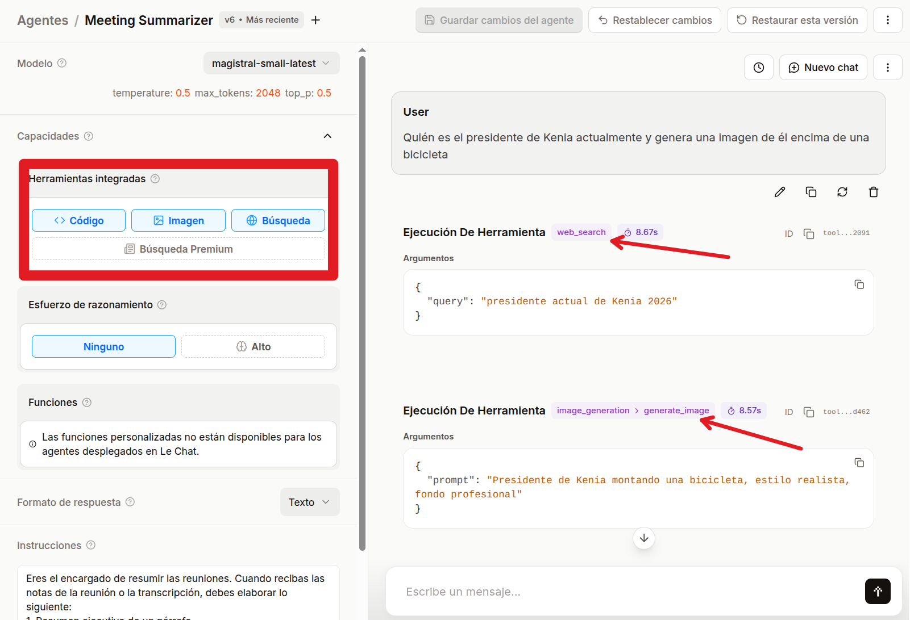
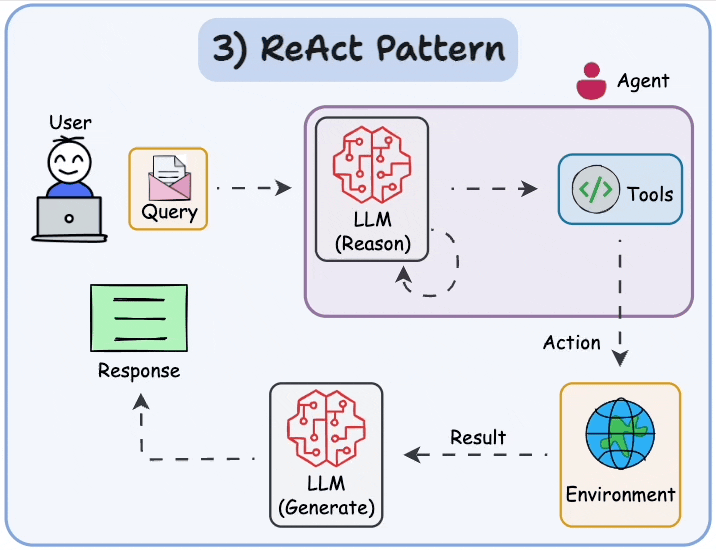
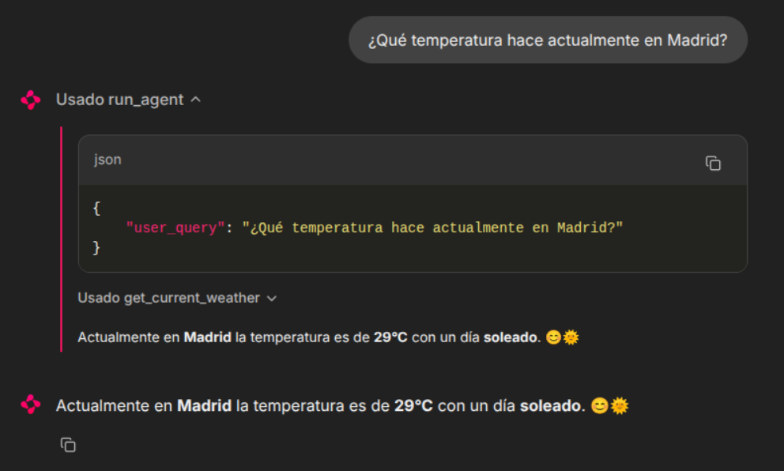
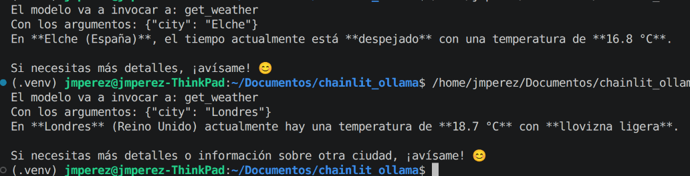
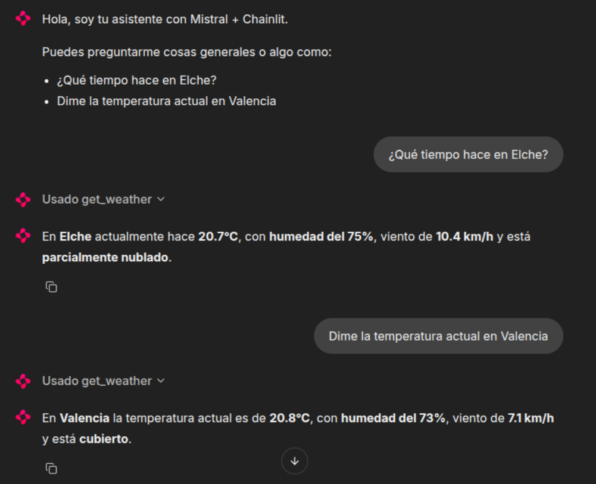
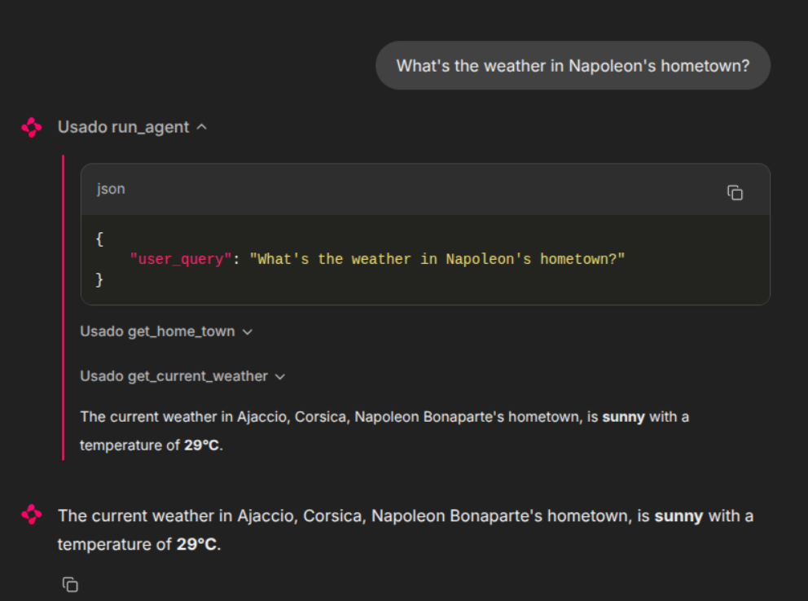
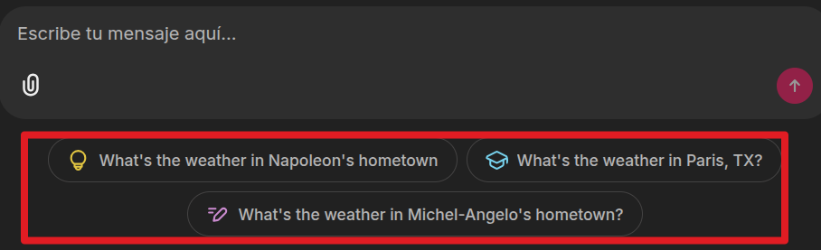
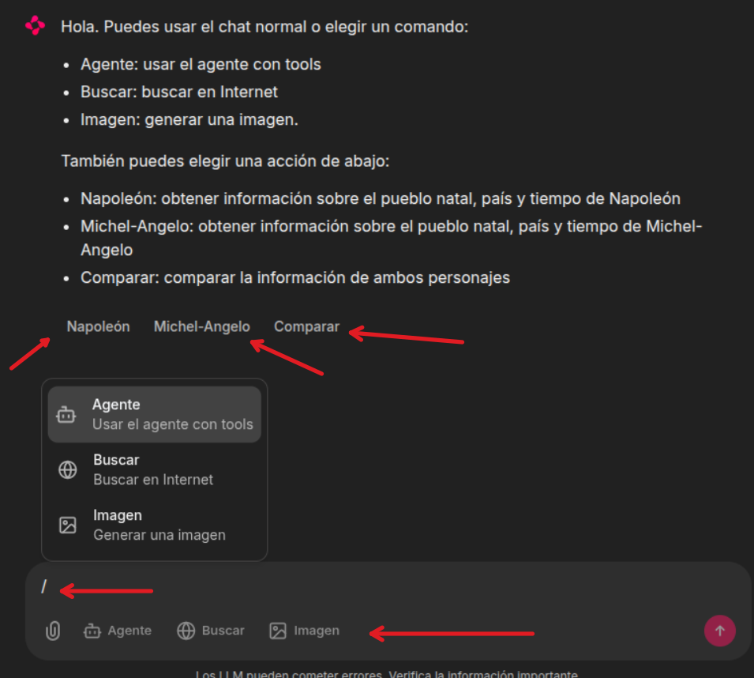
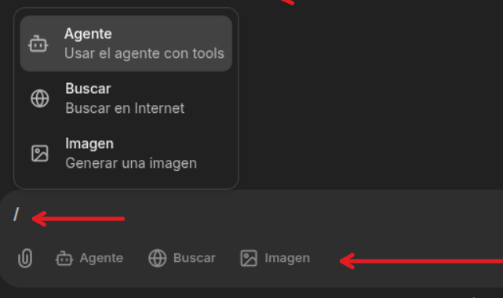

## Probar funciones propias en Mistral Studio

### Usar la herramienta integrada "búsqueda" en el Agente Meeting Summarizer



**Ejemplo de uso en Mistral IA de agente razonando y usando herramientas integradas (Patrón ReAct)**


**Patrón ReAct (Reason-Acting)**


## Actividad guiada: Crear un agente con herramientas personalizadas



En esta actividad vamos a usar modelo de Mistral que acceda a funciones externas y que pueda llamar durante una conversación.

* Definir un esquema de herramienta que describa su función.
* Enviar un mensaje que active una llamada a la herramienta
* Ejecutar la función localmente y devuelve el resultado al modelo.

Este patrón funciona con cualquier fuente de datos: API, bases de datos o servicios internos.

### Paso 1: Definir la función

Definir la función que el modelo va a llamar. Este ejemplo crea una `get_weather` herramienta que acepta el nombre de una ciudad.

```bash
pip install mistralai dotenv
```


```python
import json
import os
from mistralai.client import Mistral
from dotenv import load_dotenv

load_dotenv()

client = Mistral(api_key=os.environ["MISTRAL_API_KEY"])

# Definir el esquema de la herramienta.
tools = [
    {
        "type": "function",
        "function": {
            "name": "get_weather",
            "description": "Obtiene la temperatura actual de una ciudad dada.",
            "parameters": {
                "type": "object",
                "properties": {
                    "city": {
                        "type": "string",
                        "description": "Nombre de la ciudad, e.g. 'Madrid'."
                    }
                },
                "required": ["city"]
            }
        }
    }
]
```
### Paso 2: Enviar una solicitud con la herramienta

Hacer al modelo una pregunta que requiera la herramienta. El modelo devuelve una respuesta de tipo `tool_calls` en lugar de una respuesta de texto.

```python
messages = [
    {"role": "user", "content": "¿Qué tiempo hace en Madrid hoy?"}
]

response = client.chat.complete(
    model="mistral-medium-latest",
    messages=messages,
    tools=tools,
)

tool_call = response.choices[0].message.tool_calls[0]
print(f"El modelo va a invocar a: {tool_call.function.name}")
print(f"Con los argumentos: {tool_call.function.arguments}")
```

### Paso 3: Ejecutar la función y devolver el resultado.

Ejecutar la función con los argumentos del modelo y, a continuación, devolver el resultado para que el modelo pueda generar una respuesta en lenguaje natural.

```python
# Simular la función (reemplazar con una llamada a la API real)
def get_weather(city: str) -> dict:
    return {"city": city, "temperature": "27°C", "condition": "Soleado"}

# Ejecutar la llamada a la herramienta
args = json.loads(tool_call.function.arguments)
result = get_weather(**args)

# Devuelve el resultado al modelo
messages.append(response.choices[0].message)
messages.append({
    "role": "tool",
    "name": tool_call.function.name,
    "content": json.dumps(result),
    "tool_call_id": tool_call.id,
})

final_response = client.chat.complete(
    model="mistral-medium-latest",
    messages=messages,
    tools=tools,
)

print(final_response.choices[0].message.content)
# "Hoy hace 25ºC en Madrid y está soleado."
```

**Código completo:**

```python
import json
import os
from mistralai.client import Mistral
from dotenv import load_dotenv

load_dotenv()

client = Mistral(api_key=os.environ["MISTRAL_API_KEY"])

# Definir el esquema de la herramienta.
tools = [
    {
        "type": "function",
        "function": {
            "name": "get_weather",
            "description": "Obtiene la temperatura actual de una ciudad dada.",
            "parameters": {
                "type": "object",
                "properties": {
                    "city": {
                        "type": "string",
                        "description": "Nombre de la ciudad, e.g. 'Madrid'."
                    }
                },
                "required": ["city"]
            }
        }
    }
]

messages = [
    {
        "role": "system",
        "content": "Eres un asistente útil. Usa la herramienta get_weather cuando el usuario pregunte por el tiempo."
    },
    {
        "role": "user",
        "content": "¿Qué tiempo hace en Madrid?"
    }
]

response = client.chat.complete(
    model="mistral-medium-latest",
    messages=messages,
    tools=tools,
)

tool_call = response.choices[0].message.tool_calls[0]
print(f"El modelo va a invocar a: {tool_call.function.name}")
print(f"Con los argumentos: {tool_call.function.arguments}")

# Simular la función (reemplazar con una llamada a la API real)
def get_weather(city: str) -> dict:
    return {"city": city, "temperature": "25°C", "condition": "Soleado"}

# Ejecutar la llamada a la herramienta
args = json.loads(tool_call.function.arguments)
result = get_weather(**args)

# Devuelve el resultado al modelo
messages.append(response.choices[0].message)
messages.append({
    "role": "tool",
    "name": tool_call.function.name,
    "content": json.dumps(result),
    "tool_call_id": tool_call.id,
})

final_response = client.chat.complete(
    model="mistral-medium-latest",
    messages=messages,
    tools=tools,
)

print(final_response.choices[0].message.content)
# "Hoy hace 25ºC en Madrid y está soleado."
```
#### Paso 4: Verificar

Una ejecución exitosa imprime una respuesta en lenguaje natural que incluye el valor de retorno de la herramienta. El modelo:

* Detectó que la solicitud requería datos externos.
* `tool_calls` generó una solicitud estructurada
* Incorporó el resultado de nuestra función en una respuesta conversacional.

Podemos configurar la opción `tool_choice: "any"` para forzar al modelo a llamar siempre a una herramienta, o podemos utilizar `tool_choice: "auto"` (opción predeterminada) para dejar que el modelo decida.

### Paso 5: Añadir una llamada a una API que devuelve el tiempo

**Importamos la librería `requests`:**

```python
import requests
```

**Modificamos la función/herramienta `get_weather`**

```python
def get_weather(city: str) -> dict:
    # 1) Geocodificación
    geo_url = "https://geocoding-api.open-meteo.com/v1/search"
    geo_resp = requests.get(geo_url, params={"name": city, "count": 1, "language": "es", "format": "json"}, timeout=20)
    geo_resp.raise_for_status()
    geo_data = geo_resp.json()

    results = geo_data.get("results", [])
    if not results:
        return {
            "city": city,
            "error": f"No se encontró la ciudad '{city}'."
        }

    place = results[0]
    latitude = place["latitude"]
    longitude = place["longitude"]
    resolved_name = place["name"]
    country = place.get("country", "")

    # 2) Tiempo actual
    weather_url = "https://api.open-meteo.com/v1/forecast"
    weather_resp = requests.get(
        weather_url,
        params={
            "latitude": latitude,
            "longitude": longitude,
            "current": "temperature_2m,weather_code",
            "timezone": "auto"
        },
        timeout=20
    )
    weather_resp.raise_for_status()
    weather_data = weather_resp.json()

    current = weather_data.get("current", {})
    temp = current.get("temperature_2m")
    code = current.get("weather_code")

    code_map = {
        0: "Despejado",
        1: "Mayormente despejado",
        2: "Parcialmente nuboso",
        3: "Cubierto",
        45: "Niebla",
        48: "Niebla con escarcha",
        51: "Llovizna ligera",
        53: "Llovizna moderada",
        55: "Llovizna densa",
        61: "Lluvia ligera",
        63: "Lluvia moderada",
        65: "Lluvia intensa",
        71: "Nieve ligera",
        73: "Nieve moderada",
        75: "Nieve intensa",
        80: "Chubascos ligeros",
        81: "Chubascos moderados",
        82: "Chubascos violentos",
        95: "Tormenta"
    }

    return {
        "city": resolved_name,
        "country": country,
        "temperature_c": temp,
        "condition": code_map.get(code, f"Código meteorológico {code}"),
        "latitude": latitude,
        "longitude": longitude
    }
```

**Comprobamos que funciona correctamente:**



**Código completo:**

```python
import requests
import json
import os
from mistralai.client import Mistral
from dotenv import load_dotenv

load_dotenv()

client = Mistral(api_key=os.environ["MISTRAL_API_KEY"])

# Definir el esquema de la herramienta.
# ¿Por qué get_country_info() debe estar descrita tanto en Python como en la lista tools? 
# Eso es así porque una parte define la función real y la otra informa al modelo de que esa 
# herramienta existe y cómo puede invocarla. 
tools = [
    {
        "type": "function",
        "function": {
            "name": "get_weather",
            "description": "Obtiene la temperatura actual de una ciudad dada.",
            "parameters": {
                "type": "object",
                "properties": {
                    "city": {
                        "type": "string",
                        "description": "Nombre de la ciudad, e.g. 'Madrid'."
                    }
                },
                "required": ["city"]
            }
        }
    }
]

messages = [
    {
        "role": "system",
        "content": "Eres un asistente útil. Usa la herramienta get_weather cuando el usuario pregunte por el tiempo."
    },
    {
        "role": "user",
        "content": "¿Qué tiempo hace en Madrid?"
    }
]

response = client.chat.complete(
    model="mistral-medium-latest",
    messages=messages,
    tools=tools,
)

tool_call = response.choices[0].message.tool_calls[0]
print(f"El modelo va a invocar a: {tool_call.function.name}")
print(f"Con los argumentos: {tool_call.function.arguments}")

def get_weather(city: str) -> dict:
    # 1) Geocodificación
    geo_url = "https://geocoding-api.open-meteo.com/v1/search"
    geo_resp = requests.get(geo_url, params={"name": city, "count": 1, "language": "es", "format": "json"}, timeout=20)
    geo_resp.raise_for_status()
    geo_data = geo_resp.json()

    results = geo_data.get("results", [])
    if not results:
        return {
            "city": city,
            "error": f"No se encontró la ciudad '{city}'."
        }

    place = results[0]
    latitude = place["latitude"]
    longitude = place["longitude"]
    resolved_name = place["name"]
    country = place.get("country", "")

    # 2) Tiempo actual
    weather_url = "https://api.open-meteo.com/v1/forecast"
    weather_resp = requests.get(
        weather_url,
        params={
            "latitude": latitude,
            "longitude": longitude,
            "current": "temperature_2m,weather_code",
            "timezone": "auto"
        },
        timeout=20
    )
    weather_resp.raise_for_status()
    weather_data = weather_resp.json()

    current = weather_data.get("current", {})
    temp = current.get("temperature_2m")
    code = current.get("weather_code")

    code_map = {
        0: "Despejado",
        1: "Mayormente despejado",
        2: "Parcialmente nuboso",
        3: "Cubierto",
        45: "Niebla",
        48: "Niebla con escarcha",
        51: "Llovizna ligera",
        53: "Llovizna moderada",
        55: "Llovizna densa",
        61: "Lluvia ligera",
        63: "Lluvia moderada",
        65: "Lluvia intensa",
        71: "Nieve ligera",
        73: "Nieve moderada",
        75: "Nieve intensa",
        80: "Chubascos ligeros",
        81: "Chubascos moderados",
        82: "Chubascos violentos",
        95: "Tormenta"
    }

    return {
        "city": resolved_name,
        "country": country,
        "temperature_c": temp,
        "condition": code_map.get(code, f"Código meteorológico {code}"),
        "latitude": latitude,
        "longitude": longitude
    }

# Ejecutar la llamada a la herramienta
args = json.loads(tool_call.function.arguments)
result = get_weather(**args)

# Devuelve el resultado al modelo
messages.append(response.choices[0].message)
messages.append({
    "role": "tool",
    "name": tool_call.function.name,
    "content": json.dumps(result),
    "tool_call_id": tool_call.id,
})

final_response = client.chat.complete(
    model="mistral-medium-latest",
    messages=messages,
    tools=tools,
)

print(final_response.choices[0].message.content)
```

## Actividad guiada: Chainlit+agente con herramientas personalizadas

Vamos ahora a integrar el uso de tools personalizadas con la interfaz de Chainlit. El objetivo de la actividad es construir un asistente en Chainlit capaz de responder preguntas generales y, cuando sea necesario, llamar a una **tool real**, por ejemplo, **`get_weather()`** para consultar el tiempo de una ciudad. 

Veremos: 

* Eventos de chainlit
* Persistencia de estado por sesión
* Arquitectura de **`tool calling`** con un LLM.

### Paso 1- Idea de arquitectura : Chainlit gestiona la interfaz, Mistral decide si necesita una tool y Python ejecuta la tool real. 

Flujo de trabajo:

```python
# Chainlit recibe el mensaje
# Mistral decide si responde o llama a una tool
# Python ejecuta la tool
# Mistral redacta la respuesta final
```

**¿Quién ejecuta realmente `get_weather()`: el modelo o nuestro backend?**

La respuesta correcta es: el **backend en Python**.

### Paso 2 - Preparar el entorno y el bloque inicial de configuración. 

Primero se carga la clave, luego se crea el cliente y finalmente se define el prompt del sistema. Esto da contexto antes de entrar en los callbacks de Chainlit.

**NOTA**: Se ha añadido una nueva variable de configuración llamada MODEL para no hardcodear el modelo seleccionado.

```python
import os
import json
import requests
import chainlit as cl
from dotenv import load_dotenv
from mistralai.client import Mistral

load_dotenv()

API_KEY = os.getenv("MISTRAL_API_KEY")
MODEL = os.getenv("MISTRAL_MODEL", "mistral-medium-latest")

if not API_KEY:
    raise ValueError("Falta la variable de entorno MISTRAL_API_KEY")

client = Mistral(api_key=API_KEY)
```
Explicación:

* **`load_dotenv()`** carga las variables del .env.

* **`API_KEY`** y **`MODEL`** parametrizan la aplicación.

* **`Mistral(...)`** crea el cliente con el que se llamará a la API.
​
### Paso 3

Introducimos la variable **`SYSTEM_PROMPT`** y la definición de **`TOOLS`**. La variable `tool` no es solo una función Python, sino también una descripción estructurada que el modelo puede leer para saber cuándo usarla y con qué argumentos.

```python
SYSTEM_PROMPT = """
Eres un asistente útil y conciso.
Si el usuario pregunta por el tiempo o la meteorología de una ciudad,
usa la herramienta get_weather.
Responde en español.
""".strip()

TOOLS = [
    {
        "type": "function",
        "function": {
            "name": "get_weather",
            "description": "Obtiene el tiempo actual de una ciudad",
            "parameters": {
                "type": "object",
                "properties": {
                    "city": {
                        "type": "string",
                        "description": "Nombre de la ciudad, por ejemplo Elche, Madrid o Paris"
                    }
                },
                "required": ["city"]
            }
        }
    }
]
```

**IMPORTANTE**: no confundir la lista TOOLS con la función real **`get_weather()`**. 

Conviene insistir en que:

* **`TOOLS`** es la descripción para el modelo.
* **`get_weather()`** es la implementación real en Python.

### Paso 4: Función función auxiliar weather_code_to_text()

Buena práctica: separar la transformación de datos de la lógica principal del agente. Así el código queda más limpio y además es más fácil de testear.
​
```python
def weather_code_to_text(code: int | None) -> str:
    code_map = {
        0: "Despejado",
        1: "Mayormente despejado",
        2: "Parcialmente nuboso",
        3: "Cubierto",
        45: "Niebla",
        48: "Niebla con escarcha",
        51: "Llovizna ligera",
        53: "Llovizna moderada",
        55: "Llovizna intensa",
        61: "Lluvia ligera",
        63: "Lluvia moderada",
        65: "Lluvia intensa",
        71: "Nieve ligera",
        73: "Nieve moderada",
        75: "Nieve intensa",
        80: "Chubascos ligeros",
        81: "Chubascos moderados",
        82: "Chubascos fuertes",
        95: "Tormenta",
        96: "Tormenta con granizo ligero",
        99: "Tormenta con granizo fuerte",
    }
    return code_map.get(code, f"Código meteorológico {code}")
```

### Paso 5: tool real **`get_weather()`**

Este es el bloque más importante del lado del backend porque muestra que una **`tool`** puede **encadenar dos APIs**: una para geocodificación y otra para obtener el tiempo actual. 
Además, el decorador **`@cl.step(type="tool")`** permite que **Chainlit muestre visualmente la ejecución de la herramienta**.

```python
@cl.step(type="tool", name="get_weather")
async def get_weather(city: str) -> str:
    try:
        geo_resp = requests.get(
            "https://geocoding-api.open-meteo.com/v1/search",
            params={
                "name": city,
                "count": 1,
                "language": "es",
                "format": "json"
            },
            timeout=20,
        )
        geo_resp.raise_for_status()
        geo_data = geo_resp.json()

        results = geo_data.get("results", [])
        if not results:
            return json.dumps(
                {
                    "city": city,
                    "error": f"No se encontró la ciudad '{city}'."
                },
                ensure_ascii=False
            )

        place = results[0]
        latitude = place["latitude"]
        longitude = place["longitude"]

        weather_resp = requests.get(
            "https://api.open-meteo.com/v1/forecast",
            params={
                "latitude": latitude,
                "longitude": longitude,
                "current": "temperature_2m,relative_humidity_2m,weather_code,wind_speed_10m",
                "timezone": "auto"
            },
            timeout=20,
        )
        weather_resp.raise_for_status()
        weather_data = weather_resp.json()

        current = weather_data.get("current", {})

        result = {
            "city": place["name"],
            "country": place.get("country"),
            "latitude": latitude,
            "longitude": longitude,
            "temperature_c": current.get("temperature_2m"),
            "humidity": current.get("relative_humidity_2m"),
            "wind_kmh": current.get("wind_speed_10m"),
            "condition": weather_code_to_text(current.get("weather_code")),
        }

        return json.dumps(result, ensure_ascii=False)

    except requests.RequestException as e:
        return json.dumps(
            {
                "city": city,
                "error": f"Error consultando la API meteorológica: {str(e)}"
            },
            ensure_ascii=False
        )
    except Exception as e:
        return json.dumps(
            {
                "city": city,
                "error": f"Error inesperado: {str(e)}"
            },
            ensure_ascii=False
        )
```
Aspectos a remarcar:

* La **`tool`** devuelve texto JSON, no un dicccionario Python sin serializar. Eso es así porque luego se añade al historial como **`content`**.
* **`@cl.step(type="tool")`** permite ver la tool como paso intermedio en Chainlit.
* Se controlan errores para que el agente no se rompa ante fallos de red

### Paso 6 - `AVAILABLE_TOOLS`

Variable que hace de puente entre el nombre que el modelo genera y la función Python que realmente se ejecutará.

```python
AVAILABLE_TOOLS = {
    "get_weather": get_weather
}
```

**¿Por qué no ejecutamos directamente `tool_call.function.name` como si fuera una función?**
Porque el modelo solo devuelve texto estructurado; el backend necesita resolver ese nombre en una función segura y conocida.

### Paso 7 `@cl.on_chat_start`

Chainlit lo usa para *reaccionar* al inicio de una nueva sesión de chat. Aquí se inicializa el historial y se envía el mensaje de bienvenida.

```python
@cl.on_chat_start
async def on_chat_start():
    cl.user_session.set(
        "messages",
        [{"role": "system", "content": SYSTEM_PROMPT}]
    )

    await cl.Message(
        content=(
            "Hola, soy tu asistente con Mistral + Chainlit.\n\n"
            "Puedes preguntarme cosas generales o algo como:\n"
            "- ¿Qué tiempo hace en Elche?\n"
            "- Dime la temperatura actual en Valencia\n"
        )
    ).send()
```
Puntos clave:

* **`cl.user_session`** guarda datos por sesión de usuario, no globalmente.
* El primer mensaje del historial es el **`system prompt`**, que actúa como contexto permanente de la conversación.

### Paso 8 **`@cl.on_message`**

Recibe el mensaje del usuario, lo añade al historial, consulta al modelo, ejecuta **`tools`** si hace falta y finalmente devuelve la respuesta al chat. 
Chainlit documenta este **`callback`** como el punto de entrada principal para mensajes de la **UI**.
​
```python
@cl.on_message
async def on_message(message: cl.Message):
```

Esquema:

1. Recuperar historial.
2. Añadir mensaje usuario.
3. Llamar al modelo.
4. ¿Pide **`tool`**?
5. Si sí, ejecutar **`tool`** y volver al paso 3.
6. Si no, enviar respuesta final.

### Paso 9 - Memoria conversacional

Explica el bloque inicial de recuperación de sesión y añadido del mensaje del usuario. Esta parte conecta con el concepto de memoria conversacional.

```python
    messages = cl.user_session.get("messages", [])
    messages.append({"role": "user", "content": message.content})

    final_answer = None
```
Explicación:

* **`messages`** es la historia completa.
* Sin este historial, cada pregunta sería aislada.
* **`final_answer`** guardará la respuesta final que se enviará al usuario.

### Paso 10 - Bucle controlado de hasta 5 iteraciones

La documentación de Mistral contempla **cadenas sucesivas** de **`function calling`**, por eso tiene sentido iterar.
​
```python
for _ in range(5):
```

Ojo, este for:

* no es para repetir siempre cinco veces,
* sino para permitir varias rondas de **“`modelo -> tool -> modelo`”**,
* con un límite que evita **bucles infinitos**.
​
### Paso 11 - llamada al modelo

```python
response = await client.chat.complete_async(
    model=MODEL,
    messages=messages,
    tools=TOOLS,
    tool_choice="auto",
)
```
Explicación:

* **`messages`** da contexto.

* **`tools=TOOLS`** informa al modelo de qué herramientas existen.

* **`tool_choice="auto"`** deja que el modelo decida si necesita una tool o no.

**¿Qué pasaría si quitamos tools=TOOLS?** El modelo ya no sabría que puede usar **`get_weather`**.
​
### Paso 12 - Cómo se extrae el mensaje del asistente y se prepara su estructura para el historial.

```python
# Obtener el mensaje del asistente de la respuesta
assistant_message = response.choices[0].message
# Construir el payload del mensaje del asistente, 
# incluyendo las llamadas a herramientas si las hay
assistant_payload = {
    "role": "assistant",
    "content": assistant_message.content or ""
}
```

Ojo, **el mensaje del asistente puede venir**:

* con texto normal,

* con **`tool_calls`**,

* o con ambas cosas.

### Paso 13 - Detección de **`tool_calls`**. Este es el corazón del patrón.

```python
tool_calls = getattr(assistant_message, "tool_calls", None)
```

Si hay **`tool_calls`**, el modelo está pidiendo que el backend haga algo antes de seguir. Si no hay **`tool_calls`**, ya tenemos respuesta final.
​
### Paso 14 - Añadir las **`tool calls`** al historial. 

Esto es importante porque el historial debe reflejar también lo que el asistente pidió hacer.

```python
if tool_calls:
    assistant_payload["tool_calls"] = [
        {
            "id": tool_call.id,
            "type": "function",
            "function": {
                "name": tool_call.function.name,
                "arguments": tool_call.function.arguments,
            },
        }
        for tool_call in tool_calls
    ]
```
Después se añade el mensaje del asistente al historial:

```python
messages.append(assistant_payload)
```
Ojo, el historial no guarda solo lo que dice el usuario, sino también lo que dice el asistente y lo que devuelven las **`tools`**.

### Paso 15 - Salida temprana cuando no hay `tools`
​
```python
if not tool_calls:
    final_answer = assistant_message.content or "No tengo respuesta."
    break
```
Esto significa: **“el modelo ya ha terminado; no necesita ninguna herramienta externa”**. En ese caso se guarda la respuesta y se rompe el bucle.
​
### Paso 16 - Ejecución real de **`tools`**. 

Diferencia entre “el modelo propone” y “el backend ejecuta”.

```python
for tool_call in tool_calls:
    function_name = tool_call.function.name
    function_args = json.loads(tool_call.function.arguments)

    if function_name not in AVAILABLE_TOOLS:
        tool_result = json.dumps(
            {"error": f"Herramienta no implementada: {function_name}"},
            ensure_ascii=False
        )
    else:
        print(f"Invocando a la tool: {function_name} con los argumentos: {function_args}")
        tool_result = await AVAILABLE_TOOLS[function_name](**function_args)
```
Explicación:

* **`function_name`** es el nombre generado por el modelo.

* **`function_args`** transforma el **JSON** en un diccionario Python.

* **`AVAILABLE_TOOLS`** actúa como tabla de resolución segura.

### Paso 17 - ¿Cómo se devuelve el resultado de la **`tool`** al historial?

```python
messages.append(
    {
        "role": "tool",
        "name": function_name,
        "tool_call_id": tool_call.id,
        "content": tool_result,
    }
)
```
En la siguiente iteración, el modelo leerá ese resultado y podrá producir una respuesta final como “En Elche hay 18°C y cielo parcialmente nuboso”.

### Paso 18 - Cierra con el guardado del historial y el envío del mensaje final al usuario.

```python
cl.user_session.set("messages", messages)

await cl.Message(
    content=final_answer or "No he podido generar una respuesta final."
).send()
```

**Explicación:**

* **`set("messages", messages)`** persiste la conversación en la sesión actual.
​
* **`cl.Message(...).send()`** muestra la salida en la interfaz.

**Solución completa:**

```python
import os
import json
import requests
import chainlit as cl
from dotenv import load_dotenv
from mistralai.client import Mistral

load_dotenv()

API_KEY = os.getenv("MISTRAL_API_KEY")
MODEL = os.getenv("MISTRAL_MODEL", "mistral-medium-latest")

if not API_KEY:
    raise ValueError("Falta la variable de entorno MISTRAL_API_KEY")

client = Mistral(api_key=API_KEY)

SYSTEM_PROMPT = """
Eres un asistente útil y conciso.
Si el usuario pregunta por el tiempo o la meteorología de una ciudad,
usa la herramienta get_weather.
Responde en español.
""".strip()

TOOLS = [
    {
        "type": "function",
        "function": {
            "name": "get_weather",
            "description": "Obtiene el tiempo actual de una ciudad",
            "parameters": {
                "type": "object",
                "properties": {
                    "city": {
                        "type": "string",
                        "description": "Nombre de la ciudad, por ejemplo Elche, Madrid o Paris"
                    }
                },
                "required": ["city"]
            }
        }
    }
]

def weather_code_to_text(code: int | None) -> str:
    code_map = {
        0: "Despejado",
        1: "Mayormente despejado",
        2: "Parcialmente nuboso",
        3: "Cubierto",
        45: "Niebla",
        48: "Niebla con escarcha",
        51: "Llovizna ligera",
        53: "Llovizna moderada",
        55: "Llovizna intensa",
        61: "Lluvia ligera",
        63: "Lluvia moderada",
        65: "Lluvia intensa",
        71: "Nieve ligera",
        73: "Nieve moderada",
        75: "Nieve intensa",
        80: "Chubascos ligeros",
        81: "Chubascos moderados",
        82: "Chubascos fuertes",
        95: "Tormenta",
        96: "Tormenta con granizo ligero",
        99: "Tormenta con granizo fuerte",
    }
    return code_map.get(code, f"Código meteorológico {code}")


@cl.step(type="tool", name="get_weather")
async def get_weather(city: str) -> str:
    try:
        geo_resp = requests.get(
            "https://geocoding-api.open-meteo.com/v1/search",
            params={
                "name": city,
                "count": 1,
                "language": "es",
                "format": "json"
            },
            timeout=20,
        )
        geo_resp.raise_for_status()
        geo_data = geo_resp.json()

        results = geo_data.get("results", [])
        if not results:
            return json.dumps(
                {
                    "city": city,
                    "error": f"No se encontró la ciudad '{city}'."
                },
                ensure_ascii=False
            )

        place = results[0]
        latitude = place["latitude"]
        longitude = place["longitude"]

        weather_resp = requests.get(
            "https://api.open-meteo.com/v1/forecast",
            params={
                "latitude": latitude,
                "longitude": longitude,
                "current": "temperature_2m,relative_humidity_2m,weather_code,wind_speed_10m",
                "timezone": "auto"
            },
            timeout=20,
        )
        weather_resp.raise_for_status()
        weather_data = weather_resp.json()

        current = weather_data.get("current", {})

        result = {
            "city": place["name"],
            "country": place.get("country"),
            "latitude": latitude,
            "longitude": longitude,
            "temperature_c": current.get("temperature_2m"),
            "humidity": current.get("relative_humidity_2m"),
            "wind_kmh": current.get("wind_speed_10m"),
            "condition": weather_code_to_text(current.get("weather_code")),
        }

        return json.dumps(result, ensure_ascii=False)

    except requests.RequestException as e:
        return json.dumps(
            {
                "city": city,
                "error": f"Error consultando la API meteorológica: {str(e)}"
            },
            ensure_ascii=False
        )
    except Exception as e:
        return json.dumps(
            {
                "city": city,
                "error": f"Error inesperado: {str(e)}"
            },
            ensure_ascii=False
        )


AVAILABLE_TOOLS = {
    "get_weather": get_weather
}

@cl.on_chat_start
async def on_chat_start():
    cl.user_session.set(
        "messages",
        [{"role": "system", "content": SYSTEM_PROMPT}]
    )

    await cl.Message(
        content=(
            "Hola, soy tu asistente con Mistral + Chainlit.\n\n"
            "Puedes preguntarme cosas generales o algo como:\n"
            "- ¿Qué tiempo hace en Elche?\n"
            "- Dime la temperatura actual en Valencia\n"
        )
    ).send()

@cl.on_message
async def on_message(message: cl.Message):
    messages = cl.user_session.get("messages", [])
    messages.append({"role": "user", "content": message.content})

    final_answer = None

    for _ in range(5):
        response = await client.chat.complete_async(
            model=MODEL,
            messages=messages,
            tools=TOOLS,
            tool_choice="auto",
        )
        # Obtener el mensaje del asistente de la respuesta
        assistant_message = response.choices[0].message

        assistant_payload = {
            "role": "assistant",
            "content": assistant_message.content or ""
        }

        tool_calls = getattr(assistant_message, "tool_calls", None)

        if tool_calls:
            assistant_payload["tool_calls"] = [
                {
                    "id": tool_call.id,
                    "type": "function",
                    "function": {
                        "name": tool_call.function.name,
                        "arguments": tool_call.function.arguments,
                    },
                }
                for tool_call in tool_calls
            ]

        messages.append(assistant_payload)

        if not tool_calls:
            final_answer = assistant_message.content or "No tengo respuesta."
            break

        for tool_call in tool_calls:
            function_name = tool_call.function.name
            function_args = json.loads(tool_call.function.arguments)

            if function_name not in AVAILABLE_TOOLS:
                tool_result = json.dumps(
                    {"error": f"Herramienta no implementada: {function_name}"},
                    ensure_ascii=False
                )
            else:
                tool_result = await AVAILABLE_TOOLS[function_name](**function_args)

            messages.append(
                {
                    "role": "tool",
                    "name": function_name,
                    "tool_call_id": tool_call.id,
                    "content": tool_result,
                }
            )

    cl.user_session.set("messages", messages)

    await cl.Message(
        content=final_answer or "No he podido generar una respuesta final."
    ).send()

```

#### Esquema mental

Puede explicarse en seis pasos: 

1. Chainlit recibe un mensaje del usuario.
2. Se añade ese mensaje al historial de conversación.
3. Se pregunta a Mistral si puede responder o si necesita una tool.
4. Si pide una tool, el backend ejecuta la función Python correspondiente.
5. El resultado de la tool se devuelve al historial como `role="tool"`.
6. Mistral genera la respuesta final y Chainlit la muestra en pantalla.

**Actividad guiada funcionando:**


---

### Otro ejemplo de la documentación de Chainlit: un modelo usa dos funciones personalizadas

A continuación podemos ver un caso de uso donde un modelo usa dos funciones personalizadas **`get_current_weather`** y **`get_home_town`** para obtener información y mostrar un resultado.



**Fuente**: documentación de Mistral

Este ejemplo implementa, con Chainlit y Mistral, un **agente conversacional que puede llamar a dos herramientas (*`tools`*)** para responder preguntas sobre el tiempo, incluso cuando el usuario pregunta por el clima en el pueblo natal de alguien.

#### Descripción JSON de las herramientas para Mistral

```python
tools = [
    {
        "type": "function",
        "function": {
            "name": "get_home_town",
            "description": "Get the home town of a specific person",
            "parameters": {
                "type": "object",
                "properties": {
                    "person": {
                        "type": "string",
                        "description": "The name of a person (first and last names) to identify.",
                    }
                },
                "required": ["person"],
            },
        },
    },
    {
        "type": "function",
        "function": {
            "name": "get_current_weather",
            "description": "Get the current weather in a given location",
            "parameters": {
                "type": "object",
                "properties": {
                    "location": {
                        "type": "string",
                        "description": "The city and state, e.g. San Francisco, CA",
                    },
                },
                "required": ["location"],
            },
        },
    },
]
```
Esta lista es lo que se pasa al modelo en **`tools=tools`**.

Cada tool tiene:

* **`name`**: nombre que el modelo debe usar.
* **`description`**: qué hace.
* **`parameters`**: esquema JSON de los argumentos esperados (person o location).

El modelo lee esta “API spec” y decide cuándo llamar a qué función y con qué argumentos.

#### Ejecución de múltiples tool calls en paralelo

```python
async def run_multiple(tool_calls):
    """
    Ejecutar múltiples herramientas en paralelo asíncronamente.
    """
    available_tools = {
        "get_current_weather": get_current_weather,
        "get_home_town": get_home_town,
    }

    async def run_single(tool_call):
        function_name = tool_call.function.name
        function_to_call = available_tools[function_name]
        function_args = json.loads(tool_call.function.arguments)

        function_response = await function_to_call(**function_args)
        return {
            "tool_call_id": tool_call.id,
            "role": "tool",
            "name": function_name,
            "content": function_response,
        }

    # Ejecutar las llamadas a las tools paralelamente.
    tool_results = await asyncio.gather(
        *(run_single(tool_call) for tool_call in tool_calls)
    )
    return tool_results
```

* **`tool_calls`** viene del modelo: lista de llamadas que quiere hacer.
* **`available_tools`** mapea nombres a funciones Python reales.
* **`run_single`**:
    * Lee el nombre de la tool y sus argumentos.
    * Ejecuta la función Python correspondiente.
    * Devuelve un mensaje con role: "tool" y el resultado, listo para añadir al historial.

* **`asyncio.gather(...)`** ejecuta todas las **`tool calls`** en paralelo, útil si el modelo pide varias herramientas a la vez.

#### Motor del agente: **`run_agent`**

```python
@cl.step(type="run", tags=["to_score"])
async def run_agent(user_query: str):
    messages = [{"role": "user", "content": f"{user_query}"}]

    number_iterations = 0
    answer_message_content = None

    while number_iterations < 5:
        completion = mai_client.chat.complete(
            model=MODEL,
            messages=messages,
            tool_choice="auto",
            tools=tools,
        )
        message = completion.choices.message
        messages.append(message)
        answer_message_content = message.content

        if not message.tool_calls:
            break

        tool_results = await run_multiple(message.tool_calls)
        messages.extend(tool_results)

        number_iterations += 1

    return answer_message_content
```

Flujo:

1. Inicializa el historial con el mensaje del usuario.
2. Bucle (hasta 5 veces):
    * Llama al modelo con **`messages`** y **`tools`**.
    * Añade el mensaje del asistente al historial.
    * Guarda el texto de respuesta en **`answer_message_content`**.
    * Si no hay **`tool_calls`**, sale del bucle (ya hay respuesta final).
    * Si sí hay **`tool_calls`**, llama a **`run_multiple(...)`** para ejecutar las herramientas pedidas y añade los resultados (role: "tool") al historial.
3. Devuelve el texto final (**`answer_message_content`**) que se enviará al usuario.

Ejemplo de cadena de llamadas:

* Usuario: What's the weather in Napoleon's hometown?

* Modelo:

    1. Llama a **`get_home_town(person="Napoleon Bonaparte")`** → “Ajaccio, Corsica”.

    2. Llama a **`get_current_weather(location="Ajaccio, Corsica")`**.

* Modelo: con esos datos, **genera la respuesta en lenguaje natural**.

#### Starters en Chainlit

Define **“tarjetas de inicio”** en la UI para que el usuario pueda lanzar ejemplos con un clic.


**Ejemplo**
```python
@cl.set_starters
async def set_starters():
    return [
        cl.Starter(
            label="What's the weather in Napoleon's hometown",
            message="What's the weather in Napoleon's hometown?",
            icon="/public/idea.svg",
        ),
        cl.Starter(
            label="What's the weather in Paris, TX?",
            message="What's the weather in Paris, TX?",
            icon="/public/learn.svg",
        ),
        cl.Starter(
            label="What's the weather in Michel-Angelo's hometown?",
            message="What's the weather in Michel-Angelo's hometown?",
            icon="/public/write.svg",
        ),
    ]
```
Cada starter tiene:

* **`label`**: texto del botón.
* **`message`**: mensaje que se envía al agente.
* **`icon`**: icono mostrado.

### Integración con Chainlit: **`on_message`**

```python
@cl.on_message
async def main(message: cl.Message):
    """
    Manejador principal de mensajes para los mensajes entrantes de los usuarios.
    """
    answer_message = await run_agent(message.content) #llamar al agente
    await cl.Message(content=answer_message).send()
```
Es el manejador de mensajes del usuario. Cuando el usuario escribe algo en el chat:

* Llama a **`run_agent(message.content)`**.
* Espera a que el agente termine todas las llamadas de tools necesarias.
* Envía la respuesta final de vuelta al chat.

Resumen - **Implementación de agente con Chainlit y Mistral que**:

* Recibe preguntas del usuario.

* Deja que el modelo decida si necesita llamar a:

    * **`get_home_town`** (para averiguar el pueblo natal de alguien).

    * **`get_current_weather`** (para consultar el tiempo de una ciudad).

* Ejecuta las **`tools`** en paralelo si hace falta.

* Devuelve al usuario una respuesta final en lenguaje natural.

Ejemplo claro de **`function calling`** con múltiples herramientas y de cómo integrarlo en una interfaz de chat con Chainlit.

**Código completo:**

```python
import os
import json
import asyncio
import chainlit as cl
from dotenv import load_dotenv

from mistralai.client import Mistral

load_dotenv()

mai_client = Mistral(api_key=os.getenv("MISTRAL_API_KEY", "").strip())

@cl.step(type="tool", name="get_current_weather")
async def get_current_weather(location):
    # Make an actual API call! To open-meteo.com for instance.
    return json.dumps(
        {
            "location": location,
            "temperature": "29",
            "unit": "celsius",
            "forecast": ["sunny"],
        }
    )


@cl.step(type="tool", name="get_home_town")
async def get_home_town(person: str) -> str:
    """Get the hometown of a person"""
    if "Napoleon" in person:
        return "Ajaccio, Corsica"
    elif "Michel" in person:
        return "Caprese, Italy"
    else:
        return "Paris, France"


"""
La lista tools contiene el contrato JSON de cada función. 
Esto le indica al modelo qué nombre tiene cada herramienta, 
para qué sirve y qué argumentos espera.
"""
tools = [
    {
        "type": "function",
        "function": {
            "name": "get_home_town",
            "description": "Get the home town of a specific person",
            "parameters": {
                "type": "object",
                "properties": {
                    "person": {
                        "type": "string",
                        "description": "The name of a person (first and last names) to identify.",
                    }
                },
                "required": ["person"],
            },
        },
    },
    {
        "type": "function",
        "function": {
            "name": "get_current_weather",
            "description": "Get the current weather in a given location",
            "parameters": {
                "type": "object",
                "properties": {
                    "location": {
                        "type": "string",
                        "description": "The city and state, e.g. San Francisco, CA",
                    },
                },
                "required": ["location"],
            },
        },
    },
]

"""
La función run_multiple(...) se encarga de ejecutar en paralelo todas las herramientas 
que el modelo haya pedido. 
Esto es útil cuando Mistral solicita varias tools en la misma iteración. 
"""
async def run_multiple(tool_calls):
    """
    Ejecutar múltiples llamadas a herramientas (tools) asíncronamente.
    """
    available_tools = {
        "get_current_weather": get_current_weather,
        "get_home_town": get_home_town,
    }

    # Función auxiliar para ejecutar una sola llamada a una herramienta.
    async def run_single(tool_call):
        # Extrae el nombre de la función y los argumentos de la llamada a la herramienta.
        function_name = tool_call.function.name
        # Obtiene la función correspondiente de available_tools y prepara los argumentos.
        function_to_call = available_tools[function_name]
        # Los argumentos vienen como un string JSON, así que los parseamos para obtener un diccionario.
        function_args = json.loads(tool_call.function.arguments)
        
        # Ejecuta la función y obtiene la respuesta.
        function_response = await function_to_call(**function_args)
        return {
            "tool_call_id": tool_call.id,
            "role": "tool",
            "name": function_name,
            "content": function_response,
        }

    # Ejecuta varias llamadas de manera concurrente.
    tool_results = await asyncio.gather(
        *(run_single(tool_call) for tool_call in tool_calls)
    )
    return tool_results

"""
El motor principal del agente
La función run_agent(...) mantiene el flujo habitual del agente: recibe la consulta del usuario, llama al modelo, detecta si quiere usar tools, ejecuta esas tools y devuelve la respuesta final. 
"""
@cl.step(type="run", tags=["to_score"])
async def run_agent(user_query: str):
    messages = [{"role": "user", "content": f"{user_query}"}]

    number_iterations = 0
    answer_message_content = None

    while number_iterations < 5:
        completion = mai_client.chat.complete(
            model="mistral-large-latest",
            messages=messages,
            tool_choice="auto",
            tools=tools,
        )
        message = completion.choices[0].message
        messages.append(message)
        answer_message_content = message.content

        if not message.tool_calls:
            break

        tool_results = await run_multiple(message.tool_calls)
        messages.extend(tool_results)

        number_iterations += 1

    return answer_message_content


@cl.set_starters
async def set_starters():
    return [
        cl.Starter(
            label="What's the weather in Napoleon's hometown",
            message="What's the weather in Napoleon's hometown?",
        ),
        cl.Starter(
            label="What's the weather in Paris, TX?",
            message="What's the weather in Paris, TX?",
        ),
        cl.Starter(
            label="What's the weather in Michel-Angelo's hometown?",
            message="What's the weather in Michel-Angelo's hometown?",
        ),
    ]

@cl.on_message
async def main(message: cl.Message):
    """
    Main message handler for incoming user messages.
    """
    answer_message = await run_agent(message.content)
    await cl.Message(content=answer_message).send()
```
# Actividad guiada: usar `Command` en Chainlit para añadir modos de trabajo al agente



Esta actividad guiada enseña cómo ampliar una aplicación en Chainlit añadiendo la opción **Command**, de forma que el usuario pueda elegir entre varios modos de interacción desde el cuadro de entrada. Chainlit permite definir comandos con **`cl.context.emitter.set_commands(...)`** y detectar el comando elegido desde **`msg.command`** dentro de **`@cl.on_message`**. 

La idea es transformar una aplicación con un único flujo conversacional en una aplicación con varios modos:

- **Agente**: usa el agente con tools sobre Napoleón, Michel-Angelo, país y tiempo.
- **Buscar**: realiza una búsqueda en Internet.
- **Imagen**: genera una imagen a partir de un prompt.

## Objetivos

- Comprender qué son los comandos en Chainlit y para qué sirven. 
- Crear una lista de comandos y registrarla en **`on_chat_start`**. 
- Detectar qué comando ha seleccionado el usuario desde **`message.command`**. 
- Reutilizar la lógica del agente según el modo de trabajo elegido. 
- Diferenciar entre flujo general del agente, búsqueda externa y generación de imagen. 

## Qué vamos a construir

La aplicación final tendrá tres caminos posibles de ejecución: 

1. Si el usuario elige **Agente**, el mensaje se procesará con el agente conversacional y sus tools. 
2. Si el usuario elige **Buscar**, el mensaje se tratará como una búsqueda web. 
3. Si el usuario elige **Imagen**, el mensaje se interpretará como un prompt para generar una imagen. 

## Paso 1. Preparar el contexto del proyecto

Partimos de una aplicación en Chainlit que ya dispone de un agente con tools. Ese agente utiliza Mistral para decidir cuándo llamar a funciones como `get_home_town`, `get_current_weather` o `get_country_info`. El objetivo ahora no es cambiar ese núcleo, sino añadir una nueva capa de interacción en la interfaz. 

La idea principal es que el usuario no siempre escribirá "mensajes normales", sino que podrá indicar previamente qué quiere hacer con ese mensaje. Eso es precisamente lo que resuelven los **commands**. 

## Paso 2. Importar librerías y crear el cliente

El primer paso del código es el habitual: importar librerías, cargar variables de entorno y crear el cliente de Mistral. 

```python
import os
import json
import asyncio
import requests
import chainlit as cl
from dotenv import load_dotenv
from mistralai.client import Mistral

load_dotenv()

mai_client = Mistral(api_key=os.getenv("MISTRAL_API_KEY", "").strip())
MODEL = os.getenv("MISTRAL_MODEL", "mistral-small-latest")
```

### Explicación

- `load_dotenv()` carga las claves del fichero `.env`.  
- `Mistral(...)` crea el cliente para enviar mensajes al modelo.  
- `MODEL` define qué modelo de Mistral se va a usar. 

## Paso 3. Definir los comandos de Chainlit

Ahora añadimos a una lista llamada **`commands`**. Cada comando es un diccionario con información que Chainlit usará para mostrarlo en la interfaz del cuadro de texto. La documentación indica que los atributos más habituales son **`id`**, **`icon`**, **`description`**, **`button`** y **`persistent`**. 

```python
commands = [
    {
        "id": "Agente",
        "icon": "bot",
        "description": "Usar el agente con tools",
        "button": True,
        "persistent": False,
    },
    {
        "id": "Buscar",
        "icon": "globe",
        "description": "Buscar en Internet",
        "button": True,
        "persistent": False,
    },
    {
        "id": "Imagen",
        "icon": "image",
        "description": "Generar una imagen",
        "button": True,
        "persistent": False,
    },
]
```

### Explicación para el alumnado

- **`id`**: es el nombre interno del comando. Luego lo compararemos con `message.command`. 
- **`icon`**: icono que se mostrará en la interfaz. 
- **`description`**: texto explicativo. 
- **`button=True`**: hace que Chainlit lo muestre como botón de selección. 
- **`persistent=False`**: indica que el comando no queda fijado permanentemente para todos los mensajes siguientes. 

## Paso 4. Mantener las tools del agente

El agente seguirá teniendo las mismas tools de antes. En esta actividad se parte de tres funciones: **una para obtener el pueblo natal**, **otra para el tiempo** y otra para **información del país**. Mistral usa la lista **`tools`** para saber qué herramientas puede invocar. 

### Tool: `get_current_weather`

```python
@cl.step(type="tool", name="get_current_weather")
async def get_current_weather(location: str) -> str:
    return json.dumps(
        {
            "location": location,
            "temperature": "29",
            "unit": "celsius",
            "forecast": ["sunny"],
        }
    )
```

### Tool: `get_home_town`

```python
@cl.step(type="tool", name="get_home_town")
async def get_home_town(person: str) -> str:
    if "Napoleon" in person:
        return "Ajaccio, Corsica"
    elif "Michel" in person:
        return "Caprese, Italy"
    else:
        return "Paris, France"
```

### Tool: `get_country_info`

```python
@cl.step(type="tool", name="get_country_info")
async def get_country_info(location: str) -> str:
    if "Ajaccio" in location:
        return json.dumps(
            {"country": "France", "capital": "Paris", "continent": "Europe"}
        )
    elif "Caprese" in location:
        return json.dumps(
            {"country": "Italy", "capital": "Rome", "continent": "Europe"}
        )
    else:
        return json.dumps(
            {"country": "Unknown", "capital": "Unknown", "continent": "Unknown"}
        )
```

### Explicación

Estas funciones son **tools** reales de Python, pero además hay que describirlas para el modelo en la variable **`tools`**. Esa doble definición es necesaria porque el modelo necesita saber qué herramientas existen y el backend necesita saber qué funciones ejecutar. 

## Paso 5. Describir las tools para Mistral

La lista **`tools`** contiene el contrato JSON de cada función. Esto le indica al modelo qué nombre tiene cada herramienta, para qué sirve y qué argumentos espera. 

```python
tools = [
    {
        "type": "function",
        "function": {
            "name": "get_home_town",
            "description": "Get the home town of a specific person",
            "parameters": {
                "type": "object",
                "properties": {
                    "person": {"type": "string"}
                },
                "required": ["person"],
            },
        },
    },
    {
        "type": "function",
        "function": {
            "name": "get_current_weather",
            "description": "Get the current weather in a given location",
            "parameters": {
                "type": "object",
                "properties": {
                    "location": {"type": "string"}
                },
                "required": ["location"],
            },
        },
    },
    {
        "type": "function",
        "function": {
            "name": "get_country_info",
            "description": "Get country information for a given location",
            "parameters": {
                "type": "object",
                "properties": {
                    "location": {"type": "string"}
                },
                "required": ["location"],
            },
        },
    },
]
```

### Explicación

Solo hemos informado al modelo de que existen 3 funciones disponibles. Cuando el modelo las necesite, devolverá **`tool_calls`** con los argumentos correspondientes. 

## Paso 6. Ejecutar varias tool calls

La función **`run_multiple(...)`** se encarga de ejecutar en paralelo todas las herramientas que el modelo haya pedido. Esto es útil cuando Mistral solicita varias **`tools`** en la misma iteración. 

```python
async def run_multiple(tool_calls):
    available_tools = {
        "get_current_weather": get_current_weather,
        "get_home_town": get_home_town,
        "get_country_info": get_country_info,
    }

    async def run_single(tool_call):
        function_name = tool_call.function.name
        function_to_call = available_tools[function_name]
        function_args = json.loads(tool_call.function.arguments)

        function_response = await function_to_call(**function_args)
        return {
            "tool_call_id": tool_call.id,
            "role": "tool",
            "name": function_name,
            "content": function_response,
        }

    return await asyncio.gather(*(run_single(tc) for tc in tool_calls))
```

### Explicación

- **`available_tools`** relaciona el nombre de la tool con la función Python real. 
- **`json.loads(...)`** convierte los argumentos del modelo en un diccionario Python. 
- **`asyncio.gather(...)`** permite ejecutar varias llamadas de manera concurrente. 

## Paso 7. Crear el motor principal del agente

La función **`run_agent(...)`** mantiene el flujo habitual del agente: recibe la consulta del usuario, llama al modelo, detecta si quiere usar tools, ejecuta esas tools y devuelve la respuesta final. 

```python
@cl.step(type="run")
async def run_agent(user_query: str):
    messages = cl.user_session.get("messages", [])
    messages.append({"role": "user", "content": user_query})

    number_iterations = 0
    answer_message_content = None
    # El agente puede hacer hasta 5 iteraciones de llamadas a herramientas para llegar a una 
    # respuesta final
    while number_iterations < 5:
        completion = mai_client.chat.complete(
            model=MODEL,
            messages=messages,
            tool_choice="auto",
            tools=tools,
        )
        # Obtener el mensaje de respuesta del asistente y añadirlo al historial de mensajes
        message = completion.choices[0].message
        messages.append(message)
        answer_message_content = message.content

        # Si el mensaje no incluye llamadas a herramientas, se asume que es la respuesta 
        # final y se termina el proceso
        if not message.tool_calls:
            break
        # Si hay llamadas a herramientas, se ejecutan en paralelo 
        tool_results = await run_multiple(message.tool_calls)
        # Se añaden los resultados de las herramientas al historial de mensajes para que el 
        # modelo los procese en la siguiente iteración
        messages.extend(tool_results)
        number_iterations += 1

    cl.user_session.set("messages", messages)
    return answer_message_content
```

### Explicación

Esta función no depende de los commands. Es el corazón del agente. Precisamente por eso se puede reutilizar tanto desde mensajes normales como desde botones o comandos. 

## Paso 8. Crear funciones auxiliares para `Buscar` e `Imagen`

Ahora añadimos dos funciones adicionales. En esta actividad se dejan como implementaciones sencillas para que el alumnado entienda primero la arquitectura. Más adelante podrían conectarse a una API de búsqueda real o a generación real de imágenes. 

### Función de búsqueda

```python
@cl.step(type="tool", name="search_internet")
async def search_internet(query: str) -> str:
    # Sustituye esta parte por tu API real de búsqueda
    # Por ejemplo SerpAPI, Tavily, Brave Search, etc.
    return f"Resultado simulado de búsqueda para: {query}"
```

### Función de imagen

```python
@cl.step(type="tool", name="generate_picture")
async def generate_picture(prompt: str) -> str:
    # Opción simple para clase: simular respuesta
    # Opción avanzada: integrar agente/image_generation de Mistral
    return f"Imagen generada para el prompt: {prompt}"    
```
### Explicación

Estas funciones representan dos nuevos modos de trabajo. No se ejecutan como tools del agente de Mistral, sino como utilidades independientes activadas por un command concreto. 

## Paso 9. Registrar los commands al comenzar el chat

En **`on_chat_start`** se inicializa la sesión y se llama a **`set_commands(commands)`**. Ese es el momento en que Chainlit registra los comandos y los muestra en la interfaz. 

```python
@cl.on_chat_start
async def on_chat_start():
    cl.user_session.set("messages", [])

    await cl.context.emitter.set_commands(commands)
    await cl.Message(
        content=
            "Hola. Puedes usar el chat normal o elegir un comando:\n"
            "- Agente: usar el agente con tools\n"
            "- Buscar: buscar en Internet\n"
            "- Imagen: generar una imagen.\n"
            "\n"
            "También puedes elegir una acción de abajo:\n"
            "- Napoleón: obtener información sobre el pueblo natal, país y tiempo de Napoleón\n"
            "- Michel-Angelo: obtener información sobre el pueblo natal, país y tiempo de Michel-Angelo\n"
            "- Comparar: comparar la información de ambos personajes\n"
        ,
        actions=get_action_buttons()
    ).send()
```

### Explicación

- **`cl.user_session.set(...)`** prepara el historial de la conversación. 
- **`set_commands(commands)`** hace visibles los comandos en la interfaz del chat. 
- El mensaje inicial ayuda al usuario a saber qué modos tiene disponibles. 

## Paso 10. Usar `message.command` en `on_message`



Este es el paso más importante. La documentación de Chainlit indica que el comando seleccionado se puede leer desde **`message.command`**. A partir de ahí, se decide qué función ejecutar. 

```python
@cl.on_message
async def main(message: cl.Message):
    if message.command == "Buscar":
        result = await search_internet(message.content)
        await cl.Message(content=result).send()
        return

    if message.command == "Imagen":
        result = await generate_picture(message.content)                      
        await cl.Message(content=result).send()
        return

    #Ejemplo de uso del agente con tools para cualquier mensaje que no sea un comando específico
    answer = await run_agent(message.content)
    await cl.Message(content=answer).send()
```

### Explicación

- Si el usuario ha seleccionado el comando **Buscar**, el texto se interpreta como una búsqueda web. 
- Si ha seleccionado **Imagen**, el texto se interpreta como un prompt para imagen. 
- Si no ha seleccionado esos comandos, se usa el flujo habitual del agente. 

## Código completo de la actividad

```python
import os
import json
import asyncio
import chainlit as cl
from dotenv import load_dotenv
from mistralai.client import Mistral

load_dotenv()

mai_client = Mistral(api_key=os.getenv("MISTRAL_API_KEY", "").strip())

MODEL = os.getenv("MISTRAL_MODEL", "mistral-small-latest")

@cl.step(type="tool", name="get_current_weather")
async def get_current_weather(location: str) -> str:
    if "Ajaccio" in location:
        return json.dumps(
            {
                "location": location,
                "temperature": "22",
                "unit": "celsius",
                "forecast": ["sunny"],
            }
        )
    elif "Caprese" in location:
        return json.dumps(
            {
                "location": location,
                "temperature": "19",
                "unit": "celsius",
                "forecast": ["partly cloudy"],
            }
        )
    elif "Paris" in location:
        return json.dumps(
            {
                "location": location,
                "temperature": "17",
                "unit": "celsius",
                "forecast": ["cloudy"],
            }
        )
    else:
        return json.dumps(
            {
                "location": location,
                "temperature": "25",
                "unit": "celsius",
                "forecast": ["unknown"],
            }
        )


@cl.step(type="tool", name="get_home_town")
async def get_home_town(person: str) -> str:
    if "Napoleon" in person:
        return "Ajaccio, Corsica"
    elif "Michel" in person:
        return "Caprese, Italy"
    else:
        return "Paris, France"


@cl.step(type="tool", name="get_country_info")
async def get_country_info(location: str) -> str:
    if "Ajaccio" in location:
        return json.dumps(
            {
                "country": "France",
                "capital": "Paris",
                "continent": "Europe",
            }
        )
    elif "Caprese" in location:
        return json.dumps(
            {
                "country": "Italy",
                "capital": "Rome",
                "continent": "Europe",
            }
        )
    elif "Paris" in location:
        return json.dumps(
            {
                "country": "France",
                "capital": "Paris",
                "continent": "Europe",
            }
        )
    else:
        return json.dumps(
            {
                "country": "Unknown",
                "capital": "Unknown",
                "continent": "Unknown",
            }
        )


tools = [
    {
        "type": "function",
        "function": {
            "name": "get_home_town",
            "description": "Get the home town of a specific person",
            "parameters": {
                "type": "object",
                "properties": {
                    "person": {
                        "type": "string",
                        "description": "The name of a person (first and last names) to identify.",
                    }
                },
                "required": ["person"],
            },
        },
    },
    {
        "type": "function",
        "function": {
            "name": "get_current_weather",
            "description": "Get the current weather in a given location",
            "parameters": {
                "type": "object",
                "properties": {
                    "location": {
                        "type": "string",
                        "description": "The city and state, e.g. San Francisco, CA",
                    },
                },
                "required": ["location"],
            },
        },
    },
    {
        "type": "function",
        "function": {
            "name": "get_country_info",
            "description": "Get country, capital and continent for a given location",
            "parameters": {
                "type": "object",
                "properties": {
                    "location": {
                        "type": "string",
                        "description": "A city or location, e.g. Ajaccio, Corsica",
                    },
                },
                "required": ["location"],
            },
        },
    },
]


async def run_multiple(tool_calls):
    available_tools = {
        "get_current_weather": get_current_weather,
        "get_home_town": get_home_town,
        "get_country_info": get_country_info,
    }
    # Función para ejecutar una sola llamada a una herramienta
    async def run_single(tool_call):
        function_name = tool_call.function.name
        function_to_call = available_tools[function_name]
        function_args = json.loads(tool_call.function.arguments)

        function_response = await function_to_call(**function_args)
        return {
            "tool_call_id": tool_call.id,
            "role": "tool",
            "name": function_name,
            "content": function_response,
        }
    # Ejecutar todas las llamadas a herramientas en paralelo
    tool_results = await asyncio.gather(
        *(run_single(tool_call) for tool_call in tool_calls)
    )
    return tool_results


@cl.step(type="run")
async def run_agent(user_query: str):
    messages = cl.user_session.get("messages", [])
    messages.append({"role": "user", "content": user_query})

    number_iterations = 0
    answer_message_content = None
    # El agente puede hacer hasta 5 iteraciones de llamadas a herramientas para llegar a una 
    # respuesta final
    while number_iterations < 5:
        completion = mai_client.chat.complete(
            model=MODEL,
            messages=messages,
            tool_choice="auto",
            tools=tools,
        )
        # Obtener el mensaje de respuesta del asistente y añadirlo al historial de mensajes
        message = completion.choices[0].message
        messages.append(message)
        answer_message_content = message.content

        # Si el mensaje no incluye llamadas a herramientas, se asume que es la respuesta 
        # final y se termina el proceso
        if not message.tool_calls:
            break
        # Si hay llamadas a herramientas, se ejecutan en paralelo 
        tool_results = await run_multiple(message.tool_calls)
        # Se añaden los resultados de las herramientas al historial de mensajes para que el 
        # modelo los procese en la siguiente iteración
        messages.extend(tool_results)
        number_iterations += 1

    cl.user_session.set("messages", messages)
    return answer_message_content


def get_action_buttons():
    return [
        cl.Action(
            name="napoleon_button",
            label="Napoleón",
            icon="/public/idea.svg",
            payload={"prompt": "What's the weather in Napoleon's hometown and in which country is it?"},
        ),
        cl.Action(
            name="michel_button",
            label="Michel-Angelo",
            payload={"prompt": "Tell me the hometown, country and weather for Michel-Angelo."},
        ),
        cl.Action(
            name="compare_button",
            label="Comparar",
            payload={"prompt": "Compare Napoleon's hometown and Michel-Angelo's hometown, including country and weather."},
        ),
    ]


@cl.action_callback("napoleon_button")
async def on_napoleon(action: cl.Action):
    # Obtener el prompt específico para Napoleón o usar un valor por defecto
    prompt = action.payload.get(
        "prompt",
        "What's the weather in Napoleon's hometown and in which country is it?",
    )
    answer = await run_agent(prompt)
    await cl.Message(content=answer, actions=get_action_buttons()).send()


@cl.action_callback("michel_button")
async def on_michel(action: cl.Action):
    # Obtener el prompt específico para Michel-Angelo o usar un valor por defecto
    prompt = action.payload.get(
        "prompt",
        "Tell me the hometown, country and weather for Michel-Angelo.",
    )
    answer = await run_agent(prompt)
    await cl.Message(content=answer, actions=get_action_buttons()).send()


@cl.action_callback("compare_button")
async def on_compare(action: cl.Action):
    # Obtener el prompt específico para comparar o usar un valor por defecto
    prompt = action.payload.get(
        "prompt",
        "Compare Napoleon's hometown and Michel-Angelo's hometown, including country and weather.",
    )
    answer = await run_agent(prompt)
    await cl.Message(content=answer, actions=get_action_buttons()).send()

@cl.step(type="tool", name="search_internet")
async def search_internet(query: str) -> str:
    # Sustituye esta parte por tu API real de búsqueda
    # Por ejemplo SerpAPI, Tavily, Brave Search, etc.
    return f"Resultado simulado de búsqueda para: {query}"

@cl.step(type="tool", name="generate_picture")
async def generate_picture(prompt: str) -> str:
    # Opción simple para clase: simular respuesta
    # Opción avanzada: integrar agente/image_generation de Mistral
    return f"Imagen generada para el prompt: {prompt}"

commands = [
    {
        "id": "Agente",
        "icon": "bot",
        "description": "Usar el agente con tools",
        "button": True,
        "persistent": False,
    },
    {
        "id": "Buscar",
        "icon": "globe",
        "description": "Buscar en Internet",
        "button": True,
        "persistent": False,
    },
    {
        "id": "Imagen",
        "icon": "image",
        "description": "Generar una imagen",
        "button": True,
        "persistent": False,
    },
]


@cl.on_chat_start
async def on_chat_start():
    cl.user_session.set("messages", [])

    await cl.context.emitter.set_commands(commands)
    await cl.Message(
        content=
            "Hola. Puedes usar el chat normal o elegir un comando:\n"
            "- Agente: usar el agente con tools\n"
            "- Buscar: buscar en Internet\n"
            "- Imagen: generar una imagen.\n"
            "\n"
            "También puedes elegir una acción de abajo:\n"
            "- Napoleón: obtener información sobre el pueblo natal, país y tiempo de Napoleón\n"
            "- Michel-Angelo: obtener información sobre el pueblo natal, país y tiempo de Michel-Angelo\n"
            "- Comparar: comparar la información de ambos personajes\n"
        ,
        actions=get_action_buttons()
    ).send()

@cl.on_message
async def main(message: cl.Message):
    if message.command == "Buscar":
        result = await search_internet(message.content)
        await cl.Message(content=result).send()
        return

    if message.command == "Imagen":
        result = await generate_picture(message.content)                      
        await cl.Message(content=result).send()
        return

    #Ejemplo de uso del agente con tools para cualquier mensaje que no sea un comando específico
    answer = await run_agent(message.content)
    await cl.Message(content=answer).send()
```

## Pruebas que pueden hacer los alumnos

Estas pruebas permiten comprobar que el sistema funciona correctamente: 

- En modo **Agente**: `What's the weather in Napoleon's hometown and in which country is it?`
- En modo **Agente**: `Compare Napoleon's hometown and Michel-Angelo's hometown.`
- En modo **Buscar**: `Latest news about Valencia CF`
- En modo **Picture**: `A watercolor painting of Ajaccio at sunset`

## Preguntas de reflexión

- ¿Qué ventaja aporta `Command` frente a dejar todos los mensajes en un único flujo? 
- ¿Qué diferencia hay entre una tool del agente y una función auxiliar como `search_internet()` usada por un command? 
- ¿Por qué es útil separar `run_agent(...)` del código de `on_message(...)`? 
- ¿Qué ocurriría si no leyésemos `message.command`? 

## Reto de ampliación

Como ampliación, el alumnado puede sustituir `search_internet()` por una API real de búsqueda o `generate_picture()` por una integración real de generación de imagen. La documentación de Mistral muestra soporte para un agente con herramienta `image_generation`, lo que abre la puerta a una versión más avanzada de esta actividad. 


