# Smolagents y orquestación multiagente

**Patrón CodeAct**
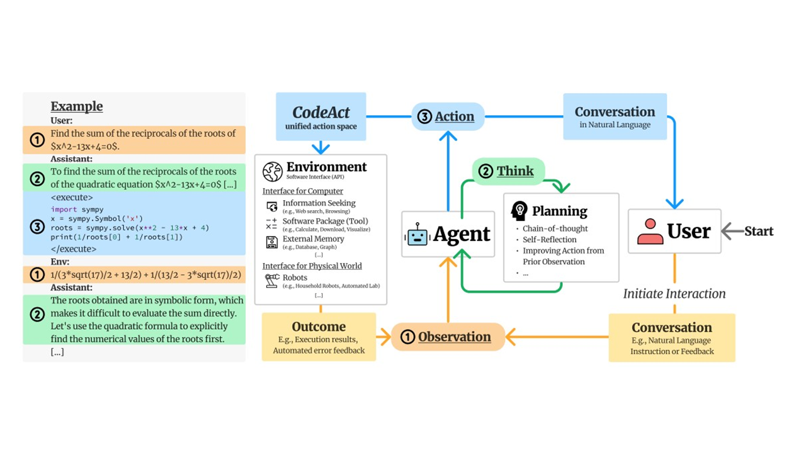
**Ejemplo de uso del patrón CodeAgent**
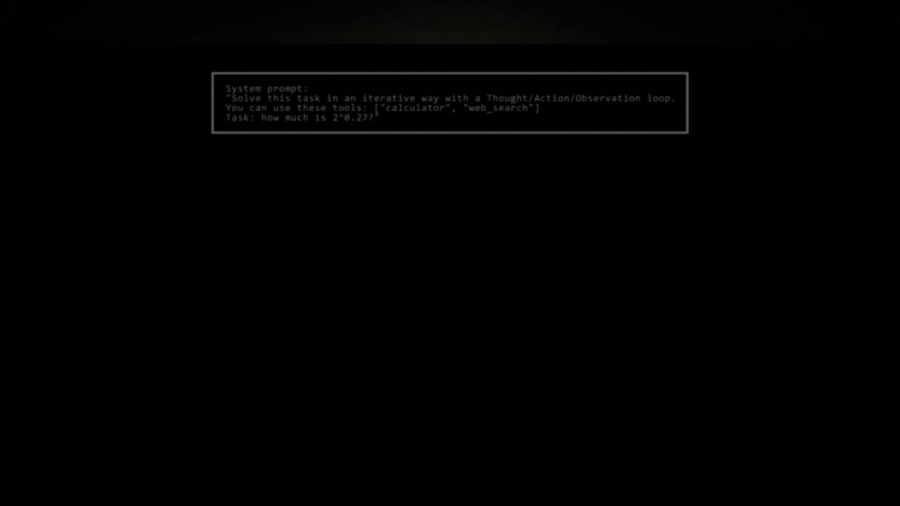

### 1️⃣ Por qué usar smolagents

**`smolagents`** es uno de los muchos frameworks de agentes de código abierto disponibles para el desarrollo de aplicaciones. Las opciones alternativas incluyen **`LlamaIndex`** y **`LangGraph`**. **`smolagents`** ofrece varias características clave que podrían hacerlo una gran opción para casos de uso específicos, pero siempre debemos considerar todas las opciones al seleccionar un framework. 

### 2️⃣ Agentes de código

Los **`CodeAgents` (Agentes de Código)** son el tipo principal de agente en **`smolagents`**. En lugar de generar JSON o texto, estos agentes producen código Python para realizar acciones. 

### 3️⃣ Agentes de llamada a herramientas (tools)

Los **`ToolCallingAgents` (Agentes de Llamada a Herramientas)** son el segundo tipo de agente soportado por **`smolagents`**. A diferencia de los **`CodeAgents`**, que generan código Python, estos agentes dependen de bloques JSON/texto que el sistema debe analizar e interpretar para ejecutar acciones. 

### 4️⃣ Herramientas (tools)

Como vimos en sesiones anteriores, las herramientas son funciones que un LLM puede usar dentro de un sistema de agentes, y actúan como los bloques de construcción esenciales para el comportamiento del agente. Veremos cómo crear herramientas, su estructura y diferentes métodos de implementación usando la clase **`Tool`** o el decorador **`@tool`**. 

### 5️⃣ Agentes de Recuperación (RAG)

Los agentes de recuperación permiten a los modelos acceder a bases de conocimiento, haciendo posible buscar, sintetizar y recuperar información de múltiples fuentes. Aprovechan los almacenes vectoriales para una recuperación eficiente e implementan patrones de **Generación Aumentada por Recuperación (RAG)**. Estos agentes son particularmente útiles para integrar la búsqueda web con bases de conocimiento personalizadas mientras mantienen el contexto de la conversación a través de sistemas de memoria. Este módulo explora estrategias de implementación, incluyendo mecanismos de respaldo para una recuperación de información robusta.

### 6️⃣ Sistemas Multi-Agente

Orquestar múltiples agentes de manera efectiva es crucial para construir sistemas multi-agente potentes. Al combinar agentes con diferentes capacidades—como un agente de búsqueda web con un agente de ejecución de código—puedes crear soluciones más sofisticadas. 

### 7️⃣ Agentes de Visión y Navegador

Los agentes de visión extienden las capacidades tradicionales de los agentes al incorporar **Modelos de Visión-Lenguaje (VLMs)**, permitiéndoles procesar e interpretar información visual. Es posible diseñar e integrar agentes potenciados por VLM, desbloqueando funcionalidades avanzadas como razonamiento basado en imágenes, análisis de datos visuales e interacciones multimodales. También se pueden usar agentes de visión para construir un agente de navegador que pueda navegar por la web y extraer información de ella.

# ¿Por qué usar smolagents?

## ¿Qué es `smolagents`?

**`smolagents`** es un **framework simple** pero potente para construir agentes de IA. Proporciona a los LLMs la _capacidad de acción_ para interactuar con el mundo real, como buscar o generar imágenes.

Como vimos anteriormente, los agentes de IA son programas que utilizan LLMs para generar **pensamientos** basados en **observaciones** para realizar **acciones**. 

### Ventajas clave de `smolagents`
- **Simplicidad:** Mínima complejidad de código y abstracciones, para hacer que el framework sea fácil de entender, adoptar y extender
- **Soporte flexible para LLM:** Funciona con cualquier LLM a través de la integración con herramientas de Hugging Face y APIs externas
- **Enfoque centrado en el código:** Soporte para **Agentes de Código** que escriben sus acciones directamente en código, eliminando la necesidad de análisis y simplificando la llamada a herramientas
- **Integración con HF Hub:** Integración perfecta con Hugging Face Hub, permitiendo el uso de **Espacios Gradio** como herramientas

### ¿Cuándo usar smolagents?

**`smolagents`** es ideal cuando:

* Necesitas una **solución ligera y mínima.**
* Quieres **experimentar rápidamente** sin configuraciones complejas.
* La **lógica de tu aplicación es sencilla.**

### Acciones de Código vs. JSON
A diferencia de otros frameworks donde los agentes escriben acciones en JSON, `smolagents` **se centra en llamadas a herramientas en código**, simplificando el proceso de ejecución. Esto se debe a que no hay necesidad de analizar el JSON para construir código que llame a las herramientas: la salida puede ejecutarse directamente.

El siguiente diagrama ilustra esta diferencia:


### Tipos de Agentes en `smolagents`

Los agentes en **`smolagents`** operan como **agentes de múltiples pasos**.

Cada **[`MultiStepAgent`](https://huggingface.co/docs/smolagents/main/en/reference/agents#smolagents.MultiStepAgent)** realiza:
- Un pensamiento
- Una llamada a herramienta y ejecución

Además de usar **[CodeAgent](https://huggingface.co/docs/smolagents/main/en/reference/agents#smolagents.CodeAgent)** como el tipo principal de agente, smolagents también soporta **[ToolCallingAgent](https://huggingface.co/docs/smolagents/main/en/reference/agents#smolagents.ToolCallingAgent)**, que escribe llamadas a herramientas en JSON.

> En smolagents, las herramientas se definen usando el decorador @tool que envuelve una función de Python o la clase Tool.

### Integración de Modelos en `smolagents`
`smolagents` soporta una integración flexible de LLM, permitiéndote usar cualquier modelo invocable que cumpla con [ciertos criterios](https://huggingface.co/docs/smolagents/main/en/reference/models). El framework proporciona varias clases predefinidas para simplificar las conexiones de modelos:

- **[TransformersModel](https://huggingface.co/docs/smolagents/main/en/reference/models#smolagents.TransformersModel):** Implementa un pipeline local de `transformers` para una integración perfecta.
- **[InferenceClientModel](https://huggingface.co/docs/smolagents/main/en/reference/models#smolagents.InferenceClientModel):** Soporta llamadas de [inferencia sin servidor](https://huggingface.co/docs/huggingface_hub/main/en/guides/inference) a través de la [infraestructura de Hugging Face](https://huggingface.co/docs/api-inference/index), o a través de un número creciente de [proveedores de inferencia de terceros](https://huggingface.co/docs/huggingface_hub/main/en/guides/inference#supported-providers-and-tasks).
- **[LiteLLMModel](https://huggingface.co/docs/smolagents/main/en/reference/models#smolagents.LiteLLMModel):** Aprovecha [LiteLLM](https://www.litellm.ai/) para interacciones ligeras con modelos.
- **[OpenAIServerModel](https://huggingface.co/docs/smolagents/main/en/reference/models#smolagents.OpenAIServerModel):** Se conecta a cualquier servicio que ofrezca una interfaz de API de OpenAI.
- **[AzureOpenAIServerModel](https://huggingface.co/docs/smolagents/main/en/reference/models#smolagents.AzureOpenAIServerModel):** Soporta la integración con cualquier despliegue de Azure OpenAI.

Esta flexibilidad asegura que los desarrolladores puedan elegir el modelo y servicio más adecuados para sus casos de uso específicos, y permite una fácil experimentación.

# Construcción de agentes que usan código

Los agentes de código son el tipo de agente predeterminado en **`smolagents`**. Generan llamadas a herramientas en Python para realizar acciones, logrando representaciones de acciones que son eficientes, expresivas y precisas.

Su enfoque simplificado reduce el número de acciones requeridas, simplifica operaciones complejas y permite la reutilización de funciones de código existentes. **`smolagents`** proporciona un framework ligero para construir agentes de código, implementado en aproximadamente 1,000 líneas de código.


Gráfico del artículo [Executable Code Actions Elicit Better LLM Agents](https://huggingface.co/papers/2402.01030)

## ¿Por qué Agentes de Código?

En un proceso de agente de múltiples pasos, el LLM escribe y ejecuta acciones, típicamente involucrando llamadas a herramientas externas. Los enfoques tradicionales utilizan un formato JSON para especificar nombres de herramientas y argumentos como cadenas de texto, **que el sistema debe analizar para determinar qué herramienta ejecutar**.

Sin embargo, la investigación muestra que **los LLMs que llaman a herramientas funcionan más efectivamente con código directamente**. Este es un principio fundamental de **`smolagents`**, como se muestra en el diagrama anterior del artículo [Executable Code Actions Elicit Better LLM Agents](https://huggingface.co/papers/2402.01030).

Escribir acciones en código en lugar de JSON ofrece varias ventajas clave:

* **Componibilidad**: Combinar y reutilizar acciones fácilmente
* **Gestión de Objetos**: Trabajar directamente con estructuras complejas como imágenes
* **Generalidad**: Expresar cualquier tarea computacionalmente posible
* **Natural para LLMs**: Código de alta calidad ya está presente en los datos de entrenamiento de LLMs

## ¿Cómo funciona un agente de código?


El diagrama anterior ilustra cómo funciona **`CodeAgent.run()`**, siguiendo el marco **ReAct** mencionado anteriormente. La abstracción principal para agentes en **`smolagents`** es un **`MultiStepAgent`**, que sirve como el bloque de construcción central. **`CodeAgent`** es un tipo especial de **`MultiStepAgent`**, como veremos en un ejemplo a continuación.

Un **`CodeAgent`** realiza acciones a través de un **ciclo de pasos, con variables y conocimientos existentes** incorporados en el contexto del agente, que se mantiene en un registro de ejecución:

1. El prompt del sistema se almacena en un **`SystemPromptStep`**, y la consulta del usuario se registra en un **`TaskStep`**.

2. Luego, se ejecuta el siguiente bucle while:

    2.1 El método **`agent.write_memory_to_messages()`** escribe los registros del agente en una lista de [mensajes de chat](https://huggingface.co/docs/transformers/en/chat_templating) legibles por el LLM.
    
    2.2 Estos mensajes se envían a un **`Model`**, que genera una finalización.
    
    2.3 La finalización se analiza para extraer la acción, que, en nuestro caso, debería ser un fragmento de código ya que estamos trabajando con un **`CodeAgent`**.
    
    2.4 La acción se ejecuta.
    
    2.5 Los resultados se registran en la memoria en un **`ActionStep`**.

Al final de cada paso, si el agente incluye alguna llamada a función (en **`agent.step_callback`**), estas se ejecutan.

**Ejemplo de uso del patrón CodeAgent**


## Veamos algunos ejemplos

# Actividad guiada: primer agente con herramientas usando smolagents, Ollama y Chainlit

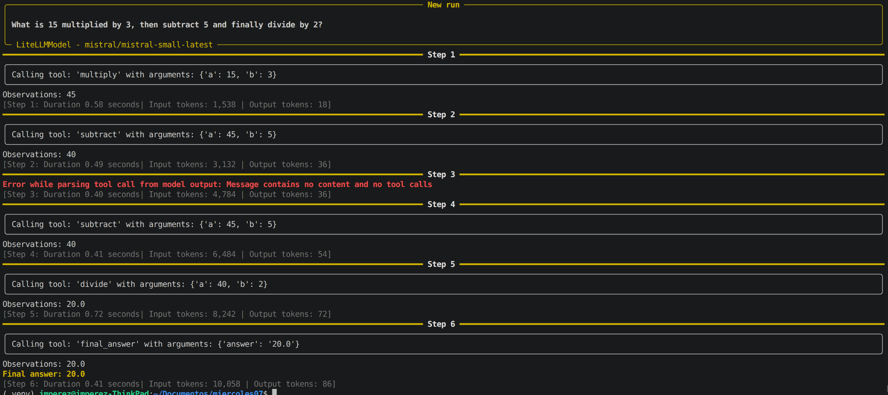

Esta actividad guiada introduce la creación de un agente con herramientas en **`smolagents`**, conectado a un modelo Mistral AI y con una interfaz conversacional sencilla en Chainlit. El objetivo es entender cómo un **modelo de lenguaje LLM** decide qué función **Python** ejecutar para resolver una tarea **expresada en lenguaje natural**.

## Objetivos didácticos

- Identificar qué papel cumplen **`@tool`**, **`ToolCallingAgent`** y **`LiteLLMModel`** en una arquitectura básica de agentes.
- Crear herramientas propias en Python para que un agente pueda utilizarlas.
- Conectar **`smolagents`** con un modelo local ejecutado en Ollama mediante LiteLLM.
- Crear una interfaz conversacional básica con **`Chainlit`** para interactuar con el agente desde el navegador.

## Instalación

Instalar las librerías necesarias con `pip`:

```bash
pip install smolagents[litellm] chainlit mistralai dotenv
```

Configurar la clave de API de Mistral AI en un fichero **`.env`**:

```text
MISTRAL_API_KEY="tu_clave_api"
```

## Verificación opcional de la clave API

Antes de usar `smolagents`, puede resultar útil comprobar que la clave funciona correctamente con el cliente oficial de Mistral AI. El patrón de uso recomendado por la librería es similar a este:

```python
from mistralai import Mistral
import os

mai_client = Mistral(api_key=os.getenv("MISTRAL_API_KEY", "").strip())
models = mai_client.models.list()
print(models)
```

La documentación de **`smolagents`** recoge el uso de **LiteLLM** para conectar con **distintos proveedores y motores de inferencia**, y Gradio ofrece una forma rápida de construir interfaces web para probar funciones o modelos.


## Código base del ejercicio

```python
import os
from mistralai import Mistral
from smolagents import tool
from smolagents import ToolCallingAgent
from smolagents import LiteLLMModel

mai_client = Mistral(api_key=os.getenv("MISTRAL_API_KEY", "").strip())

# declaramos las herramientas que va a usar el agente
@tool
def add(a: float, b: float) -> float:
    """
    Adds two numbers together.
    
    Args:
        a (float): The first number.
        b (float): The second number.
    """
    return a + b


@tool
def subtract(a: float, b: float) -> float:
    """
    Subtracts the second number from the first.
    
    Args:
        a (float): The first number.
        b (float): The second number.
    """
    return a - b


@tool
def multiply(a: float, b: float) -> float:
    """
    Multiplies two numbers together.
    
    Args:
        a (float): The first number.
        b (float): The second number.
    """
    return a * b


@tool
def divide(a: float, b: float) -> float | str:
    """
    Divides the first number by the second. Returns an error message if division by zero is attempted.
    
    Args:
        a (float): The first number.
        b (float): The second number.
    """
    if b == 0:
        return "Error: Division by zero is not allowed."
    return a / b

# instanciamos el LLM que vamos a utilizar

model = LiteLLMModel(
    model_id="mistral/mistral-large-latest", #formato proveedor/modelo
    api_key=os.getenv("MISTRAL_API_KEY", "").strip(),
    temperature=0.2,
)

# instanciamos el agente con las herramientas declaradas
agent = ToolCallingAgent(
    model=model,
    tools=[add, subtract, multiply, divide]
)

# ejemplo de uso
agent.run("What is 15 multiplied by 3, then subtract 5 and finally divide by 2?")
```
LiteLLM documenta el uso de modelos Mistral con identificadores del tipo `mistral/mistral-large-latest` y autenticación mediante `MISTRAL_API_KEY`. `smolagents` también documenta `LiteLLMModel` como la vía estándar para usar proveedores externos como OpenAI, Anthropic o similares, y ese patrón encaja con Mistral AI.

## Desarrollo paso a paso

### Paso 1. Importar las librerías necesarias

```python
import os
from mistralai import Mistral
from smolagents import tool
from smolagents import ToolCallingAgent
from smolagents import LiteLLMModel
```

Aquí se importan tres grupos de elementos: utilidades del sistema para leer variables de entorno, el cliente oficial de Mistral AI y los componentes de `smolagents`. Esto permite explicar al alumnado la diferencia entre una librería de proveedor, que sirve para autenticar o probar la API, y una librería de agentes, que organiza tools, prompts y llamadas al modelo.

### Paso 2. Crear el cliente de Mistral AI

```python
mai_client = Mistral(api_key=os.getenv("MISTRAL_API_KEY", "").strip())
```

Esta línea crea un cliente oficial de Mistral AI utilizando la clave guardada en la variable de entorno `MISTRAL_API_KEY`.[cite:135] Aunque el agente funcionará a través de `LiteLLMModel`, mantener esta línea en la actividad es útil para que el alumnado vea claramente cómo se gestiona la autenticación con un proveedor real.

### Paso 3. Crear herramientas matemáticas con `@tool`

```python
@tool
def add(a: float, b: float) -> float:
    """Adds two numbers together."""
    return a + b

@tool
def subtract(a: float, b: float) -> float:
    """Subtracts the second number from the first."""
    return a - b

@tool
def multiply(a: float, b: float) -> float:
    """Multiplies two numbers together."""
    return a * b

@tool
def divide(a: float, b: float) -> float | str:
    """Divides the first number by the second."""
    if b == 0:
        return "Error: Division by zero is not allowed."
    return a / b
```

El decorador `@tool` transforma una función Python en una herramienta interpretable por el agente, apoyándose en el nombre, los tipos y el docstring para describir su uso. Esto permite que el modelo no tenga que “imaginar” cómo sumar, restar o dividir, sino que pueda invocar funciones reales ya implementadas en Python.

Las cuatro herramientas del ejercicio son:

- `add(a, b)`: suma dos números.
- `subtract(a, b)`: resta el segundo número al primero.
- `multiply(a, b)`: multiplica dos números.
- `divide(a, b)`: divide y además controla el caso de división entre cero devolviendo un mensaje de error.

### Paso 4. Configurar el modelo de Mistral AI en `LiteLLMModel`

```python
model = LiteLLMModel(
    model_id="mistral/mistral-large-latest",
    api_key=os.getenv("MISTRAL_API_KEY", "").strip(),
    temperature=0.2,
)
```

LiteLLM documenta la integración con Mistral AI usando modelos como `mistral/mistral-large-latest` y autenticación con `MISTRAL_API_KEY`. El parámetro `temperature=0.2` ayuda a reducir la aleatoriedad, algo conveniente cuando interesa que el agente elija herramientas matemáticas de forma consistente.

### Paso 5. Crear el agente con las herramientas disponibles

```python
agent = ToolCallingAgent(
    model=model,
    tools=[add, subtract, multiply, divide]
)
```

`ToolCallingAgent` es un agente que decide cuándo llamar a una tool y con qué argumentos a partir del prompt recibido. La lista `tools=[...]` delimita las capacidades del agente: si una función no está en esa lista, el agente no podrá usarla.

### Paso 6. Ejecutar una consulta en lenguaje natural

```python
result = agent.run("What is 15 multiplied by 3, then subtract 5 and finally divide by 2?")
print(result)
```

En esta llamada el usuario no expresa la operación en sintaxis matemática tradicional, sino en lenguaje natural. El agente interpreta la secuencia de pasos, llama previsiblemente a `multiply`, luego a `subtract` y finalmente a `divide`, encadenando resultados parciales hasta construir la respuesta final.

## Explicación:

Este ejercicio muestra que **un agente no es solo un chatbot, sino un sistema que combina comprensión del lenguaje con ejecución de herramientas concretas**. La idea clave es que el modelo elige la acción, pero el cálculo real lo hace Python mediante funciones bien definidas y controladas.

Una forma útil de explicarlo en clase es con esta secuencia:

1. El usuario escribe una petición en lenguaje natural.
2. El modelo analiza la intención y decide qué tool necesita.
3. El agente ejecuta la función Python correspondiente con argumentos concretos.
4. El resultado de una herramienta puede servir como entrada para la siguiente.
5. Finalmente, el agente devuelve una respuesta final al usuario.

## Script completo comentado

```python
import os
from mistralai import Mistral
from smolagents import tool
from smolagents import ToolCallingAgent
from smolagents import LiteLLMModel

# Paso 1: Creamos un cliente del proveedor para comprobar autenticación o listar modelos.
mai_client = Mistral(api_key=os.getenv("MISTRAL_API_KEY", "").strip())

# Paso 2: Definimos las herramientas matemáticas que el agente podrá usar.
@tool
def add(a: float, b: float) -> float:
    """
    Adds two numbers together.
    """
    return a + b


@tool
def subtract(a: float, b: float) -> float:
    """
    Subtracts the second number from the first.
    """
    return a - b


@tool
def multiply(a: float, b: float) -> float:
    """
    Multiplies two numbers together.
    """
    return a * b


@tool
def divide(a: float, b: float) -> float | str:
    """
    Divides the first number by the second.
    Returns an error message if division by zero is attempted.
    """
    if b == 0:
        return "Error: Division by zero is not allowed."
    return a / b

# Paso 3: Conectamos con el modelo remoto de Mistral AI.
model = LiteLLMModel(
    model_id="mistral/mistral-large-latest",
    api_key=os.getenv("MISTRAL_API_KEY", "").strip(),
    temperature=0.2,
)

# Paso 4: Creamos el agente y le damos acceso a las herramientas anteriores.
agent = ToolCallingAgent(
    model=model,
    tools=[add, subtract, multiply, divide]
)

# Paso 5: Lanzamos una consulta de prueba.
result = agent.run("What is 15 multiplied by 3, then subtract 5 and finally divide by 2?")
print(result)
```

### ¿Por qué usamos `tools` si el LLM puede crear código Python para ejecutar la petición "What is 15 multiplied by 3, then subtract 5 and finally divide by 2?"

El ejemplo de la calculadora parece trivial precisamente porque Python ya puede ejecutar esa operación directamente, pero ese es el punto pedagógico: **las tools no son para hacer cosas que el LLM ya puede hacer, sino para establecer una arquitectura escalable a problemas reales**.

Veamos qué pasa usando **`CodeAgent`** en vez de **`ToolCallingAgent`**:

```python
from smolagents import CodeAgent, tool
from smolagents import LiteLLMModel
import os

MISTRAL_API_KEY = os.getenv("MISTRAL_API_KEY", "").strip()
# instanciamos el LLM que vamos a utilizar
# en nuestro caso uso de Ollama
model = LiteLLMModel(
    model_id="mistral/mistral-small-latest",
    api_key=MISTRAL_API_KEY,
    temperature=0.2,
)
# instanciamos el agente con las herramientas declaradas
# verbosity_level=2 para que nos muestre el proceso de pensamiento del agente
agent = CodeAgent(tools=[], model=model, verbosity_level=2)

# ejemplo de uso
agent.run("What is 15 multiplied by 3, then subtract 5 and finally divide by 2?")
```
**Ejemplo de ejecución:**
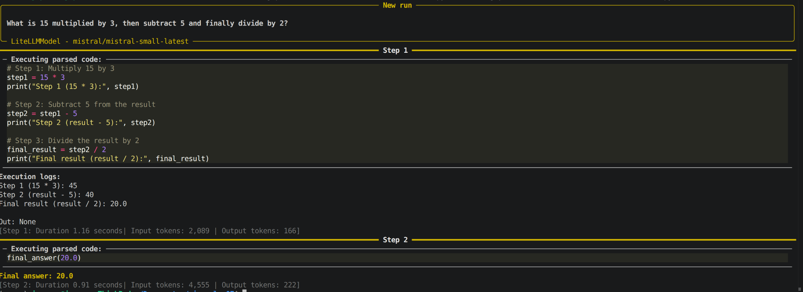

> **NOTA**: Prueba varias ejecuciones porque suelen cambiar los pasos en cada ejecución

**Nivel de Log**
```
verbosity-level = 2
```
Son niveles de log/registro:
* 0: Sin logs (silencioso).
* 1: Predeterminado. Muestra los pasos generales.
* 2: Detallado. Muestra logs detallados, incluyendo los resultados del modelo y los pasos internos.

## Por qué usar tools en este caso específico

### 1. Didáctica: aprender con un caso simple antes de escalar

El ejercicio de la calculadora es **intencionalmente sencillo** para entiender el mecanismo de **`tools`** sin distraernos con lógica de negocio compleja. Los LLMs pueden generar código Python para calcular `(15 * 3 - 5) / 2`, pero si empezáramos la explicación con herramientas como **"buscar en una base de datos SQL", "llamar a una API externa" o "procesar un CSV con pandas"**, tendríamos que abordar/aprender simultáneamente 3 cosas: 
* cómo funciona el agente
* cómo funciona la tool compleja
* y cómo se integran.

### 2. Control y validación

Con **`tools`**, el programador **controla explícitamente qué puede hacer el agente**. Si el modelo genera código Python arbitrario, podría:

- Hacer cálculos incorrectos por alucinación,
- Ejecutar código inseguro (borrar archivos, hacer peticiones de red no autorizadas),
- Fallar silenciosamente sin que el sistema pueda capturar el error de forma estructurada.

Con `@tool`, cada operación está **definida, testeada y acotada**.

### 3. Separación de responsabilidades

El modelo decide **qué** hacer (multiplicar primero, luego restar, finalmente dividir), pero el cálculo real lo hace Python mediante funciones probadas. Esta arquitectura escala mejor: mañana puedes cambiar `add(a, b)` para que registre cada suma en una base de datos, sin tocar el agente ni el modelo.

### 4. Diferencia entre "generar código" y "ejecutar herramientas"

Un LLM puede **generar** código Python para sumar, pero:

- ese código puede tener errores sintácticos o lógicos,
- no está validado ni testeado,
- cada vez que el modelo genera código, hay un riesgo de variabilidad (a veces usa `+`, otras veces `sum()`, otras construye un bucle innecesario).

Con tools, el código de `add(a, b)` es **el mismo siempre**, probado una vez y reutilizado miles.

## Cuándo SÍ tiene sentido usar `CodeAgent` en lugar de `ToolCallingAgent`

**`smolagents`** ofrece `CodeAgent`, que precisamente genera y ejecuta código Python dinámicamente para resolver tareas. Ese enfoque es útil cuando:

- la tarea es exploratoria y no sabemos de antemano qué tools necesitaremos,
- necesitamos flexibilidad total (manipular DataFrames, crear gráficos, procesar archivos),
- confiamos en el modelo y tenemos un entorno de ejecución controlado (sandbox).

Pero para **producción**, herramientas explícitas (`ToolCallingAgent` + `@tool`) son **más seguras, predecibles y mantenibles**.

## Ejemplo real

Imagina que en lugar de calcular `(15 * 3 - 5) / 2`, el agente debe:

1. Consultar el precio de un producto en una base de datos SQL.
2. Aplicar un descuento del 15% si el usuario es premium (consultando otra tabla).
3. Añadir IVA según el país del usuario (reglas fiscales complejas).
4. Formatear el precio final con la moneda correcta.

**Con `CodeAgent` generando código dinámico:**

- El modelo podría alucinar una consulta SQL incorrecta.
- Podría aplicar el IVA antes del descuento (error lógico).
- Podría formatear mal la moneda.

**Con `ToolCallingAgent` + tools específicas:**

```python
@tool
def get_product_price(product_id: int) -> float:
    """Consulta el precio base en la BD."""
    return db.query("SELECT price FROM products WHERE id = ?", product_id)

@tool
def apply_discount(price: float, is_premium: bool) -> float:
    """Aplica descuento si el usuario es premium."""
    return price * 0.85 if is_premium else price

@tool
def add_tax(price: float, country: str) -> float:
    """Añade IVA según país."""
    tax_rates = {"ES": 1.21, "FR": 1.20, "DE": 1.19}
    return price * tax_rates.get(country, 1.0)

@tool
def format_currency(amount: float, country: str) -> str:
    """Formatea con la moneda correcta."""
    currencies = {"ES": "€", "FR": "€", "DE": "€"}
    return f"{amount:.2f} {currencies.get(country, '$')}"
```

Cada función está **probada, documentada y es reutilizable**. El modelo solo decide el orden de llamada, pero la lógica de negocio está controlada por el programador.

## Resumen

| Aspecto | LLM genera código | ToolCallingAgent + @tool |
| :-- | :-- | :-- |
| **Simplicidad inicial** | Más rápido para prototipos | Requiere definir tools |
| **Control** | Bajo (código impredecible) | Alto (funciones fijas) |
| **Seguridad** | Riesgo de código arbitrario | Solo ejecuta lo permitido |
| **Testabilidad** | Difícil (código varía) | Fácil (tools testeables) |
| **Mantenibilidad** | Baja (cambios en prompts) | Alta (cambios en código) |
| **Escalabilidad** | Limitada | Excelente |

La calculadora es un **ejercicio pedagógico**: usa un caso trivial para enseñar una arquitectura que luego escala a casos reales (APIs, bases de datos, procesamiento de archivos, llamadas a servicios externos).

> Analogía: **usar un LLM para generar código Python para sumar es como pedirle a ChatGPT que escriba una función `suma(a, b)` cada vez que necesitas sumar, en lugar de tener la función ya definida y simplemente llamarla**.


## Ejecución con Chainlit

Chainlit permite construir una interfaz conversacional en Python mediante decoradores como `@cl.on_message`, que se ejecuta cada vez que el usuario envía un mensaje. La propia documentación muestra que una aplicación Chainlit básica se ejecuta con `chainlit run app.py -w`, donde `-w` activa el modo watch para recargar cambios automáticamente.

### Archivo `app.py`

```python
import os
import chainlit as cl
from mistralai.client import Mistral
from smolagents import tool, ToolCallingAgent, LiteLLMModel

mai_client = Mistral(api_key=os.getenv("MISTRAL_API_KEY", "").strip())

@tool
def add(a: float, b: float) -> float:
    """
    Adds two numbers together.

    Args:
        a: The first number.
        b: The second number.

    Returns:
        The sum of the two numbers.
    """
    return a + b


@tool
def subtract(a: float, b: float) -> float:
    """
    Subtracts the second number from the first.

    Args:
        a: The first number.
        b: The second number.

    Returns:
        The result of subtracting b from a.
    """
    return a - b


@tool
def multiply(a: float, b: float) -> float:
    """
    Multiplies two numbers together.

    Args:
        a: The first number.
        b: The second number.

    Returns:
        The product of the two numbers.
    """
    return a * b


@tool
def divide(a: float, b: float) -> float | str:
    """
    Divides the first number by the second.

    Args:
        a: The numerator.
        b: The denominator.

    Returns:
        The quotient, or an error message if b is zero.
    """
    if b == 0:
        return "Error: Division by zero is not allowed."
    return a / b


model = LiteLLMModel(
    model_id="mistral/mistral-large-latest",
    api_key=os.getenv("MISTRAL_API_KEY", "").strip(),
    temperature=0.2,
)

agent = ToolCallingAgent(
    model=model,
    tools=[add, subtract, multiply, divide],
    verbosity_level=2
)

@cl.on_chat_start
async def start():
    await cl.Message(
        content="Hola. Soy un agente con herramientas matemáticas y uso un modelo de Mistral AI. Escribe una operación en lenguaje natural."
    ).send()

def run_agent_sync(user_input: str):
    return agent.run(user_input)

@cl.on_message
async def main(message: cl.Message):
    thinking = cl.Message(content="Pensando...")
    await thinking.send()

    try:
        result = await cl.make_async(run_agent_sync)(message.content)
        thinking.content = str(result)
        await thinking.update()
    except Exception as e:
        thinking.content = f"Error: {type(e).__name__}: {e}"
        await thinking.update()
```
### Explicación

#### Función síncrona separada
```python
def run_agent_sync(user_input: str):
    return agent.run(user_input)
```
Esta función encapsula la llamada síncrona al agente. Se separa así porque luego Chainlit puede envolverla con **`cl.make_async(...)`** para ejecutarla sin bloquear la UI del chat.

**Aunque parece una función trivial, tiene valor estructural: desacopla el trabajo pesado del manejador asíncrono de mensajes**

#### Mensaje “Pensando...”
```python
thinking = cl.Message(content="Pensando...")
await thinking.send()
```
Aquí se crea un mensaje provisional para indicar al usuario que el sistema está procesando su petición. Esto mejora la experiencia de uso porque evita la sensación de que la app se ha quedado colgada mientras el agente llama al modelo o a las tools.

#### Ejecución no bloqueante
```python
result = await cl.make_async(run_agent_sync)(message.content)
```
**Esta es una de las líneas más importantes**. **`agent.run(...)`** es **síncrono**, así que si lo llamamos directamente dentro de **`async def main(...)`**, puedes bloquear el bucle de eventos de Chainlit y la interfaz puede no actualizarse correctamente.

**`cl.make_async(run_agent_sync)`** convierte esa función síncrona en una llamada compatible con el flujo asíncrono de Chainlit. Después se invoca con (message.content), es decir, con el texto que el usuario ha enviado.

#### Actualización del mensaje con el resultado
```python
thinking.content = str(result)
await thinking.update()
```
En lugar de crear un mensaje nuevo, aquí se reutiliza el mensaje "Pensando..." y se sustituye su contenido por la respuesta final del agente. La documentación de Chainlit muestra precisamente ese patrón: **`send()`** primero y **`update()`** después para modificar un mensaje ya renderizado.

Esto da una experiencia más limpia porque la misma burbuja cambia de “estado de espera” a “respuesta final”.

#### Manejo de errores
```python
except Exception as e:
    thinking.content = f"Error: {type(e).__name__}: {e}"
    await thinking.update()
```
Si algo falla durante la ejecución del agente, el error no se pierde silenciosamente. En su lugar, el contenido del mensaje provisional se reemplaza por una descripción del fallo, incluyendo el tipo de excepción y su texto.

Esto es muy útil en desarrollo y en clase, porque permite ver directamente en la interfaz si el problema viene de la **API, del modelo, de una tool o de la configuración**.

#### Flujo completo
El recorrido completo sería este:

1. Chainlit arranca el chat y ejecuta **`on_chat_start`**, mostrando el mensaje inicial.
2. El usuario escribe una operación en lenguaje natural.
3. **`on_message`** recibe ese texto y muestra "Pensando...".
4. **`Chainlit`** ejecuta el agente de forma **no bloqueante** con **`make_async`**.
5. **`ToolCallingAgent`** usa el modelo para decidir qué herramientas llamar y en qué orden.
6. El resultado final reemplaza el mensaje provisional con **`update()`**.
7. Si algo falla, también se actualiza ese mismo mensaje, pero mostrando el error.

### Ejecución

Guardar el código anterior en un archivo llamado `app.py` y ejecutar en la terminal:

```bash
chainlit run app.py -w
```
**Log**
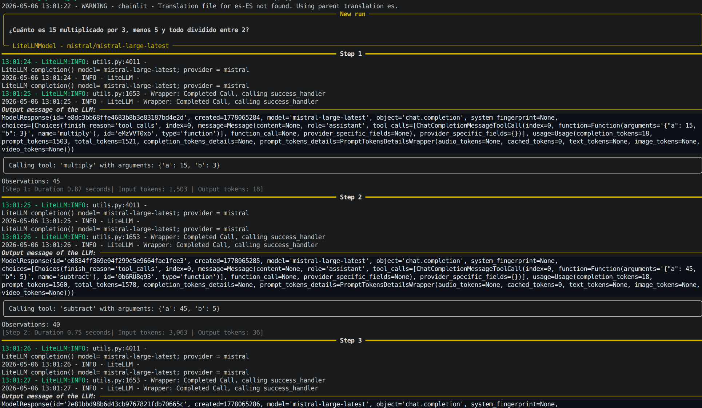

**Chat de chainlit**
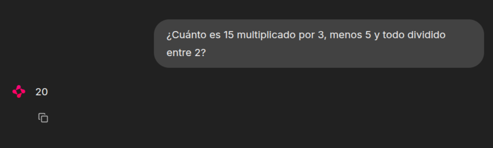

## Propuesta de actividades de ampliación

Las siguientes extensiones permiten reforzar el aprendizaje y comprobar si el alumnado ha entendido la arquitectura de tools y el uso de un proveedor externo.

- Añadir una herramienta **`power(a, b)`** para calcular potencias y realizar varias pruebas de ejecución.
- Añadir una herramienta **`mod(a, b)`** para calcular restos.
- Añadir una herramienta **`mcd(lista de numeros)`** o **`mcm(lista de numeros)`** para calcular el **m.c.m** o el **m.c.d** de varios números.
- Pedir consultas en castellano en lugar de inglés y comparar resultados.

## El agente Alfred 

Alfred está planeando una fiesta en la mansión de la familia Wayne y necesita tu ayuda para asegurarse de que todo salga bien. Para ayudarlo, aplicaremos lo que hemos aprendido sobre cómo opera un `CodeAgent` de múltiples pasos.


Instalamos `smolagents` dede el siguiente comando:

```bash
pip install smolagents -U
```
También debemos iniciar sesión en el ***Hugging Face Hub*** para tener acceso a la API de Inferencia **`Serverless`**.

**login_hf.py**
```python
from huggingface_hub import login

login()
```

Prueba sencilla de funcionamiento:

```python
from huggingface_hub import InferenceClient

client = InferenceClient(model="google/gemma-7b") # O el modelo que prefieras
response = client.text_generation("Hola, ¿cómo estás?")
print(response)

```
### Seleccionando una lista de reproducción para la fiesta usando `smolagents`

¡La música es una parte esencial de una fiesta exitosa! Alfred necesita ayuda para seleccionar la lista de reproducción. Por suerte, ¡**`smolagents`** nos tiene cubiertos! Podemos construir un agente capaz de buscar en la web usando DuckDuckGo. Para dar al agente acceso a esta herramienta, la incluimos en la lista de herramientas al crear el agente.


Para el modelo, confiaremos en **`InferenceClientModel`**, que proporciona acceso a la [API de Inferencia Serverless](https://huggingface.co/docs/api-inference/index) de Hugging Face. El modelo predeterminado es `"Qwen/Qwen2.5-Coder-32B-Instruct"`, que es eficiente y está disponible para inferencia rápida, pero puedes seleccionar cualquier modelo compatible del Hub.

Para poder utilizar la herrameinta (tool) **`DuckDuckGoSearchTool`** (herramienta que utiliza **DuckDuckGo** para realizar búsquedas. Permite a los agentes aprovechar su motor de búsqueda para recuperar información y además no requiere una clave API) necesitamos instalar la librería ddgs (DuckDuckGoSearch):

```bash
pip install ddgs
```
Un vez instalado, ejecutar un agente es bastante sencillo:

```python
from smolagents import CodeAgent, DuckDuckGoSearchTool, InferenceClientModel

agent = CodeAgent(tools=[DuckDuckGoSearchTool()], model=InferenceClientModel(), verbosity_level=2)

agent.run("Busca las mejores recomendaciones de música para una fiesta en la mansión de los Wayne.")
```

Cuando ejecutamos este ejemplo, la salida **mostrará un seguimiento de los pasos del flujo de trabajo siendo ejecutados**. También imprimirá el código Python correspondiente con el mensaje:

```python
 ─ Ejecutando código analizado: ──────────────────────────────────────────────────────────────────────────────────── 
  results = web_search(query="mejor música para una fiesta de Batman")                                                      
  print(results)                                                                                                   
 ───────────────────────────────────────────────────────────────────────────────────────────────────────────────── 
```
**Ejecución del paso 1 del *Agente Alfred***
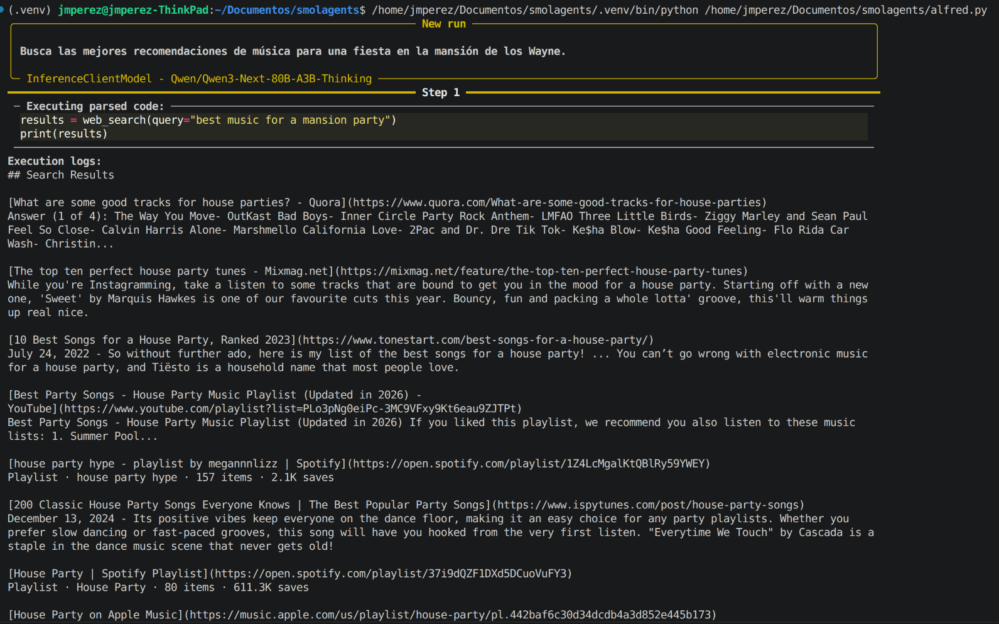
**Ejecución del paso 2 del *Agente Alfred***
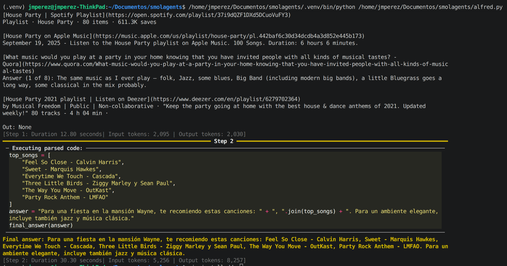

Después de algunos pasos, veremos la lista de reproducción generada que Alfred puede usar para la fiesta🎵

### Usando una herramienta personalizada para preparar el menú


Ahora que hemos seleccionado una lista de reproducción, necesitamos organizar el menú para los invitados. De nuevo, Alfred puede aprovechar **`smolagents`** para hacerlo. Aquí, usamos el decorador **`@tool`** para definir una función personalizada que actúa como herramienta. Cubriremos la creación de herramientas con más detalle más adelante, así que por ahora, simplemente podemos ejecutar el código.

Como podemos ver en el siguiente ejemplo, crearemos una herramienta usando el decorador **`@tool`** y la incluiremos en la lista de **`tools`**.

```python
from smolagents import CodeAgent, tool, InferenceClientModel

# Herramienta para sugerir un menú basado en la ocasión
@tool
def suggest_menu(occasion: str) -> str:
    """
    Sugiere un menú basado en la ocasión.
    Args:
        occasion: El tipo de ocasión para la fiesta.
    """
    if occasion == "casual":
        return "Pizza, aperitivos y bebidas."
    elif occasion == "formal":
        return "Cena de 3 platos con vino y postre."
    elif occasion == "superhero":
        return "Buffet con comida saludable y de alta energía."
    else:
        return "Menú personalizado para el mayordomo."

# Alfred, el mayordomo, preparando el menú para la fiesta
agent = CodeAgent(tools=[suggest_menu], model=InferenceClientModel())

# Preparando el menú para la fiesta
agent.run("Prepara un menú formal para la fiesta.")
```

El agente se ejecutará durante algunos pasos hasta encontrar la respuesta.

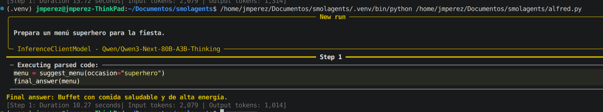

¡El menú está listo! 🥗

### Usando importaciones (imports) de Python dentro del agente

Tenemos la lista de reproducción y el menú listos, pero necesitamos verificar un detalle más crucial: ¡el tiempo de preparación!

Alfred necesita calcular cuándo todo estaría listo si comenzara a preparar ahora, en caso de que necesiten asistencia de otros superhéroes.

**`smolagents`** se especializa en agentes que escriben y ejecutan fragmentos de código Python, ofreciendo ejecución en sandbox para seguridad.
**La ejecución de código tiene medidas de seguridad estrictas** - las importaciones fuera de una lista predefinida segura están bloqueadas por defecto. Sin embargo, podemos autorizar importaciones (**imports**) adicionales pasándolas como cadenas en **`additional_authorized_imports`**.
Para más detalles sobre la ejecución segura de código, consulta la [guía](https://huggingface.co/docs/smolagents/tutorials/secure_code_execution) oficial.

Al crear el agente, usaremos **`additional_authorized_imports`** para permitir la importación del módulo **`datetime`**.

Como en el ejemplo vamos a usar **`numpy`**, la instalamos usando pip:

```bash
pip install numpy
```
**Ejemplo de uso de imports en los agentes:**
```python
from smolagents import CodeAgent, InferenceClientModel
import numpy as np
import time
import datetime

agent = CodeAgent(tools=[], model=InferenceClientModel(), additional_authorized_imports=['datetime'])

agent.run(
    """
    Alfred necesita prepararse para la fiesta. Aquí están las tareas:
    1. Preparar las bebidas - 30 minutos
    2. Decorar la mansión - 60 minutos
    3. Configurar el menú - 45 minutos
    4. Preparar la música y la lista de reproducción - 45 minutos

    Si comenzamos ahora mismo, ¿a qué hora estará lista la fiesta?
    """
)
```

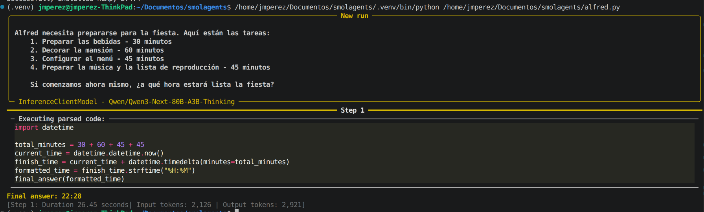

Estos ejemplos son solo el comienzo de lo que podemos hacer con agentes de código, y ya estamos empezando a ver su utilidad para preparar la fiesta.

En resumen, **`smolagents`** se especializa en agentes que escriben y ejecutan fragmentos de código Python, ofreciendo ejecución en un **sandbox para seguridad**. Soporta modelos de lenguaje tanto locales como basados en API, haciéndolo adaptable a varios entornos de desarrollo.

### Compartiendo nuestro agente preparador de fiestas personalizado en el Hub

Vamos a crear un spacio en hugging para probar la herramienta de forma remota y haciendo de Gradio 

La biblioteca `smolagents` hace esto posible al permitirte compartir un agente completo con la comunidad y descargar otros para uso inmediato. Es tan simple como lo siguiente:

```python
# Cambia a tu nombre de usuario y nombre de repositorio
agent.push_to_hub('sergiopaniego/AlfredAgent')
```

Para descargar el agente nuevamente, usa el código a continuación:

```python
# Cambia a tu nombre de usuario y nombre de repositorio
alfred_agent = agent.from_hub('sergiopaniego/AlfredAgent')

alfred_agent.run("Dame la mejor lista de reproducción para una fiesta en la mansión de Wayne. La idea de la fiesta es un tema de 'mascarada de villanos'")  
```

Por ejemplo, el _AlfredAgent_ está disponible [aquí](https://huggingface.co/spaces/sergiopaniego/AlfredAgent). Puedes probarlo directamente a continuación:

Veamos el ejemplo completo:

```python
from smolagents import CodeAgent, DuckDuckGoSearchTool, FinalAnswerTool, InferenceClientModel, Tool, tool, VisitWebpageTool

@tool
def suggest_menu(occasion: str) -> str:
    """
    Sugiere un menú basado en la ocasión.
    Args:
        occasion: El tipo de ocasión para la fiesta.
    """
    if occasion == "casual":
        return "Pizza, aperitivos y bebidas."
    elif occasion == "formal":
        return "Cena de 3 platos con vino y postre."
    elif occasion == "superhero":
        return "Buffet con comida saludable y de alta energía."
    else:
        return "Menú personalizado para el mayordomo."

@tool
def catering_service_tool(query: str) -> str:
    """
    Esta herramienta devuelve el servicio de catering mejor calificado en Ciudad Gótica.
    
    Args:
        query: Un término de búsqueda para encontrar servicios de catering.
    """
    # Lista de ejemplo de servicios de catering y sus calificaciones
    services = {
        "Gotham Catering Co.": 4.9,
        "Wayne Manor Catering": 4.8,
        "Gotham City Events": 4.7,
    }
    
    # Encuentra el servicio de catering mejor calificado (simulando filtrado de consulta de búsqueda)
    best_service = max(services, key=services.get)
    
    return best_service

class SuperheroPartyThemeTool(Tool):
    name = "superhero_party_theme_generator"
    description = """
    Esta herramienta sugiere ideas creativas para fiestas temáticas de superhéroes basadas en una categoría.
    Devuelve una idea única de tema para la fiesta."""
    
    inputs = {
        "category": {
            "type": "string",
            "description": "El tipo de fiesta de superhéroes (por ejemplo, 'héroes clásicos', 'mascarada de villanos', 'Gotham futurista').",
        }
    }
    
    output_type = "string"

    def forward(self, category: str):
        themes = {
            "classic heroes": "Gala de la Liga de la Justicia: Los invitados vienen vestidos como sus héroes favoritos de DC con cócteles temáticos como 'El Ponche de Kryptonita'.",
            "villain masquerade": "Baile de los Pícaros de Gotham: Una mascarada misteriosa donde los invitados se visten como villanos clásicos de Batman.",
            "futuristic Gotham": "Noche Neo-Gotham: Una fiesta de estilo cyberpunk inspirada en Batman Beyond, con decoraciones de neón y gadgets futuristas."
        }
        
        return themes.get(category.lower(), "Idea de fiesta temática no encontrada. Prueba con 'héroes clásicos', 'mascarada de villanos' o 'Gotham futurista'.")

# Alfred, el mayordomo, preparando el menú para la fiesta
agent = CodeAgent(
    tools=[
        DuckDuckGoSearchTool(), 
        VisitWebpageTool(),
        suggest_menu,
        catering_service_tool,
        SuperheroPartyThemeTool()
    ], 
    model=InferenceClientModel(),
    max_steps=10,
    verbosity_level=2
)

agent.run("Dame la mejor lista de reproducción para una fiesta en la mansión de Wayne. La idea de la fiesta es un tema de 'mascarada de villanos'")
```

Como podemos ver, hemos creado un `CodeAgent` con varias herramientas que mejoran la funcionalidad del agente:

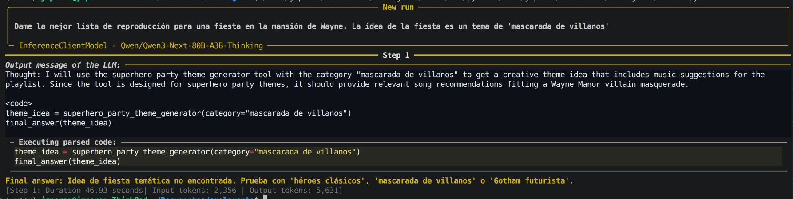

### Inspeccionando nuestro agente preparador de fiestas con OpenTelemetry y Langfuse 📡

A medida que Alfred perfecciona el Agente Preparador de Fiestas, se está cansando de depurar sus ejecuciones. Los agentes, por naturaleza, son impredecibles y difíciles de inspeccionar. Pero como su objetivo es construir el mejor Agente Preparador de Fiestas y desplegarlo en producción, necesita una trazabilidad robusta para monitoreo y análisis futuros.

**`smolagents`** adopta el estándar [OpenTelemetry](https://opentelemetry.io/) para **instrumentar ejecuciones de agentes, permitiendo una inspección y registro sin problemas**. Con la ayuda de [Langfuse](https://langfuse.com/) y el **`SmolagentsInstrumentor`**, Alfred puede rastrear y analizar fácilmente el comportamiento de su agente.

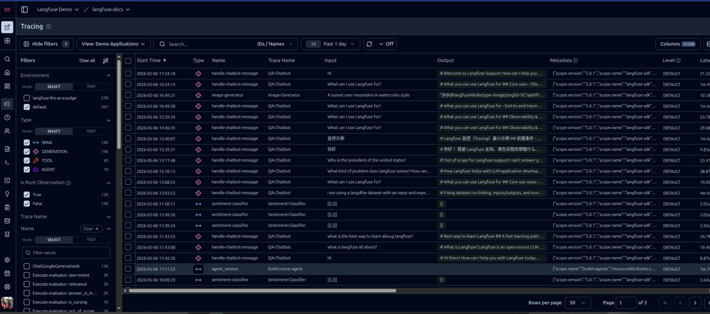

[Try Langfuse Demo](https://cloud.langfuse.com/project/clkpwwm0m000gmm094odg11gi/traces)

Primero, necesitamos instalar las dependencias necesarias:

```bash
pip install opentelemetry-sdk opentelemetry-exporter-otlp openinference-instrumentation-smolagents
```

A continuación, Alfred ya ha creado una cuenta en Langfuse y tiene sus claves API listas. Podemos registrarnos Langfuse Cloud [aquí](https://cloud.langfuse.com/) o explorar [alternativas](https://huggingface.co/docs/smolagents/tutorials/inspect_runs).

Una vez que tengamos nuestras claves API, deben configurarse correctamente de la siguiente manera:

```python
import os
import base64

LANGFUSE_PUBLIC_KEY="pk-lf-..."
LANGFUSE_SECRET_KEY="sk-lf-..."
LANGFUSE_AUTH=base64.b64encode(f"{LANGFUSE_PUBLIC_KEY}:{LANGFUSE_SECRET_KEY}".encode()).decode()

os.environ["OTEL_EXPORTER_OTLP_ENDPOINT"] = "https://cloud.langfuse.com/api/public/otel" # Región de datos EU
# os.environ["OTEL_EXPORTER_OTLP_ENDPOINT"] = "https://us.cloud.langfuse.com/api/public/otel" # Región de datos US
os.environ["OTEL_EXPORTER_OTLP_HEADERS"] = f"Authorization=Basic {LANGFUSE_AUTH}"
```

Finalmente, Alfred está listo para inicializar el **`SmolagentsInstrumentor`** y comenzar a rastrear el rendimiento de su agente.

```python
from opentelemetry.sdk.trace import TracerProvider

from openinference.instrumentation.smolagents import SmolagentsInstrumentor
from opentelemetry.exporter.otlp.proto.http.trace_exporter import OTLPSpanExporter
from opentelemetry.sdk.trace.export import SimpleSpanProcessor

trace_provider = TracerProvider()
trace_provider.add_span_processor(SimpleSpanProcessor(OTLPSpanExporter()))

SmolagentsInstrumentor().instrument(tracer_provider=trace_provider)
```

¡Alfred ahora está conectado 🔌! Las ejecuciones de **`smolagents`** se están registrando en **Langfuse**, dándole visibilidad completa del comportamiento del agente. Con esta configuración, está listo para revisar ejecuciones anteriores y refinar aún más su Agente Preparador de Fiestas.

```python
from smolagents import CodeAgent, InferenceClientModel

agent = CodeAgent(tools=[], model=InferenceClientModel())
alfred_agent = agent.from_hub('sergiopaniego/AlfredAgent', trust_remote_code=True)
alfred_agent.run("Dame la mejor lista de reproducción para una fiesta en la mansión de Wayne. La idea de la fiesta es un tema de 'mascarada de villanos'")  
```

Alfred ahora puede acceder a estos registros [aquí](https://cloud.langfuse.com/project/cm7bq0abj025rad078ak3luwi/traces/995fc019255528e4f48cf6770b0ce27b?timestamp=2025-02-19T10%3A28%3A36.929Z) para revisarlos y analizarlos.

Mientras tanto, la [lista de reproducción sugerida](https://open.spotify.com/playlist/0gZMMHjuxMrrybQ7wTMTpw) establece el ambiente perfecto para los preparativos de la fiesta. ¿Genial, verdad? 🎶

---


# Escribiendo acciones como fragmentos de código o estructuras JSON

Los Agentes que invocan a herramientas son el segundo tipo de agente disponible en **`smolagents`**. A diferencia de los **Agentes de Código** que utilizan fragmentos de Python, estos agentes **utilizan las capacidades integradas de invocación a herramientas de los proveedores de LLM** para generar llamadas a herramientas como **estructuras JSON**. Este es el enfoque estándar utilizado por **OpenAI, Anthropic y muchos otros proveedores**.

Veamos un ejemplo. Cuando Alfred quiere buscar servicios de catering e ideas para fiestas, un **`CodeAgent`** generaría y ejecutaría código Python como este:

```python
for query in [
    "Mejores servicios de catering en Ciudad Gótica", 
    "Ideas de temas de fiesta para superhéroes"
]:
    print(web_search(f"Buscar: {query}"))
```

Un **`ToolCallingAgent`** en cambio crearía una estructura JSON:

```python
[
    {"name": "web_search", "arguments": "Mejores servicios de catering en Ciudad Gótica"},
    {"name": "web_search", "arguments": "Ideas de temas de fiesta para superhéroes"}
]
```

Esta estructura JSON se utiliza luego para ejecutar las llamadas a herramientas.

Aunque **`smolagents`** se centra principalmente en **`CodeAgents`** ya que [tienen un mejor rendimiento general](https://huggingface.co/papers/2402.01030), los **`ToolCallingAgents`** pueden ser efectivos para sistemas simples que no requieren manejo de variables o llamadas a herramientas complejas.

  

## ¿Cómo funcionan los Agentes de llamada a herramientas?  

Los **Agentes de llamada (ToolCallingAgents) a herramientas** siguen el mismo flujo de trabajo de múltiples pasos que los **Agentes de Código (CodeAgent)**. 

La diferencia clave está en **cómo estructuran sus acciones**: en lugar de código ejecutable, **generan objetos JSON que especifican nombres de herramientas y argumentos**. El sistema luego **analiza estas instrucciones** para ejecutar las herramientas apropiadas.

## Ejemplo: Ejecutando un agente de llamada a herramientas  

Revisemos el ejemplo anterior donde Alfred comenzó los preparativos de la fiesta, pero esta vez usaremos un **`ToolCallingAgent`** para destacar la diferencia. Construiremos un agente que pueda buscar en la web usando DuckDuckGo, al igual que en nuestro ejemplo de Agente de Código. La única diferencia es el tipo de agente - el framework se encarga de todo lo demás:

```python
'''
#CÓDIGO CodeAgent para comparar
from smolagents import CodeAgent, DuckDuckGoSearchTool, InferenceClientModel
agent = CodeAgent(tools=[DuckDuckGoSearchTool()], model=InferenceClientModel())
'''
#Código ToolCallingAgent
from smolagents import ToolCallingAgent, DuckDuckGoSearchTool, InferenceClientModel

model = InferenceClientModel(
    # ejemplo de la documentación, 
    # pero podemos usar cualquier modelo compatible con Hugging Face Inference API 
    model_id="meta-llama/Llama-3.3-70B-Instruct", 
    token="hf_xxx" #o usar HF_TOKEN en entorno
)

agent = ToolCallingAgent(
        tools=[DuckDuckGoSearchTool()], 
        model=model,
        verbosity_level=2
)

agent.run("Busca las mejores recomendaciones de música para una fiesta en la mansión Wayne.")
```

**Alternativa usando Mistral y LiteLLModel
```python
#Código ToolCallingAgent
from smolagents import ToolCallingAgent, DuckDuckGoSearchTool, LiteLLMModel
import os

model = LiteLLMModel(
    model_id="mistral/mistral-large-latest",
    api_key=os.getenv("MISTRAL_API_KEY", "").strip(),
    temperature=0.2,
)

agent = ToolCallingAgent(
        tools=[DuckDuckGoSearchTool()], 
        model=model,
        verbosity_level=2
)

agent.run("Busca las mejores recomendaciones de música para una fiesta en la mansión Wayne.")
```

Cuando veamos el log del agente, en lugar de ver **`Executing parsed code:`**, veremos algo como:

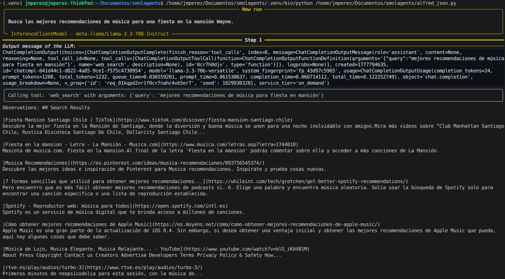
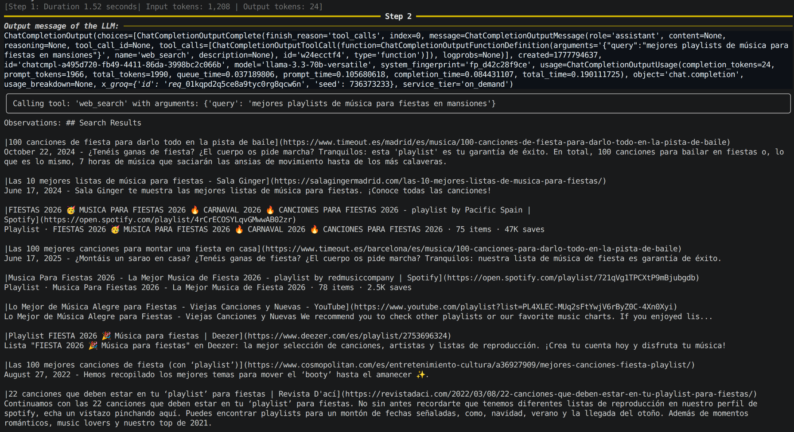
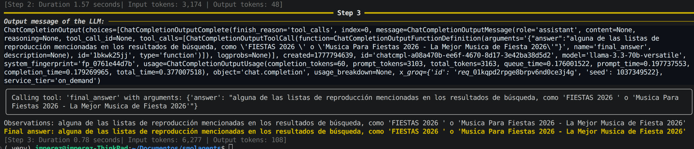

El agente genera una llamada a la herramienta de forma estructurada que el sistema procesa para producir la salida, en lugar de ejecutar directamente código como un `CodeAgent`.

Ahora que entendemos ambos tipos de agentes, podemos elegir el adecuado para nuestras necesidades. 

# Herramientas  

Como exploramos anteriormente, los agentes utilizan herramientas para realizar diversas acciones. En `smolagents`, las herramientas son tratadas como **funciones que un LLM pueden llamar dentro de un sistema de agentes**.

Para interactuar con una herramienta, el LLM necesita una **descripción de la interfaz** con estos componentes clave:  

- **Nombre**: Cómo se llama la herramienta
- **Descripción de la herramienta**: Qué hace la herramienta  
- **Tipos de entrada y descripciones**: Qué argumentos acepta la herramienta
- **Tipo de salida**: Qué devuelve la herramienta

Por ejemplo, mientras prepara una fiesta en la Mansión Wayne, Alfred necesita varias herramientas para recopilar información - desde buscar servicios de catering hasta encontrar ideas para temas de fiesta. Así es como podría verse la interfaz de una herramienta de búsqueda simple:

- **Nombre:** `web_search`
- **Descripción de la herramienta:** Busca en la web consultas específicas
- **Entrada:** `query` (cadena) - El término de búsqueda a consultar
- **Salida:** Cadena que contiene los resultados de la búsqueda

Al utilizar estas herramientas, Alfred puede tomar decisiones informadas y recopilar toda la información necesaria para planificar la fiesta perfecta.

A continuación, puedes ver una animación que ilustra cómo se gestiona una llamada a una herramienta:


## Métodos de creación de herramientas

En `smolagents`, las herramientas pueden definirse de dos maneras:  

1. **Usando el decorador `@tool`** para herramientas simples basadas en funciones
2. **Creando una subclase de `Tool`** para funcionalidades más complejas    

### El decorador `@tool`  

El decorador `@tool` es **la forma recomendada para definir herramientas simples**. Internamente, smolagents analizará la información básica sobre la función desde Python. Por lo tanto, **si nombramos nuestra función claramente y escribimos un buen docstring, será más fácil para el LLM utilizarla**.

Usando este enfoque, definimos una función con:  

- **Un nombre de función claro y descriptivo** que ayuda al LLM a entender su propósito.  
- **Anotaciones de tipo tanto para entradas como para salidas** para garantizar un uso adecuado.  
- **Una descripción detallada**, que incluye una sección `Args:` donde cada argumento se describe explícitamente. Estas descripciones proporcionan un contexto valioso para el LLM, por lo que es importante escribirlas cuidadosamente.  

#### Generando una herramienta que recupera el servicio de catering mejor valorado


Imaginemos que Alfred ya ha decidido el menú para la fiesta, pero ahora necesita ayuda para preparar comida para un número tan grande de invitados. Para hacerlo, le gustaría contratar un servicio de catering y necesita identificar las opciones mejor valoradas disponibles. Alfred puede aprovechar una herramienta para buscar los mejores servicios de catering en su área.

A continuación se muestra un ejemplo de cómo Alfred puede usar el decorador **`@tool`** para lograrlo:

```python
from smolagents import CodeAgent, InferenceClientModel, tool

# Imaginemos que tenemos una función que obtiene los servicios de catering mejor valorados.
@tool
def catering_service_tool(query: str) -> str:
    """
    Esta herramienta devuelve el servicio de catering mejor valorado en Ciudad Gótica.
    
    Args:
        query: Un término de búsqueda para encontrar servicios de catering.
    """
    # Lista de ejemplo de servicios de catering y sus calificaciones
    services = {
        "Gotham Catering Co.": 4.9,
        "Wayne Manor Catering": 4.8,
        "Gotham City Events": 4.7,
    }
    
    # Encuentra el servicio de catering mejor valorado (simulando el filtrado de consultas de búsqueda)
    best_service = max(services, key=services.get)
    
    return best_service

agent = CodeAgent(tools=[catering_service_tool], model=InferenceClientModel())

# Ejecuta el agente para encontrar el mejor servicio de catering
result = agent.run(
    "¿Puedes darme el nombre del servicio de catering mejor valorado en Ciudad Gótica?"
)

print(result)   # Salida: Gotham Catering Co.
```

### Definiendo una herramienta como una clase de Python  

Este enfoque implica crear una subclase de **[`Tool`](https://huggingface.co/docs/smolagents/v1.8.1/en/reference/tools#smolagents.Tool)**. Para herramientas complejas, podemos implementar una clase en lugar de una función de Python. La clase envuelve la función con metadatos que ayudan al LLM a entender cómo usarla de manera efectiva. En esta clase, definimos:  

- **`name`**: El nombre de la herramienta.  
- **`description`**: Una descripción utilizada para completar el prompt del sistema del agente.  
- **`inputs`**: Un diccionario con claves `type` y `description`, proporcionando información para ayudar al intérprete de Python a procesar las entradas.  
- **`output_type`**: Especifica el tipo de salida esperado.  
- **`forward`**: El método que contiene la lógica de inferencia a ejecutar.

A continuación, podemos ver un ejemplo de una herramienta construida usando **`Tool`** y cómo integrarla dentro de un **`CodeAgent`**.

#### Generando una herramienta para generar ideas sobre la fiesta temática de superhéroes

La fiesta de Alfred en la mansión es un **evento temático de superhéroes**, pero necesita algunas ideas creativas para hacerla verdaderamente especial. Como anfitrión fantástico, quiere sorprender a los invitados con un tema único.

Para hacer esto, puede usar un agente que genere ideas de fiestas temáticas de superhéroes basadas en una categoría dada. De esta manera, Alfred puede encontrar el tema de fiesta perfecto para impresionar a sus invitados.

```python
from smolagents import Tool, CodeAgent, InferenceClientModel

class SuperheroPartyThemeTool(Tool):
    name = "superhero_party_theme_generator"
    description = """
    Esta herramienta sugiere ideas creativas para fiestas temáticas de superhéroes basadas en una categoría.
    Devuelve una idea única de tema para la fiesta."""
    
    inputs = {
        "category": {
            "type": "string",
            "description": "El tipo de fiesta de superhéroes (por ejemplo, 'héroes clásicos', 'mascarada de villanos', 'Gotham futurista').",
        }
    }
    
    output_type = "string"

    def forward(self, category: str):
        themes = {
            "classic heroes": "Gala de la Liga de la Justicia: Los invitados vienen vestidos como sus héroes favoritos de DC con cócteles temáticos como 'El Ponche de Kryptonita'.",
            "villain masquerade": "Baile de los Pícaros de Gotham: Una mascarada misteriosa donde los invitados se visten como villanos clásicos de Batman.",
            "futuristic Gotham": "Noche Neo-Gotham: Una fiesta de estilo cyberpunk inspirada en Batman Beyond, con decoraciones de neón y gadgets futuristas."
        }
        
        return themes.get(category.lower(), "Idea de fiesta temática no encontrada. Prueba con 'héroes clásicos', 'mascarada de villanos' o 'Gotham futurista'.")

# Instancia la herramienta
party_theme_tool = SuperheroPartyThemeTool()
agent = CodeAgent(tools=[party_theme_tool], model=InferenceClientModel())

# Ejecuta el agente para generar una idea de tema para la fiesta
result = agent.run(
    "¿Cuál sería una buena idea para una fiesta de superhéroes con el tema 'mascarada de villanos'?"
)

print(result)  # Salida: "Baile de los Pícaros de Gotham: Una mascarada misteriosa donde los invitados se visten como villanos clásicos de Batman."
```

Con esta herramienta, ¡Alfred será el mejor anfitrión, impresionando a sus invitados con una fiesta temática de superhéroes que no olvidarán! 🦸‍♂️🦸‍♀️

## Caja de Herramientas Predeterminada  

**`smolagents`** viene con un conjunto de herramientas preintegradas que pueden inyectarse directamente en tu agente. La [caja de herramientas predeterminada](https://huggingface.co/docs/smolagents/guided_tour?build-a-tool=Decorate+a+function+with+%40tool#default-toolbox) incluye:  

- **`PythonInterpreterTool`**  
- **`FinalAnswerTool`**  
- **`UserInputTool`**  
- **`DuckDuckGoSearchTool`**  
- **`GoogleSearchTool`**  
- **`VisitWebpageTool`**  

Alfred podría usar varias herramientas para asegurar una fiesta impecable en la Mansión Wayne:

- Primero, podría usar la **`DuckDuckGoSearchTool`** para encontrar ideas creativas para fiestas temáticas de superhéroes.

- Para el catering, confiaría en la **`GoogleSearchTool`** para encontrar los servicios mejor valorados en Gotham.

- Para gestionar la distribución de asientos, Alfred podría realizar cálculos con la **`PythonInterpreterTool`**.

- Una vez recopilado todo, compilaría el plan usando la **`FinalAnswerTool`**.

Con estas herramientas, Alfred garantiza que la fiesta sea excepcional e impecable. 🦇💡

## Compartir e importar herramientas

Una de las características más poderosas de **smolagents** es su capacidad para compartir herramientas personalizadas en el Hub e integrar perfectamente herramientas creadas por la comunidad. Esto incluye la conexión con **HF Spaces** y **herramientas de LangChain**, mejorando significativamente la capacidad de Alfred para organizar una fiesta inolvidable en la Mansión Wayne. 🎭

Con estas integraciones, Alfred puede aprovechar herramientas avanzadas de planificación de eventos, ya sea ajustar la iluminación para el ambiente perfecto, seleccionar la lista de reproducción ideal para la fiesta, o coordinar con los mejores servicios de catering de Gotham.

Aquí hay ejemplos que muestran cómo estas funcionalidades pueden elevar la experiencia de la fiesta:

### Compartir una Herramienta en el Hub

¡Compartir tu herramienta personalizada con la comunidad es fácil! Simplemente súbela a tu cuenta de Hugging Face usando el método **`push_to_hub()`**.

Por ejemplo, Alfred puede compartir su **`party_theme_tool`** para ayudar a otros a encontrar los mejores servicios de catering en Gotham. Así es cómo hacerlo:

```python
party_theme_tool.push_to_hub("{tu_nombre_de_usuario}/party_theme_tool", token="")
```

### Importar una Herramienta desde el Hub

Podemos importar fácilmente herramientas creadas por otros usuarios usando la función **`load_tool()`**. Por ejemplo, Alfred podría querer generar una imagen promocional para la fiesta usando IA. En lugar de construir una herramienta desde cero, puede aprovechar una predefinida de la comunidad:

```python
from smolagents import load_tool, CodeAgent, InferenceClientModel

image_generation_tool = load_tool(
    "m-ric/text-to-image",
    trust_remote_code=True
)

agent = CodeAgent(
    tools=[image_generation_tool],
    model=InferenceClientModel()
)

agent.run("Genera una imagen de una lujosa fiesta temática de superhéroes en la Mansión Wayne con superhéroes inventados.")
```

### Importar un Hugging Face Space como Herramienta

También puedes importar un HF Space como herramienta usando **`Tool.from_space()`**. Esto abre posibilidades para integrar miles de spaces de la comunidad para tareas desde generación de imágenes hasta análisis de datos.

La herramienta se conectará con el **backend Gradio del space** usando **`gradio_client`**, así que tendremos que instalarlo via **`pip`** si aún no lo hemos instalado.

Para la fiesta, Alfred puede usar un **HF Space** existente para la generación de la imagen generada por IA que se usará en el anuncio (en lugar de la herramienta preintegrada que mencionamos antes). 

```python
from smolagents import CodeAgent, InferenceClientModel, Tool

image_generation_tool = Tool.from_space(
    "black-forest-labs/FLUX.1-schnell",
    name="image_generator",
    description="Generar una imagen a partir de un prompt"
)

model = InferenceClientModel("Qwen/Qwen2.5-Coder-32B-Instruct")

agent = CodeAgent(tools=[image_generation_tool], model=model)

agent.run(
    "Mejora este prompt, luego genera una imagen del mismo.", 
    additional_args={'user_prompt': 'Una gran fiesta temática de superhéroes en la Mansión Wayne, con Alfred supervisando una lujosa gala'}
)
```

### Importar una herramienta de LangChain - DuckDuckGoSearchRun

Discutiremos el framework **`LangChain`** en las próximas sesiones. Por ahora, solo notamos que ¡podemos reutilizar herramientas de LangChain en tu flujo de trabajo de smolagents!

Podemos cargar fácilmente herramientas de LangChain usando el método **`Tool.from_langchain()`**. Alfred, siempre perfeccionista, está preparando una espectacular noche de superhéroes en la Mansión Wayne mientras los Wayne están fuera. Para asegurarse de que cada detalle supere las expectativas, aprovecha las herramientas de **`LangChain`** para encontrar ideas de entretenimiento de primera categoría.

Al usar **`Tool.from_langchain()`**, Alfred añade sin esfuerzo funcionalidades de búsqueda avanzadas a su smolagent, permitiéndole descubrir ideas y servicios exclusivos para fiestas con solo unos pocos comandos.

Primero instamos las herramientas de **`langchain`** y **`DuckDuckGoSearchRun`**:

```bash
pip install langchain langchain-community ddgs
```

Ejemplo:

```python
import os
from langchain_community.tools import DuckDuckGoSearchRun
from smolagents import CodeAgent, InferenceClientModel, LiteLLMModel, Tool

# Herramienta DuckDuckGo
ddg_search = DuckDuckGoSearchRun()
search_tool = Tool.from_langchain(ddg_search)

model = LiteLLMModel(
    model_id="mistral/mistral-large-latest",
    api_key=os.getenv("MISTRAL_API_KEY", "").strip(),
    temperature=0.2,
)

agent = CodeAgent(tools=[search_tool], model=model)

agent.run("Busca ideas de entretenimiento de lujo para un evento temático de superhéroes, como actuaciones en vivo y experiencias interactivas.")
```

Con esta configuración, Alfred puede descubrir rápidamente opciones de entretenimiento lujosas, asegurando que los invitados de élite de Gotham tengan una experiencia inolvidable. ¡Esta herramienta le ayuda a organizar el evento temático de superhéroes perfecto para la Mansión Wayne! 🎉

# Construyendo sistemas RAG con Agentes

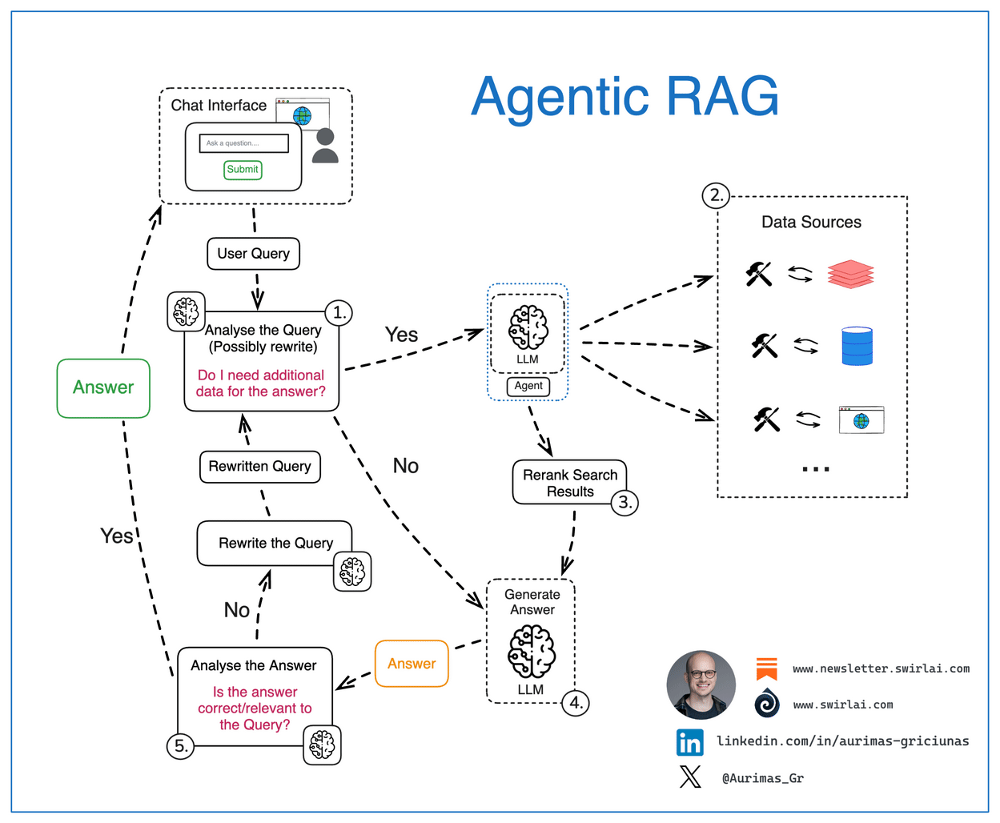

Los sistemas de **Generación Aumentada por Recuperación (RAG)** combinan las capacidades de **recuperación de datos** y **modelos de generación** para proporcionar **respuestas contextualizadas**. Por ejemplo, **la consulta de un usuario se pasa a un motor de búsqueda, y los resultados recuperados se entregan al modelo junto con la consulta. El modelo luego genera una respuesta basada en la consulta y la información recuperada**.

El **RAG con Agentes (Generación Aumentada por Recuperación)** extiende los sistemas RAG tradicionales al **combinar agentes autónomos con recuperación dinámica de conocimiento**.

Mientras que los sistemas **RAG tradicionales** utilizan un LLM para responder consultas basadas en datos recuperados, el ***RAG con agentes* permite un control inteligente tanto de los procesos de recuperación como de generación**, mejorando la eficiencia y precisión.

Los sistemas RAG tradicionales enfrentan limitaciones clave, como **depender de un solo paso de recuperación** y enfocarse en la **similitud semántica directa** con la consulta del usuario, lo que puede pasar por alto información relevante.

El **RAG con agentes** aborda estos problemas permitiendo que el agente **formule autónomamente consultas de búsqueda**, **critique los resultados recuperados** y **realice múltiples pasos de recuperación para obtener un resultado más personalizado y completo**.

## Recuperación básica con DuckDuckGo

Vamos a construir un agente simple que pueda buscar en la web usando DuckDuckGo. Este agente recuperará información y sintetizará respuestas para contestar consultas. Con RAG con agentes, el agente de Alfred puede:

* Buscar las últimas tendencias en fiestas de superhéroes
* Refinar resultados para incluir elementos de lujo
* Sintetizar información en un plan completo

Así es como el agente de Alfred puede lograr esto:

```python
from smolagents import CodeAgent, DuckDuckGoSearchTool, InferenceClientModel

# Initialize the search tool
search_tool = DuckDuckGoSearchTool()

# Initialize the model
model = InferenceClientModel()

agent = CodeAgent(
    model=model,
    tools=[search_tool]
)

# Example usage
response = agent.run(
    "Buscar ideas de fiesta temática de superhéroes de lujo, incluyendo decoración, entretenimiento y catering."
)
print(response)
```

El agente sigue este proceso:

1. **Analiza la Solicitud:** El agente de Alfred identifica los elementos clave de la consulta—planificación de fiesta temática de superhéroes de lujo, con enfoque en decoración, entretenimiento y catering.
2. **Realiza la Recuperación:** El agente utiliza DuckDuckGo para buscar la información más relevante y actualizada, asegurándose de que se alinee con las preferencias refinadas de Alfred para un evento lujoso.
3. **Sintetiza la Información:** Después de recopilar los resultados, el agente los procesa en un plan coherente y accionable para Alfred, cubriendo todos los aspectos de la fiesta.
4. **Almacena para Referencia Futura:** El agente almacena la información recuperada para un fácil acceso al planificar eventos futuros, optimizando la eficiencia en tareas posteriores.

## Herramienta de base de conocimientos personalizada

Para tareas especializadas, una **base de conocimientos personalizada** puede ser invaluable. Vamos a crear una herramienta que consulte una base de datos vectorial de documentación técnica o conocimiento especializado. Utilizando búsqueda semántica, el agente puede encontrar la información más relevante para las necesidades de Alfred.

Una **base de datos vectorial** es simplemente una **colección de documentos con representaciones enriquecidas por modelos de ML especializados**, que permiten la **búsqueda y recuperación rápida de los documentos**.

Este enfoque combina **conocimiento predefinido con búsqueda semántica** para proporcionar soluciones contextualizadas para la planificación de eventos. Con acceso a conocimiento especializado, Alfred puede perfeccionar cada detalle de la fiesta.

En este ejemplo, crearemos una herramienta que recupera ideas de planificación de fiestas desde una **base de conocimiento personalizada**. Usaremos un recuperador **BM25** para buscar en la base de conocimiento y devolver los mejores resultados, y **`RecursiveCharacterTextSplitter`** para dividir los documentos en fragmentos más pequeños para una búsqueda más eficiente.

```python
from langchain.docstore.document import Document
from langchain.text_splitter import RecursiveCharacterTextSplitter
from smolagents import Tool
from langchain_community.retrievers import BM25Retriever
from smolagents import CodeAgent, InferenceClientModel

class PartyPlanningRetrieverTool(Tool):
    name = "party_planning_retriever"
    description = "Utiliza búsqueda semántica para recuperar ideas de planificación de fiestas relevantes para la fiesta temática de superhéroes de Alfred en Wayne Manor."
    inputs = {
        "query": {
            "type": "string",
            "description": "La consulta a realizar. Esta debe ser una consulta relacionada con la planificación de fiestas o temas de superhéroes.",
        }
    }
    output_type = "string"

    def __init__(self, docs, **kwargs):
        super().__init__(**kwargs)
        self.retriever = BM25Retriever.from_documents(
            docs, k=5  # Devuelve los 5 primeros documentos
        )

    def forward(self, query: str) -> str:
        assert isinstance(query, str), "Tu consulta de búsqueda debe ser una cadena"

        docs = self.retriever.invoke(
            query,
        )
        return "\nIdeas recuperadas:\n" + "".join(
            [
                f"\n\n===== Idea {str(i)} =====\n" + doc.page_content
                for i, doc in enumerate(docs)
            ]
        )

# Simluar una base de conocimientos sobre una planificacióń sobre fiestas de super héroes
party_ideas = [
    {"text": "Una fiesta de disfraces temática de superhéroes con decoración de lujo, incluyendo detalles dorados y cortinas de terciopelo.", "source": "Ideas de fiesta 1"},
    {"text": "Contrata a un DJ profesional que pueda tocar música temática para superhéroes como Batman y Wonder Woman.", "source": "Ideas de entretenimiento"},
    {"text": "Para el catering, sirve platos con nombres de superhéroes, como 'El smoothie verde de Hulk' y 'El filete de poder de Iron Man'.", "source": "Ideas de catering"},
    {"text": "Decora con logotipos icónicos de superhéroes y proyecciones de Gotham y otras ciudades de superhéroes alrededor del lugar.", "source": "Ideas de decoración"},
    {"text": "Experiencias interactivas con realidad virtual donde los invitados pueden participar en simulaciones de superhéroes o competir en juegos temáticos.", "source": "Ideas de entretenimiento"}
]

source_docs = [
    Document(page_content=doc["text"], metadata={"source": doc["source"]})
    for doc in party_ideas
]

# Dividir los documentos anteriores en trozos (chunks) más pequeños para que la búsqueda sea más eficiente
text_splitter = RecursiveCharacterTextSplitter(
    chunk_size=500,
    chunk_overlap=50,
    add_start_index=True,
    strip_whitespace=True,
    separators=["\n\n", "\n", ".", " ", ""],
)
docs_processed = text_splitter.split_documents(source_docs)

# Crear una herramienta de recuperación (retriever tool)
party_planning_retriever = PartyPlanningRetrieverTool(docs_processed)

# Inicializar el agente
agent = CodeAgent(tools=[party_planning_retriever], model=InferenceClientModel())

# Ejemplo de uso
response = agent.run(
    "Encuentra ideas para una fiesta temática de superhéroes de lujo, incluyendo entretenimiento, catering y opciones de decoración."
)

print(response)
```

Este agente mejorado puede:
1. Primero verificar la documentación para obtener información relevante
2. Combinar ideas de la base de conocimiento
3. Mantener el contexto de la conversación en memoria

## Capacidades de Recuperación Mejoradas

Al construir sistemas RAG con agentes, el agente puede emplear estrategias sofisticadas como:

1. **Reformulación de Consultas:** En lugar de usar la consulta del usuario en bruto, el agente puede elaborar términos de búsqueda optimizados que coincidan mejor con los documentos objetivo
2. **Recuperación Multi-Paso:** El agente puede realizar múltiples búsquedas, utilizando los resultados iniciales para informar consultas posteriores
3. **Integración de Fuentes:** La información puede combinarse de múltiples fuentes como búsqueda web y documentación local
4. **Validación de Resultados:** El contenido recuperado puede analizarse para determinar su relevancia y precisión antes de incluirlo en las respuestas

Los **sistemas RAG con agentes efectivos** requieren una consideración cuidadosa de varios aspectos clave. El agente **debe seleccionar entre las herramientas disponibles según el tipo de consulta y el contexto**. Los **sistemas de memoria** ayudan a mantener el **historial de conversación y evitar recuperaciones repetitivas**. Tener **estrategias de respaldo** garantiza que el sistema pueda seguir proporcionando valor incluso cuando los métodos de recuperación principales fallan. Además, implementar **pasos de validación ayuda a garantizar la precisión y relevancia de la información recuperada**.

# Sistemas Multi-Agente

Los sistemas multi-agente permiten que **agentes especializados colaboren en tareas complejas**, mejorando la **modularidad, escalabilidad y robustez**. En lugar de depender de un solo agente, las tareas se distribuyen entre agentes con capacidades distintas.

En **smolagents**, diferentes agentes pueden combinarse para generar código Python, llamar a herramientas externas, realizar búsquedas web y más. Al orquestar estos agentes, podemos crear flujos de trabajo potentes.

Una configuración típica podría incluir:
- Un **Agente Gestor** para la delegación de tareas
- Un **Agente Intérprete de Código** para la ejecución de código
- Un **Agente de Búsqueda Web** para la recuperación de información

El diagrama a continuación ilustra una arquitectura multi-agente simple donde un **Agente Gestor** coordina una **Herramienta Intérprete de Código** y un **Agente de Búsqueda Web**, que a su vez utiliza herramientas como **`DuckDuckGoSearchTool`** y **`VisitWebpageTool`** para recopilar información relevante.


## Sistemas Multi-Agente en Acción

Un sistema multi-agente consiste en múltiples **agentes especializados** trabajando juntos bajo la coordinación de un **Agente Orquestador**. Este enfoque permite flujos de trabajo complejos distribuyendo tareas entre agentes con roles distintos.

Por ejemplo, un **sistema RAG Multi-Agente** puede integrar:
- Un **Agente Web** para navegar por internet.
- Un **Agente Recuperador** para obtener información de bases de conocimiento.
- Un **Agente de Generación de Imágenes** para producir elementos visuales.

Todos estos agentes operan bajo un orquestador que gestiona la delegación de tareas y la interacción.

## Resolviendo una tarea compleja con una jerarquía multi-agente

¡La recepción se acerca! Con tu ayuda, Alfred ya casi ha terminado con los preparativos.

Pero ahora hay un problema: el **Batmóvil ha desaparecido**. Alfred necesita encontrar un reemplazo, y encontrarlo rápidamente.

Afortunadamente, se han realizado algunas biografías cinematográficas sobre la vida de Bruce Wayne, así que tal vez Alfred podría conseguir un automóvil abandonado en uno de los sets de filmación y rediseñarlo según los estándares modernos, lo que ciertamente incluiría una opción de conducción autónoma completa.

Pero esto podría estar en cualquier lugar de las locaciones de filmación alrededor del mundo, que podrían ser numerosas.

Así que Alfred quiere tu ayuda. **¿Podrías construir un agente capaz de resolver esta tarea?**

> 👉 Encuentra todas las locaciones de filmación de Batman en el mundo, calcula el tiempo de transferencia en avión de carga hasta allí, y represéntalas en un mapa, con un color que varíe según el tiempo de transferencia en avión. También representa algunas fábricas de superdeportivos con el mismo tiempo de transferencia en avión.

¡Vamos a construir esto!

Este ejemplo necesita algunos paquetes adicionales, así que vamos a instalarlos primero:

```bash
pip install 'smolagents[litellm]' matplotlib geopandas shapely kaleido -q
```

### Primero creamos una herramienta para obtener el tiempo de transferencia del avión de carga.

```python
import math
from typing import Optional, Tuple

from smolagents import tool

@tool
def calculate_cargo_travel_time(
    origin_coords: Tuple[float, float],
    destination_coords: Tuple[float, float],
    cruising_speed_kmh: Optional[float] = 750.0,  # Velocidad media de los aviones de carga
) -> float:
    """
    Calcula el tiempo de viaje de un avión de carga entre dos puntos de la Tierra utilizando la distancia ortodrómica.

    Args:
        origin_coords: Tupla de (latitud, longitud) del punto de partida
        destination_coords: Tupla de (latitud, longitud) del destino
        cruising_speed_kmh: Velocidad de crucero opcional en km/h (el valor predeterminado es 750 km/h para aviones de carga típicos)

    Returns:
        float: El tiempo de viaje estimado en horas

    Ejemplos:
        >>> # Chicago (41.8781° N, 87.6298° W) to Sydney (33.8688° S, 151.2093° E)
        >>> result = calculate_cargo_travel_time((41.8781, -87.6298), (-33.8688, 151.2093))
    """

    def to_radians(degrees: float) -> float:
        return degrees * (math.pi / 180)

    # Extraer coordenadas y convertir a radianes
    lat1, lon1 = map(to_radians, origin_coords)
    lat2, lon2 = map(to_radians, destination_coords)

    # Radio de la Tierra en kilómetros
    EARTH_RADIUS_KM = 6371.0

    # Calcular la distancia ortodrómica utilizando la fórmula haversina
    dlon = lon2 - lon1
    dlat = lat2 - lat1
     
    a = (
        math.sin(dlat / 2) ** 2
        + math.cos(lat1) * math.cos(lat2) * math.sin(dlon / 2) ** 2
    )
    # Calcular la distancia en kilómetros
    c = 2 * math.asin(math.sqrt(a))
    distance = EARTH_RADIUS_KM * c

    #  Añadir un 10 % para tener en cuenta las rutas no directas y los controles de tráfico aéreo
    actual_distance = distance * 1.1

    # Calcular el tiempo de vuelo
    # Añadir 1 hora para los procedimientos de despegue y aterrizaje    
    flight_time = (actual_distance / cruising_speed_kmh) + 1.0

    # Formatear el resultado a dos decimales
    return round(flight_time, 2)


print(calculate_cargo_travel_time((41.8781, -87.6298), (-33.8688, 151.2093)))
```

### Configurando el agente

Para el proveedor de modelos, usamos Together AI, ¡uno de los nuevos [proveedores de inferencia en el Hub](https://huggingface.co/blog/inference-providers)!

La herramienta GoogleSearchTool usa la [API de Serper](https://serper.dev) para buscar en la web, por lo que requiere haber configurado la variable de entorno `SERPAPI_API_KEY` y pasar `provider="serpapi"` o tener `SERPER_API_KEY` y pasar `provider=serper`.

Si no tienes ningún proveedor de Serp API configurado, puedes usar `DuckDuckGoSearchTool` pero ten en cuenta que tiene un límite de tasa.

```python
import os
from PIL import Image
from smolagents import CodeAgent, GoogleSearchTool, InferenceClientModel, VisitWebpageTool

model = InferenceClientModel(
    model_id="Qwen/Qwen2.5-Coder-32B-Instruct", 
    provider="together")
```

Podemos empezar creando un agente simple como base para darnos un informe simple.

```python
task = """Encuentra todas las locaciones de filmación de Batman en el mundo, calcula el tiempo de transferencia en avión de carga hasta aquí (estamos en Gotham, 40.7128° N, 74.0060° W), y devuélvelas a mí como un dataframe de pandas.
También dame algunas fábricas de superdeportivos con el mismo tiempo de transferencia en avión."""
```

```python
agent = CodeAgent(
    model=model,
    tools=[GoogleSearchTool("serper"), VisitWebpageTool(), calculate_cargo_travel_time],
    additional_authorized_imports=["pandas"],
    max_steps=20,
)
```

```python
result = agent.run(task)
```

```python
result
```

En nuestro caso, genera este output:

```python
|  | Location                                             | Travel Time to Gotham (hours) |
|--|------------------------------------------------------|------------------------------|
| 0  | Necropolis Cemetery, Glasgow, Scotland, UK         | 8.60                         |
| 1  | St. George's Hall, Liverpool, England, UK         | 8.81                         |
| 2  | Two Temple Place, London, England, UK             | 9.17                         |
| 3  | Wollaton Hall, Nottingham, England, UK           | 9.00                         |
| 4  | Knebworth House, Knebworth, Hertfordshire, UK    | 9.15                         |
| 5  | Acton Lane Power Station, Acton Lane, Acton, UK  | 9.16                         |
| 6  | Queensboro Bridge, New York City, USA            | 1.01                         |
| 7  | Wall Street, New York City, USA                  | 1.00                         |
| 8  | Mehrangarh Fort, Jodhpur, Rajasthan, India       | 18.34                        |
| 9  | Turda Gorge, Turda, Romania                      | 11.89                        |
| 10 | Chicago, USA                                     | 2.68                         |
| 11 | Hong Kong, China                                 | 19.99                        |
| 12 | Cardington Studios, Northamptonshire, UK        | 9.10                         |
| 13 | Warner Bros. Leavesden Studios, Hertfordshire, UK | 9.13                         |
| 14 | Westwood, Los Angeles, CA, USA                  | 6.79                         |
| 15 | Woking, UK (McLaren)                             | 9.13                         |
```

Podríamos mejorar esto un poco agregando algunos pasos de planificación y más instrucciones.

Los pasos de planificación permiten al agente pensar con anticipación y planificar sus próximos pasos, lo que puede ser útil para tareas más complejas.

```python
agent.planning_interval = 4

detailed_report = agent.run(f"""
Eres un analista experto. Creas informes exhaustivos después de visitar muchos sitios web.
No dudes en buscar muchas consultas a la vez en un bucle for.
Para cada dato que encuentres, visita la URL de origen para confirmar los números.

{task}
""")

print(detailed_report)
```

```python
detailed_report
```

En nuestro caso, genera este output:

```python
|  | Location                                         | Travel Time (hours) |
|--|--------------------------------------------------|---------------------|
| 0  | Bridge of Sighs, Glasgow Necropolis, Glasgow, UK | 8.6                 |
| 1  | Wishart Street, Glasgow, Scotland, UK         | 8.6                 |
```

Gracias a estos cambios rápidos, obtuvimos un informe mucho más conciso proporcionando simplemente una instrucción detallada a nuestro agente y dándole capacidades de planificación.

El contexto de la ventana del modelo se está llenando rápidamente. Así que **si le pedimos a nuestro agente que combine los resultados de una búsqueda detallada con otra, será más lento y rápidamente aumentará los tokens y los costos**.

➡️ Necesitamos mejorar la estructura de nuestro sistema.

### ✌️ Dividiendo la tarea entre dos agentes

Las estructuras multi-agente permiten separar memorias entre diferentes sub-tareas, con dos grandes beneficios:
- Cada agente está más enfocado en su tarea principal, por lo que es más performante
- Separar memorias reduce la cantidad de tokens de entrada en cada paso, reduciendo la latencia y el costo.

Vamos a crear un equipo con un agente de búsqueda web dedicado, gestionado por otro agente.

El agente gestor debe tener capacidades de trazado para escribir su informe final: así que vamos a darle acceso a importaciones adicionales, incluyendo `matplotlib`, y `geopandas` + `shapely` para trazado espacial.

```python
model = InferenceClientModel(
    "Qwen/Qwen2.5-Coder-32B-Instruct", provider="together", max_tokens=8096
)

web_agent = CodeAgent(
    model=model,
    tools=[
        GoogleSearchTool(provider="serper"),
        VisitWebpageTool(),
        calculate_cargo_travel_time,
    ],
    name="web_agent",
    description="Navega por la web para encontrar información",
    verbosity_level=0,
    max_steps=10,
)
```

El agente gestor necesitará hacer algo de trabajo mental pesado.

Así que le damos el modelo más fuerte [DeepSeek-R1](https://huggingface.co/deepseek-ai/DeepSeek-R1), y agregamos un `planning_interval` a la mezcla.

```python
from smolagents.utils import encode_image_base64, make_image_url
from smolagents import OpenAIServerModel

def check_reasoning_and_plot(final_answer, agent_memory):
    final_answer
    multimodal_model = OpenAIServerModel("gpt-4o", max_tokens=8096)
    filepath = "saved_map.png"
    assert os.path.exists(filepath), "Asegúrate de guardar el trazado bajo saved_map.png!"
    image = Image.open(filepath)
    prompt = (
        f"Aquí está una tarea dada por el usuario y los pasos del agente: {agent_memory.get_succinct_steps()}. Ahora aquí está el trazado que se hizo."
        "Por favor, verifica que el proceso de razonamiento y el trazado sean correctos: ¿responden correctamente a la tarea dada?"
        "Primero enumera razones por las que sí/no, luego escribe tu decisión final: PASS en mayúsculas si es satisfactorio, FAIL si no lo es."
        "No seas duro: si el trazado resuelve en gran medida la tarea, debe pasar."
        "Para pasar, un trazado debe hacerse usando px.scatter_map y no cualquier otro método (scatter_map se ve mejor)."
    )
    messages = [
        {
            "role": "user",
            "content": [
                {
                    "type": "text",
                    "text": prompt,
                },
                {
                    "type": "image_url",
                    "image_url": {"url": make_image_url(encode_image_base64(image))},
                },
            ],
        }
    ]
    output = multimodal_model(messages).content
    print("Retroalimentación: ", output)
    if "FAIL" in output:
        raise Exception(output)
    return True

manager_agent = CodeAgent(
    model=InferenceClientModel("deepseek-ai/DeepSeek-R1", provider="together", max_tokens=8096),
    tools=[calculate_cargo_travel_time],
    managed_agents=[web_agent],
    additional_authorized_imports=[
        "geopandas",
        "plotly",
        "shapely",
        "json",
        "pandas",
        "numpy",
    ],
    planning_interval=5,
    verbosity_level=2,
    final_answer_checks=[check_reasoning_and_plot],
    max_steps=15,
)
```

Vamos a inspeccionar qué se ve en este equipo:

```python
manager_agent.visualize()
```

Esto generará algo como esto, ayudándonos a entender la estructura y la relación entre agentes y herramientas utilizadas:

```python
CodeAgent | deepseek-ai/DeepSeek-R1
├── ✅ Authorized imports: ['geopandas', 'plotly', 'shapely', 'json', 'pandas', 'numpy']
├── 🛠️ Tools:
│   ┏━━━━━━━━━━━━━━━━━━━━━━━━━━━━━┳━━━━━━━━━━━━━━━━━━━━━━━━━━━━━━━━━━━━━━━┳━━━━━━━━━━━━━━━━━━━━━━━━━━━━━━━━━━━━━━━┓
│   ┃ Name                        ┃ Description                           ┃ Arguments                             ┃
│   ┡━━━━━━━━━━━━━━━━━━━━━━━━━━━━━╇━━━━━━━━━━━━━━━━━━━━━━━━━━━━━━━━━━━━━━━╇━━━━━━━━━━━━━━━━━━━━━━━━━━━━━━━━━━━━━━━┩
│   │ calculate_cargo_travel_time │ Calculate the travel time for a cargo │ origin_coords (`array`): Tuple of     │
│   │                             │ plane between two points on Earth     │ (latitude, longitude) for the         │
│   │                             │ using great-circle distance.          │ starting point                        │
│   │                             │                                       │ destination_coords (`array`): Tuple   │
│   │                             │                                       │ of (latitude, longitude) for the      │
│   │                             │                                       │ destination                           │
│   │                             │                                       │ cruising_speed_kmh (`number`):        │
│   │                             │                                       │ Optional cruising speed in km/h       │
│   │                             │                                       │ (defaults to 750 km/h for typical     │
│   │                             │                                       │ cargo planes)                         │
│   │ final_answer                │ Provides a final answer to the given  │ answer (`any`): The final answer to   │
│   │                             │ problem.                              │ the problem                           │
│   └─────────────────────────────┴───────────────────────────────────────┴───────────────────────────────────────┘
└── 🤖 Managed agents:
    └── web_agent | CodeAgent | Qwen/Qwen2.5-Coder-32B-Instruct
        ├── ✅ Authorizar imports: []
        ├── 📝 Description: Navega por la web para encontrar información
        └── 🛠️ Tools:
            ┏━━━━━━━━━━━━━━━━━━━━━━━━━━━━━┳━━━━━━━━━━━━━━━━━━━━━━━━━━━━━━━━━━━┳━━━━━━━━━━━━━━━━━━━━━━━━━━━━━━━━━━━┓
            ┃ Name                        ┃ Description                       ┃ Arguments                         ┃
            ┡━━━━━━━━━━━━━━━━━━━━━━━━━━━━━╇━━━━━━━━━━━━━━━━━━━━━━━━━━━━━━━━━━━╇━━━━━━━━━━━━━━━━━━━━━━━━━━━━━━━━━━━┩
            │ web_search                  │ Performs a google web search for  │ query (`string`): The search      │
            │                             │ your query then returns a string  │ query to perform.                 │
            │                             │ of the top search results.        │ filter_year (`integer`):          │
            │                             │                                   │ Optionally restrict results to a  │
            │                             │                                   │ certain year                      │
            │ visit_webpage               │ Visits a webpage at the given url │ url (`string`): The url of the    │
            │                             │ and reads its content as a        │ webpage to visit.                 │
            │                             │ markdown string. Use this to      │                                   │
            │                             │ browse webpages.                  │                                   │
            │ calculate_cargo_travel_time │ Calculate the travel time for a   │ origin_coords (`array`): Tuple of │
            │                             │ cargo plane between two points on │ (latitude, longitude) for the     │
            │                             │ Earth using great-circle          │ starting point                    │
            │                             │ distance.                         │ destination_coords (`array`):     │
            │                             │                                   │ Tuple of (latitude, longitude)    │
            │                             │                                   │ for the destination               │
            │                             │                                   │ cruising_speed_kmh (`number`):    │
            │                             │                                   │ Optional cruising speed in km/h   │
            │                             │                                   │ (defaults to 750 km/h for typical │
            │                             │                                   │ cargo planes)                     │
            │ final_answer                │ Provides a final answer to the    │ answer (`any`): The final answer  │
            │                             │ given problem.                    │ to the problem                    │
            └─────────────────────────────┴───────────────────────────────────┴───────────────────────────────────┘
```

```python
manager_agent.run("""
Encuentra todas las locaciones de filmación de Batman en el mundo, calcula el tiempo de transferencia en avión de carga hasta aquí (estamos en Gotham, 40.7128° N, 74.0060° W).
También dame algunas fábricas de superdeportivos con el mismo tiempo de transferencia en avión.
Necesito al menos 6 puntos en total.
Representa esto como un mapa espacial del mundo, con las locaciones representadas como puntos de dispersión con un color que depende del tiempo de transferencia, y guárdalo en saved_map.png!

Aquí hay un ejemplo de cómo trazar y devolver un mapa:
import plotly.express as px
df = px.data.carshare()
fig = px.scatter_map(df, lat="centroid_lat", lon="centroid_lon", text="name", color="peak_hour", size=100,
     color_continuous_scale=px.colors.sequential.Magma, size_max=15, zoom=1)
fig.show()
fig.write_image("saved_image.png")
final_answer(fig)

Nunca intentes procesar cadenas usando código: cuando tengas una cadena para leer, simplemente imprímela y la verás.
""")
```

No sé cómo salió en tu ejecución, pero en la mía, el agente gestor dividió hábilmente las tareas dadas al agente web en `1. Buscar locaciones de filmación de Batman`, luego `2. Encontrar fábricas de superdeportivos`, antes de agregar las listas y trazar el mapa.

Vamos a ver qué se ve el mapa inspeccionándolo directamente desde el estado del agente:

```python
manager_agent.python_executor.state["fig"]
```

Esto generará el mapa:


## Recursos

- [Blog de smolagents](https://huggingface.co/blog/smolagents) - Introducción a smolagents e interacciones de código
- [smolagents: Construyendo Buenos Agentes](https://huggingface.co/docs/smolagents/tutorials/building_good_agents) - Mejores prácticas para agentes confiables
- [Construyendo Agentes Efectivos - Anthropic](https://www.anthropic.com/research/building-effective-agents) - Principios de diseño de agentes
- [Compartiendo ejecuciones con OpenTelemetry](https://huggingface.co/docs/smolagents/tutorials/inspect_runs) - Detalles sobre cómo configurar OpenTelemetry para rastrear tus agentes.
- [Documentación de ToolCallingAgent](https://huggingface.co/docs/smolagents/v1.8.1/en/reference/agents#smolagents.ToolCallingAgent) - Documentación oficial para ToolCallingAgent
- [Tutorial de Herramientas](https://huggingface.co/docs/smolagents/tutorials/tools) - Explora este tutorial para aprender a trabajar efectivamente con herramientas.
- [Documentación de Herramientas](https://huggingface.co/docs/smolagents/v1.8.1/en/reference/tools) - Documentación de referencia completa sobre herramientas.
- [Tour Guiado de Herramientas](https://huggingface.co/docs/smolagents/v1.8.1/en/guided_tour#tools) - Un tour guiado paso a paso para ayudarte a construir y utilizar herramientas eficientemente.
- [Construyendo Agentes Efectivos](https://huggingface.co/docs/smolagents/tutorials/building_good_agents) - Una guía detallada sobre mejores prácticas para desarrollar agentes de función personalizados fiables y de alto rendimiento.
- [RAG con Agentes: ¡potencia tu RAG con reformulación de consultas y auto-consulta! 🚀](https://huggingface.co/learn/cookbook/agent_rag) - Receta para desarrollar un sistema RAG con Agentes utilizando smolagents.
- [Sistemas Multi-Agente](https://huggingface.co/docs/smolagents/main/en/examples/multiagents) – Visión general de los sistemas multi-agente.  
- [¿Qué es Agentic RAG?](https://weaviate.io/blog/what-is-agentic-rag) – Introducción a Agentic RAG.  
- [Sistema RAG Multi-Agente 🤖🤝🤖 Receta](https://huggingface.co/learn/cookbook/multiagent_rag_system) – Guía paso a paso para construir un sistema RAG multi-agente.  
