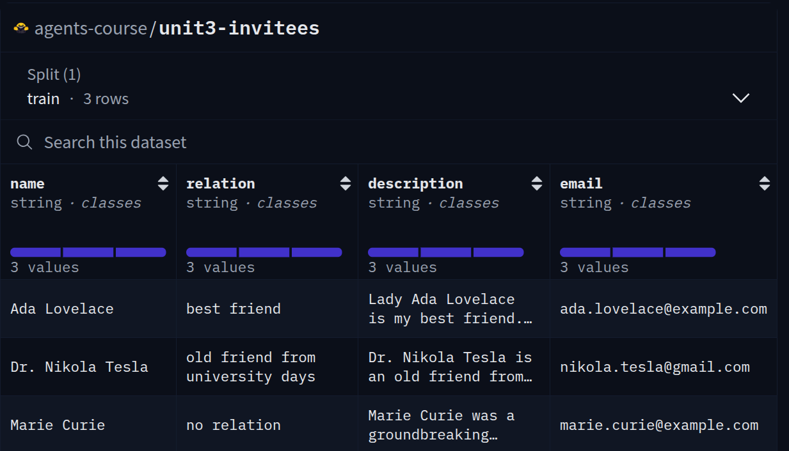

# Introducción al Caso de Uso para RAG Agéntico

En esta sesión, ayudaremos a Alfred, nuestro amigable agente que está organizando la gala, utilizando RAG Agéntico para crear una herramienta que pueda usarse para responder preguntas sobre los invitados en la gala. 

## Una gala para recordar

**Hemos decidido organizar la fiesta más extravagante y opulenta del siglo.** Esto significa banquetes lujosos, bailarines encantadores, DJs de renombre, bebidas exquisitas, un impresionante espectáculo de fuegos artificiales y mucho más.

Alfred, nuestro amigable agente de vecindario, se está preparando para atender todas tus necesidades para esta fiesta, y **Alfred va a gestionar todo por sí mismo**. Para hacerlo, necesita tener acceso a toda la información sobre la fiesta, incluyendo el menú, los invitados, el horario, pronósticos del clima, ¡y mucho más!

No solo eso, sino que también necesitas asegurarse de que la fiesta sea un éxito, por lo que **necesitas poder responder cualquier pregunta sobre la fiesta durante la fiesta**, mientras maneja situaciones inesperadas que puedan surgir.

No puede hacer esto solo, así que debemos asegurarnos de que Alfred tenga acceso a toda la información y herramientas que necesite.

Primero, vamos a darle una lista de requisitos estrictos para la gala.

## Los requisitos de la gala

Una persona debidamente educada en la época del **Renacimiento** necesitas tener tres rasgos principales.
Él o ella necesitaba ser profundo en el **conocimiento de deportes, cultura y ciencia**. Por lo tanto, debemos asegurarnos de que podamos impresionar a nuestros invitados con nuestro conocimiento y proporcionarles una gala verdaderamente inolvidable.
Sin embargo, para evitar conflictos, hay algunos **temas, como la política y la religión, que deben evitarse en una gala.** Debe ser una fiesta divertida sin conflictos relacionados con creencias e ideales.

Según la etiqueta, **un buen anfitrión debe conocer los antecedentes de los invitados**, incluyendo sus intereses y esfuerzos. Un buen anfitrión también chismea y comparte historias sobre los invitados entre sí.

Por último, debemos asegurarnos de tener **algún conocimiento general sobre el clima** para poder encontrar continuamente una actualización en tiempo real que asegure el momento perfecto para lanzar los fuegos artificiales y terminar la gala con broche de oro. 🎆

Como puedes ver, Alfred necesita mucha información para organizar la gala.
Afortunadamente, podemos ayudar y preparar a Alfred dándole algo de **entrenamiento en Generación Aumentada por Recuperación (RAG)**.

# Generación Aumentada por Recuperación con Agentes (RAG Agéntico)

Los **LLMs están entrenados en enormes volúmenes de datos para aprender conocimiento general**.
Sin embargo, el modelo de conocimiento del mundo de los LLMs no siempre puede contener información relevante y actualizada.
**RAG resuelve este problema encontrando y recuperando información relevante de tus datos y enviándola al LLM.**


Ahora, debemos pensar en cómo funciona **Alfred**:

1. Le hemos pedido a Alfred que ayude a planificar una gala
2. Alfred necesita encontrar las últimas noticias e información meteorológica
3. Alfred necesita estructurar y buscar la información de los invitados

Así como Alfred necesita buscar en la información de tu hogar para ser útil, cualquier agente necesita una manera de encontrar y comprender datos relevantes.
**RAG Agéntico es una forma poderosa de usar agentes para responder preguntas sobre tus datos.** Podemos proporcionar varias herramientas a Alfred para ayudarlo a responder preguntas.
Sin embargo, en lugar de responder automáticamente a la pregunta basada en documentos, Alfred puede decidir usar cualquier otra herramienta o flujo para responder la pregunta.


### Construir nuestro flujo de trabajo de RAG agéntico

Primero, crearemos una **herramienta RAG para recuperar detalles actualizados sobre los invitados**. Luego, **desarrollaremos herramientas para búsqueda web, actualizaciones meteorológicas y estadísticas de descargas de modelos de Hugging Face Hub**. Finalmente, **integraremos todo para dar vida a nuestro agente RAG agéntico**  

# Creando una Herramienta RAG para Historias de Invitados

Alfred, nuestro agente de confianza, está preparando la gala más extravagante del siglo. Para asegurar que el evento transcurra sin problemas, Alfred necesita acceso rápido a información actualizada sobre cada invitado. Ayudemos a Alfred creando una herramienta personalizada de Generación Aumentada por Recuperación (RAG), impulsada por nuestro conjunto de datos personalizado.

## ¿Por qué RAG para una Gala?

Imagina a Alfred mezclándose entre los invitados, necesitando recordar detalles específicos sobre cada persona en un instante. Un LLM tradicional podría tener dificultades con esta tarea porque:

1. La lista de invitados es específica para tu evento y no está en los datos de entrenamiento del modelo
2. La información de los invitados puede cambiar o actualizarse frecuentemente
3. Alfred necesita recuperar detalles precisos como direcciones de correo electrónico

Aquí es donde brilla la **Generación Aumentada por Recuperación (RAG)!** Al combinar un sistema de recuperación con un LLM, Alfred puede acceder a información precisa y actualizada sobre tus invitados bajo demanda.

## Configurando nuestra aplicación

Desarrollaremos nuestro agente dentro de un Espacio de HF(HF Space), como un proyecto Python estructurado. Este enfoque nos ayuda a mantener un código limpio y modular, organizando diferentes funcionalidades en archivos separados. Además, esto crea un caso de uso más realista donde desplegaríamos la aplicación para uso público.

### Estructura del Proyecto

- **`tools.py`** – Proporciona herramientas auxiliares para el agente.  
- **`retriever.py`** – Implementa funciones de recuperación para apoyar el acceso al conocimiento.  
- **`app.py`** – Integra todos los componentes en un agente completamente funcional.

## Descripción general del conjunto de datos

Nuestro conjunto de datos [`agents-course/unit3-invitees`](https://huggingface.co/datasets/agents-course/unit3-invitees/) contiene los siguientes campos para cada invitado:

- **Nombre**: Nombre completo del invitado
- **Relación**: Cómo se relaciona el invitado con el anfitrión
- **Descripción**: Una breve biografía o hechos interesantes sobre el invitado
- **Dirección de Correo Electrónico**: Información de contacto para enviar invitaciones o seguimientos

A continuación se muestra una vista previa del conjunto de datos:



> [!TIP]
> En un escenario del mundo real, este conjunto de datos podría ampliarse para incluir preferencias dietéticas, intereses de regalos, temas de conversación a evitar y otros detalles útiles para un anfitrión.

## Construyendo la herramienta de lista de invitados

Crearemos una herramienta personalizada que Alfred pueda usar para recuperar rápidamente información de los invitados durante la gala. Dividamos esto en tres pasos manejables:

1. Cargar y preparar el conjunto de datos
2. Crear la Herramienta de Recuperación
3. Integrar la Herramienta con Alfred

### Paso 1: Cargar y Preparar el Conjunto de Datos

Primero, necesitamos transformar nuestros datos brutos de invitados en un formato optimizado para la recuperación.

Usaremos la librería `datasets` de Hugging Face para cargar el conjunto de datos y convertirlo en una lista de objetos `Document` del módulo `langchain.docstore.document`.

```python
import datasets
from langchain_core.documents import Document

# Cargar el conjunto de datos
guest_dataset = datasets.load_dataset("agents-course/unit3-invitees", split="train")

# Convertir entradas del conjunto de datos en objetos Document
docs = [
    Document(
        page_content="\n".join([
            f"Name: {guest['name']}",
            f"Relation: {guest['relation']}",
            f"Description: {guest['description']}",
            f"Email: {guest['email']}"
        ]),
        metadata={"name": guest["name"]}
    )
    for guest in guest_dataset
]

```

En el código anterior:
- Cargamos el conjunto de datos
- Convertimos cada entrada de invitado en un objeto `Document` con contenido formateado
- Almacenamos los objetos `Document` en una lista

Esto significa que tenemos todos nuestros datos disponibles de manera ordenada para poder comenzar a configurar nuestra recuperación.

### Paso 2: Crear la Herramienta de Recuperación

Ahora, creemos una herramienta personalizada que Alfred pueda usar para buscar en nuestra información de invitados.

Usaremos el `BM25Retriever` del módulo `langchain_community.retrievers` para crear una herramienta de recuperación.

> [!TIP]
> El BM25Retriever es un gran punto de partida para la recuperación, pero para búsquedas semánticas más avanzadas, podrías considerar usar recuperadores basados en embeddings como los de sentence-transformers.

```python
from smolagents import Tool
from langchain_community.retrievers import BM25Retriever

class GuestInfoRetrieverTool(Tool):
    name = "guest_info_retriever"
    description = "Recupera información detallada sobre los invitados de la gala basada en su nombre o relación."
    inputs = {
        "query": {
            "type": "string",
            "description": "El nombre o relación del invitado sobre el que deseas información."
        }
    }
    output_type = "string"

    def __init__(self, docs):
        self.is_initialized = False
        self.retriever = BM25Retriever.from_documents(docs)

    def forward(self, query: str):
        results = self.retriever.get_relevant_documents(query)
        if results:
            return "\n\n".join([doc.page_content for doc in results[:3]])
        else:
            return "No se encontró información que coincida con la búsqueda."

# Inicializar la herramienta
guest_info_tool = GuestInfoRetrieverTool(docs)
```

Entendamos esta herramienta paso a paso: 
- El `name` y la `description` ayudan al agente a entender cuándo y cómo usar esta herramienta
- Los `inputs` definen qué parámetros espera la herramienta (en este caso, una consulta de búsqueda)
- Estamos usando un `BM25Retriever`, que es un algoritmo poderoso de recuperación de texto que no requiere embeddings
- El método `forward` procesa la consulta y devuelve la información más relevante del invitado

### Paso 3: Integrar la Herramienta con Alfred

Finalmente, juntemos todo creando nuestro agente y equipándolo con nuestra herramienta personalizada:

```python
from smolagents import CodeAgent, InferenceClientModel

# Inicializar el modelo de Hugging Face
model = InferenceClientModel()

# Crear Alfred, nuestro agente de gala, con la herramienta de información de invitados
alfred = CodeAgent(tools=[guest_info_tool], model=model)

# Ejemplo de consulta que Alfred podría recibir durante la gala
response = alfred.run("Cuéntame sobre nuestra invitada llamada 'Lady Ada Lovelace'.")

print("🎩 Respuesta de Alfred:")
print(response)
```

Salida esperada:

```
🎩 Respuesta de Alfred:
Basado en la información que recuperé, Lady Ada Lovelace es una estimada matemática y amiga. Es reconocida por su trabajo pionero en matemáticas e informática, a menudo celebrada como la primera programadora de computadoras debido a su trabajo en la Máquina Analítica de Charles Babbage. Su dirección de correo electrónico es ada.lovelace@example.com.
```

Lo que está sucediendo en este paso final:
- Inicializamos un modelo de Hugging Face usando la clase `InferenceClientModel`
- Creamos nuestro agente (Alfred) como un `CodeAgent`, que puede ejecutar código Python para resolver problemas
- Le pedimos a Alfred que recupere información sobre una invitada llamada "Lady Ada Lovelace"

## Ejemplo de Interacción

Durante la gala, una conversación podría fluir así:

**Tú:** "Alfred, ¿quién es ese caballero hablando con el embajador?"

**Alfred:** *rápidamente busca en la base de datos de invitados* "Ese es el Dr. Nikola Tesla, señor. Es un viejo amigo de sus días universitarios. Recientemente ha patentado un nuevo sistema de transmisión de energía inalámbrica y estaría encantado de discutirlo con usted. Solo recuerde que es apasionado por las palomas, así que eso podría ser un buen tema de conversación."

```json
{
    "name": "Dr. Nikola Tesla",
    "relation": "viejo amigo de días universitarios",  
    "description": "El Dr. Nikola Tesla es un viejo amigo de sus días universitarios. Recientemente ha patentado un nuevo sistema de transmisión de energía inalámbrica y estaría encantado de discutirlo con usted. Solo recuerde que es apasionado por las palomas, así que eso podría ser un buen tema de conversación.",
    "email": "nikola.tesla@gmail.com"
}
```

## Llevándolo Más Allá

Ahora que Alfred puede recuperar información de invitados, considera cómo podrías mejorar este sistema:

1. **Mejorar el recuperador** para usar un algoritmo más sofisticado como [sentence-transformers](https://www.sbert.net/)
2. **Implementar una memoria de conversación** para que Alfred recuerde interacciones previas
3. **Combinar con búsqueda web** para obtener la información más reciente sobre invitados desconocidos
4. **Integrar múltiples índices** para obtener información más completa de fuentes verificadas

# Construyendo e integrando herramientas para nuestro Agente

En esta sección, le daremos a Alfred acceso a la web, permitiéndole encontrar las últimas noticias y actualizaciones globales. 
Además, tendrá acceso a datos meteorológicos y estadísticas de descargas de modelos de Hugging Face Hub, para que pueda mantener conversaciones relevantes sobre temas actuales.

## Dándole a nuestro Agente acceso a la web

Ojo, queremos que Alfred establezca su presencia como un verdadero anfitrión renacentista, con un profundo conocimiento del mundo.

Para lograrlo, necesitamos asegurarnos de que Alfred tenga acceso a las últimas noticias e información sobre el mundo.

¡Comencemos creando una herramienta de búsqueda web para Alfred!

```python
from smolagents import DuckDuckGoSearchTool

# Inicializar la herramienta de búsqueda DuckDuckGo
search_tool = DuckDuckGoSearchTool()

# Ejemplo de uso
results = search_tool("¿Quién es el actual Presidente de Francia?")
print(results)
```

Salida esperada:

```
The current President of France in Emmanuel Macron.
```

## Creando una herramienta personalizada para información meteorológica para programar los fuegos artificiales

La gala perfecta tendría fuegos artificiales bajo un cielo despejado, necesitamos asegurarnos de que los fuegos artificiales no sean cancelados debido al mal tiempo.

Vamos a crear una herramienta personalizada que pueda usarse para llamar a una API meteorológica externa y obtener la información del clima para una ubicación determinada.

> [!TIP]
> Por simplicidad, estamos usando una API meteorológica ficticia para este ejemplo. Si quieres usar una API meteorológica real, podrías implementar una herramienta meteorológica que use la API de OpenWeatherMap, como anteriormente.

```python
from smolagents import Tool
import random

class WeatherInfoTool(Tool):
    name = "weather_info"
    description = "Obtiene información meteorológica ficticia para una ubicación dada."
    inputs = {
        "location": {
            "type": "string",
            "description": "La ubicación para la que obtener información meteorológica."
        }
    }
    output_type = "string"

    def forward(self, location: str):
        # Datos meteorológicos ficticios
        weather_conditions = [
            {"condition": "Lluvioso", "temp_c": 15},
            {"condition": "Despejado", "temp_c": 25},
            {"condition": "Ventoso", "temp_c": 20}
        ]
        # Seleccionar aleatoriamente una condición meteorológica
        data = random.choice(weather_conditions)
        return f"Clima en {location}: {data['condition']}, {data['temp_c']}°C"

# Inicializar la herramienta
weather_info_tool = WeatherInfoTool()
```

## Creando una herramienta de estadísticas de hub para influyentes creadores de IA

Entre los asistentes a la gala están los más destacados creadores de IA. Alfred quiere impresionarlos discutiendo sus modelos, conjuntos de datos y espacios más populares. Crearemos una herramienta para obtener estadísticas de modelos desde Hugging Face Hub basadas en un nombre de usuario.

```python
from smolagents import Tool
from huggingface_hub import list_models

class HubStatsTool(Tool):
    name = "hub_stats"
    description = "Obtiene el modelo más descargado de un autor específico en Hugging Face Hub."
    inputs = {
        "author": {
            "type": "string",
            "description": "El nombre de usuario del autor/organización del modelo para encontrar modelos."
        }
    }
    output_type = "string"

    def forward(self, author: str):
        try:
            # Listar modelos del autor especificado, ordenados por descargas
            models = list(list_models(author=author, sort="downloads", direction=-1, limit=1))
            
            if models:
                model = models[0]
                return f"El modelo más descargado de {author} es {model.id} con {model.downloads:,} descargas."
            else:
                return f"No se encontraron modelos para el autor {author}."
        except Exception as e:
            return f"Error al obtener modelos para {author}: {str(e)}"

# Inicializar la herramienta
hub_stats_tool = HubStatsTool()

# Ejemplo de uso
print(hub_stats_tool("facebook")) # Ejemplo: Obtener el modelo más descargado de Facebook
```

Salida esperada:

```
The most downloaded model by facebook is facebook/esmfold_v1 with 12,544,550 downloads.
```

Con la **Herramienta de estadísticas de Hub**, Alfred ahora puede impresionar a influyentes creadores de IA discutiendo sus modelos más populares.

## Integrando herramientas con Alfred

Ahora que tenemos todas las herramientas, vamos a integrarlas en el agente de Alfred:

```python
from smolagents import CodeAgent, InferenceClientModel

# Inicializar el modelo de Hugging Face
model = InferenceClientModel()

# Crear Alfred con todas las herramientas
alfred = CodeAgent(
    tools=[search_tool, weather_info_tool, hub_stats_tool], 
    model=model
)

# Ejemplo de consulta que Alfred podría recibir durante la gala
response = alfred.run("¿Qué es Facebook y cuál es su modelo más popular?")

print("🎩 Respuesta de Alfred:")
print(response)
```

Salida esperada: 

```
🎩 Respuesta de Alfred:
Facebook es un sitio web de redes sociales donde los usuarios pueden conectarse, compartir información e interactuar con otros. El modelo más descargado de Facebook en Hugging Face Hub es ESMFold_v1.
```

# Creando nuestro Agente para la gala

Ahora que hemos construido todos los componentes necesarios para Alfred, es momento de unirlos en un agente completo que pueda ayudar a organizar nuestra extravagante gala.

Vamos a combinar la recuperación de información de invitados, búsqueda web, información meteorológica y herramientas de estadísticas de Hub en un solo agente.

## Ensamblando a Alfred: el Agente completo

En lugar de reimplementar todas las herramientas que creamos en secciones anteriores, las importaremos desde sus respectivos módulos que guardamos en los archivos `tools.py` y `retriever.py`.

Importemos las bibliotecas y herramientas necesarias de las secciones anteriores:

```python
# Importar librerías necesarias
import random
from smolagents import CodeAgent, InferenceClientModel

# Importar nuestras herramientas personalizadas desde sus módulos
from tools import DuckDuckGoSearchTool, WeatherInfoTool, HubStatsTool
from retriever import load_guest_dataset
```

Ahora, combinemos todas estas herramientas en un solo agente:

```python
# Inicializar el modelo de Hugging Face
model = InferenceClientModel()

# Inicializar la herramienta de búsqueda web
search_tool = DuckDuckGoSearchTool()

# Inicializar la herramienta del clima
weather_info_tool = WeatherInfoTool()

# Inicializar la herramienta de estadísticas de Hub
hub_stats_tool = HubStatsTool()

# Cargar el conjunto de datos de invitados e inicializar la herramienta de información de invitados
guest_info_tool = load_guest_dataset()

# Crear a Alfred con todas las herramientas
alfred = CodeAgent(
    tools=[guest_info_tool, weather_info_tool, hub_stats_tool, search_tool], 
    model=model,
    add_base_tools=True,  # Agregar cualquier herramienta base adicional
    planning_interval=3   # Habilitar planificación cada 3 pasos
)
```

```python
# Importar librerías necesarias
from llama_index.core.agent.workflow import AgentWorkflow
from llama_index.llms.huggingface_api import HuggingFaceInferenceAPI

from tools import search_tool, weather_info_tool, hub_stats_tool
from retriever import guest_info_tool
```

Ahora, combinemos todas estas herramientas en un solo agente:

```python
# Inicializar el modelo de Hugging Face
llm = HuggingFaceInferenceAPI(model_name="Qwen/Qwen2.5-Coder-32B-Instruct")

# Crear Alfred con todas las herramientas
alfred = AgentWorkflow.from_tools_or_functions(
    [guest_info_tool, search_tool, weather_info_tool, hub_stats_tool],
    llm=llm,
)
```

```python
from typing import TypedDict, Annotated
from langgraph.graph.message import add_messages
from langchain_core.messages import AnyMessage, HumanMessage, AIMessage
from langgraph.prebuilt import ToolNode
from langgraph.graph import START, StateGraph
from langgraph.prebuilt import tools_condition
from langchain_huggingface import HuggingFaceEndpoint, ChatHuggingFace

from tools import DuckDuckGoSearchTool, weather_info_tool, hub_stats_tool
from retriever import load_guest_dataset
```

Ahora, combina todas estas herramientas en un solo agente:

```python
# Inicializar la herramienta de búsqueda web
search_tool = DuckDuckGoSearchTool()

# Cargar el conjunto de datos de invitados e inicializar la herramienta de información de invitados
guest_info_tool = load_guest_dataset()

# Generar la interfaz de chat, incluyendo las herramientas
llm = HuggingFaceEndpoint(
    repo_id="Qwen/Qwen2.5-Coder-32B-Instruct",
    huggingfacehub_api_token=HUGGINGFACEHUB_API_TOKEN,
)

chat = ChatHuggingFace(llm=llm, verbose=True)
tools = [guest_info_tool, search_tool, weather_info_tool, hub_stats_tool]
chat_with_tools = chat.bind_tools(tools)

# Generar el AgentState y el grafo del Agente
class AgentState(TypedDict):
    messages: Annotated[list[AnyMessage], add_messages]

def assistant(state: AgentState):
    return {
        "messages": [chat_with_tools.invoke(state["messages"])],
    }

## El grafo
builder = StateGraph(AgentState)

# Definir nodos: estos hacen el trabajo
builder.add_node("assistant", assistant)
builder.add_node("tools", ToolNode(tools))

# Definir bordes: estos determinan cómo se mueve el flujo de control
builder.add_edge(START, "assistant")
builder.add_conditional_edges(
    "assistant",
    # Si el último mensaje requiere una herramienta, enrutar a herramientas
    # De lo contrario, proporcionar una respuesta directa
    tools_condition,
)
builder.add_edge("tools", "assistant")
alfred = builder.compile()
```

¡Tu agente ahora está listo para usarse!

## Usando a Alfred: Ejemplos de Principio a Fin

Ahora que Alfred está completamente equipado con todas las herramientas necesarias, veamos cómo puede ayudar con varias tareas durante la gala.

### Ejemplo 1: Encontrando Información de Invitados

Veamos cómo Alfred puede ayudarnos con nuestra información de invitados.

```python
query = "Cuéntame sobre 'Lady Ada Lovelace'"
response = alfred.run(query)

print("🎩 Respuesta de Alfred:")
print(response)
```

Salida esperada:

```
🎩 Respuesta de Alfred:
Según la información que recuperé, Lady Ada Lovelace es una estimada matemática y amiga. Es reconocida por su trabajo pionero en matemáticas y computación, frecuentemente celebrada como la primera programadora de computadoras debido a su trabajo en el Motor Analítico de Charles Babbage. Su dirección de correo electrónico es ada.lovelace@example.com.
```

```python
query = "Cuéntame sobre Lady Ada Lovelace. ¿Cuál es su historia?"
response = await alfred.run(query)

print("🎩 Respuesta de Alfred:")
print(response.response.blocks[0].text)
```

Salida esperada:

```
🎩 Respuesta de Alfred:
Lady Ada Lovelace fue una matemática y escritora inglesa, mejor conocida por su trabajo en el Motor Analítico de Charles Babbage. Fue la primera en reconocer que la máquina tenía aplicaciones más allá del cálculo puro.
```

```python
response = alfred.invoke({"messages": "Cuéntame sobre 'Lady Ada Lovelace'"})

print("🎩 Respuesta de Alfred:")
print(response['messages'][-1].content)
```

Salida esperada:

```
🎩 Respuesta de Alfred:
Ada Lovelace, también conocida como Augusta Ada King, Condesa de Lovelace, fue una matemática y escritora inglesa. Nacida el 10 de diciembre de 1815 y fallecida el 27 de noviembre de 1852, es reconocida por su trabajo en el Motor Analítico de Charles Babbage, una computadora mecánica de propósito general. Ada Lovelace es celebrada como una de las primeras programadoras de computadoras porque creó un programa para el Motor Analítico en 1843. Reconoció que la máquina podía usarse para más que simples cálculos, visualizando su potencial de una manera que pocos hicieron en ese momento. Sus contribuciones al campo de la ciencia de la computación sentaron las bases para desarrollos futuros. Un día en octubre, designado como el Día de Ada Lovelace, honra las contribuciones de las mujeres a la ciencia y la tecnología, inspirado en el trabajo pionero de Lovelace.
```

### Ejemplo 2: Verificando el Clima para los Fuegos Artificiales

Veamos cómo Alfred puede ayudarnos con el clima.

```python
query = "¿Cómo está el clima en París esta noche? ¿Será adecuado para nuestro espectáculo de fuegos artificiales?"
response = alfred.run(query)

print("🎩 Respuesta de Alfred:")
print(response)
```

Salida esperada (variará debido a la aleatoriedad):
```
🎩 Respuesta de Alfred:
He revisado el clima en París para ti. Actualmente, está despejado con una temperatura de 25°C. Estas condiciones son perfectas para el espectáculo de fuegos artificiales de esta noche. Los cielos despejados proporcionarán una excelente visibilidad para el espectáculo espectacular, y la temperatura agradable asegurará que los invitados puedan disfrutar del evento al aire libre sin incomodidad.
```

```python
query = "¿Cómo está el clima en París esta noche? ¿Será adecuado para nuestro espectáculo de fuegos artificiales?"
response = await alfred.run(query)

print("🎩 Respuesta de Alfred:")
print(response)
```

Salida esperada:

```
🎩 Respuesta de Alfred:
El clima en París esta noche es lluvioso con una temperatura de 15°C. Debido a la lluvia, puede que no sea adecuado para un espectáculo de fuegos artificiales.
```

```python
response = alfred.invoke({"messages": "¿Cómo está el clima en París esta noche? ¿Será adecuado para nuestro espectáculo de fuegos artificiales?"})

print("🎩 Respuesta de Alfred:")
print(response['messages'][-1].content)
```

Salida esperada:

```
🎩 Respuesta de Alfred:
El clima en París esta noche es lluvioso con una temperatura de 15°C, lo que puede no ser adecuado para tu espectáculo de fuegos artificiales.
```

### Ejemplo 3: Impresionando a Investigadores de IA

Veamos cómo Alfred puede ayudarnos a impresionar a los investigadores de IA.

```python
query = "Uno de nuestros invitados es de Qwen. ¿Qué puedes decirme sobre su modelo más popular?"
response = alfred.run(query)

print("🎩 Respuesta de Alfred:")
print(response)
```

Salida esperada:

```
🎩 Respuesta de Alfred:
El modelo más popular de Qwen es Qwen/Qwen2.5-VL-7B-Instruct con 3,313,345 descargas.
```

```python
query = "Uno de nuestros invitados es de Google. ¿Qué puedes decirme sobre su modelo más popular?"
response = await alfred.run(query)

print("🎩 Respuesta de Alfred:")
print(response)
```

Salida esperada:

```
🎩 Respuesta de Alfred:
El modelo más popular de Google en Hugging Face Hub es google/electra-base-discriminator, con 28,546,752 descargas.
```

```python
response = alfred.invoke({"messages": "Uno de nuestros invitados es de Qwen. ¿Qué puedes decirme sobre su modelo más popular?"})

print("🎩 Respuesta de Alfred:")
print(response['messages'][-1].content)
```

Salida esperada:

```
🎩 Respuesta de Alfred:
El modelo más descargado de Qwen es Qwen/Qwen2.5-VL-7B-Instruct con 3,313,345 descargas.
```

### Ejemplo 4: Combinando Múltiples Herramientas

Veamos cómo Alfred puede ayudarnos a prepararnos para una conversación con el Dr. Nikola Tesla.

```python
query = "Necesito hablar con el Dr. Nikola Tesla sobre avances recientes en energía inalámbrica. ¿Puedes ayudarme a prepararme para esta conversación?"
response = alfred.run(query)

print("🎩 Respuesta de Alfred:")
print(response)
```

Salida esperada:

```
🎩 Respuesta de Alfred:
He reunido información para ayudarte a prepararte para tu conversación con el Dr. Nikola Tesla.

Información del Invitado:
Nombre: Dr. Nikola Tesla
Relación: viejo amigo de los días universitarios
Descripción: El Dr. Nikola Tesla es un viejo amigo de tus días universitarios. Recientemente ha patentado un nuevo sistema de transmisión de energía inalámbrica y estaría encantado de discutirlo contigo. Solo recuerda que le apasionan las palomas, así que eso podría ser un buen tema para iniciar la conversación.
Email: nikola.tesla@gmail.com

Avances Recientes en Energía Inalámbrica:
Basándome en mi búsqueda web, aquí hay algunos desarrollos recientes en transmisión de energía inalámbrica:
1. Los investigadores han avanzado en la transmisión de energía inalámbrica de largo alcance utilizando ondas electromagnéticas enfocadas
2. Varias empresas están desarrollando tecnologías de acoplamiento inductivo resonante para electrónica de consumo
3. Hay nuevas aplicaciones en la carga de vehículos eléctricos sin conexiones físicas

Iniciadores de Conversación:
1. "Me encantaría conocer tu nueva patente sobre transmisión de energía inalámbrica. ¿Cómo se compara con tus conceptos originales de nuestros días universitarios?"
2. "¿Has visto los desarrollos recientes en acoplamiento inductivo resonante para electrónica de consumo? ¿Qué opinas de su enfoque?"
3. "¿Cómo están tus palomas? Recuerdo tu fascinación por ellas."

Esto debería darte mucho para discutir con el Dr. Tesla mientras demuestras tu conocimiento de sus intereses y desarrollos recientes en su campo.
```

```python
query = "Necesito hablar con el Dr. Nikola Tesla sobre avances recientes en energía inalámbrica. ¿Puedes ayudarme a prepararme para esta conversación?"
response = await alfred.run(query)

print("🎩 Respuesta de Alfred:")
print(response)
```

Salida esperada:

```
🎩 Respuesta de Alfred:
Aquí hay algunos avances recientes en energía inalámbrica que podrían serte útiles para tu conversación con el Dr. Nikola Tesla:

1. **Avances y Desafíos en la Transferencia de Energía Inalámbrica**: Este artículo analiza la evolución de la transferencia de energía inalámbrica (WPT) desde los métodos convencionales con cables hasta las aplicaciones modernas, incluidas las estaciones de energía espacial solar. Destaca el enfoque inicial en la tecnología de microondas y la demanda actual de WPT debido al aumento de dispositivos eléctricos.

2. **Avances Recientes en Tecnologías de Transferencia de Energía Inalámbrica para Electrónica Corporal**: Este artículo explora la transferencia de energía inalámbrica (WET) como solución para alimentar dispositivos electrónicos corporales sin necesidad de baterías o cables conductores. Analiza las ventajas y posibles aplicaciones de WET en este contexto.

3. **Transferencia de Energía Inalámbrica y Captación de Energía: Estado Actual y Tendencias Futuras**: Este artículo proporciona una visión general de los avances recientes en métodos de suministro de energía inalámbrica, incluida la captación de energía y la transferencia de energía inalámbrica. Presenta varias aplicaciones prometedoras y analiza las tendencias futuras en el campo.

4. **Transferencia de Energía Inalámbrica: Aplicaciones, Desafíos, Barreras y
```

```python
response = alfred.invoke({"messages":"Necesito hablar con el 'Dr. Nikola Tesla' sobre avances recientes en energía inalámbrica. ¿Puedes ayudarme a prepararme para esta conversación?"})

print("🎩 Respuesta de Alfred:")
print(response['messages'][-1].content)
```

Salida esperada:

```
Basándome en la información proporcionada, aquí hay puntos clave para prepararte para la conversación con el 'Dr. Nikola Tesla' sobre avances recientes en energía inalámbrica:
1. **Transmisión de Energía Inalámbrica (WPT):** Comenta cómo WPT revoluciona la transferencia de energía al eliminar la necesidad de cables y aprovechar mecanismos como el acoplamiento inductivo y resonante.
2. **Avances en Carga Inalámbrica:** Destaca las mejoras en eficiencia, velocidades de carga más rápidas y el auge de soluciones de carga inalámbrica certificadas Qi/Qi2.
3. **Innovaciones 5G-Advanced y Protocolo Inalámbrico NearLink:** Menciona estos como desarrollos que mejoran la velocidad, seguridad y eficiencia en redes inalámbricas, que pueden soportar tecnologías avanzadas de energía inalámbrica.
4. **IA y ML en el Edge:** Habla sobre cómo la inteligencia artificial y el aprendizaje automático dependerán de redes inalámbricas para llevar inteligencia al borde, mejorando la automatización e inteligencia en hogares y edificios inteligentes.
5. **Avances en Matter, Thread y Seguridad:** Comenta estas innovaciones clave que impulsan la conectividad, eficiencia y seguridad en dispositivos y sistemas IoT.
6. **Avances en Tecnología de Carga Inalámbrica:** Incluye avances recientes o estudios, como el de la Universidad Nacional de Incheon, para respaldar los avances en carga inalámbrica.
```

### Ejemplo 3: Impresionando a Investigadores de IA

Veamos cómo Alfred puede ayudarnos a impresionar a los investigadores de IA.

```python
query = "Uno de nuestros invitados es de Qwen. ¿Qué puedes decirme sobre su modelo más popular?"
response = alfred.run(query)

print("🎩 Respuesta de Alfred:")
print(response)
```

Salida esperada:

```
🎩 Respuesta de Alfred:
El modelo más popular de Qwen es Qwen/Qwen2.5-VL-7B-Instruct con 3,313,345 descargas.
```

```python
query = "Uno de nuestros invitados es de Google. ¿Qué puedes decirme sobre su modelo más popular?"
response = await alfred.run(query)

print("🎩 Respuesta de Alfred:")
print(response)
```

Salida esperada:

```
🎩 Respuesta de Alfred:
El modelo más popular de Google en Hugging Face Hub es google/electra-base-discriminator, con 28,546,752 descargas.
```

```python
response = alfred.invoke({"messages": "Uno de nuestros invitados es de Qwen. ¿Qué puedes decirme sobre su modelo más popular?"})

print("🎩 Respuesta de Alfred:")
print(response['messages'][-1].content)
```

Salida esperada:

```
🎩 Respuesta de Alfred:
El modelo más descargado de Qwen es Qwen/Qwen2.5-VL-7B-Instruct con 3,313,345 descargas.
```

## Características Avanzadas: Memoria de Conversación

Para hacer que Alfred sea aún más útil durante la gala, podemos habilitar la memoria de conversación para que recuerde interacciones previas:

```python
# Crear Alfred con memoria de conversación
alfred_with_memory = CodeAgent(
    tools=[guest_info_tool, weather_info_tool, hub_stats_tool, search_tool], 
    model=model,
    add_base_tools=True,
    planning_interval=3,
    memory=True  # Habilitar memoria de conversación
)

# Primera interacción
response1 = alfred_with_memory.run("Cuéntame sobre Lady Ada Lovelace.")
print("🎩 Primera Respuesta de Alfred:")
print(response1)

# Segunda interacción (haciendo referencia a la primera)
response2 = alfred_with_memory.run("¿En qué proyectos está trabajando actualmente?")
print("🎩 Segunda Respuesta de Alfred:")
print(response2)
```

```python
from llama_index.core.workflow import Context

alfred = AgentWorkflow.from_tools_or_functions(
    [guest_info_tool, search_tool, weather_info_tool, hub_stats_tool],
    llm=llm
)

# Recordando el estado
ctx = Context(alfred)

# Primera interacción
response1 = await alfred.run("Cuéntame sobre Lady Ada Lovelace.", ctx=ctx)
print("🎩 Primera Respuesta de Alfred:")
print(response1)

# Segunda interacción (haciendo referencia a la primera)
response2 = await alfred.run("¿En qué proyectos está trabajando actualmente?", ctx=ctx)
print("🎩 Segunda Respuesta de Alfred:")
print(response2)
```

```python
# Primera interacción
response = alfred.invoke({"messages": [HumanMessage(content="Cuéntame sobre 'Lady Ada Lovelace'. ¿Cuál es su historia y cómo está relacionada conmigo?")]})

print("🎩 Respuesta de Alfred:")
print(response['messages'][-1].content)
print()

# Segunda interacción (haciendo referencia a la primera)
response = alfred.invoke({"messages": response["messages"] + [HumanMessage(content="¿En qué proyectos está trabajando actualmente?")]})

print("🎩 Respuesta de Alfred:")
print(response['messages'][-1].content)
```

## Conclusión

¡Felicitaciones! Has construido exitosamente a Alfred, un agente sofisticado equipado con múltiples herramientas para ayudar a organizar la gala más extravagante del siglo. Alfred ahora puede:

1. Recuperar información detallada sobre los invitados
2. Verificar las condiciones climáticas para planificar actividades al aire libre
3. Proporcionar información sobre influyentes creadores de IA y sus modelos
4. Buscar en la web la información más reciente
5. Mantener el contexto de la conversación con memoria

Con estas capacidades, Alfred está listo para asegurar que tu gala sea un éxito rotundo, impresionando a los invitados con atención personalizada e información actualizada.
