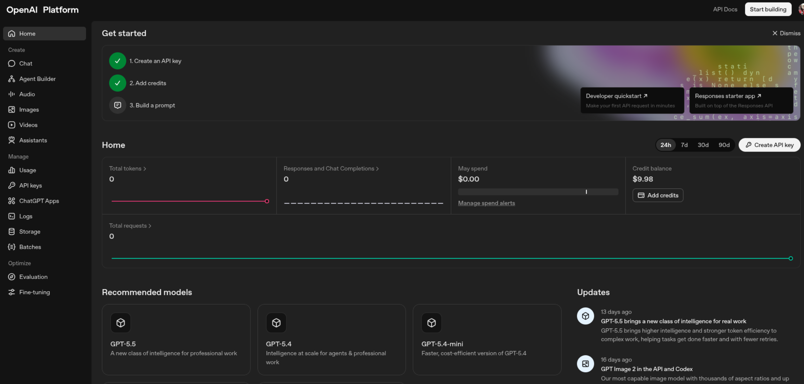
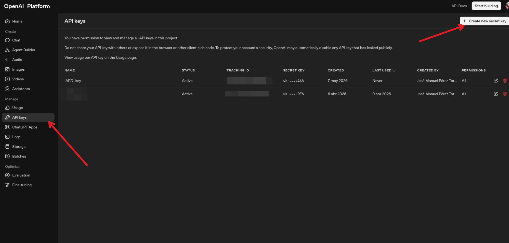
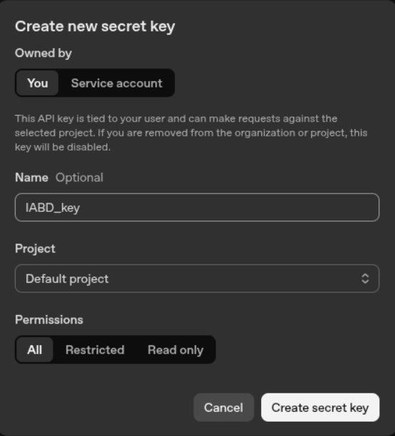

# Programación de Agentes con Langchain 

## Qué es LangChain

LangChain es una librería orientada a construir aplicaciones profesionales sobre modelos de lenguaje, superando limitaciones habituales de un uso aislado del LLM, como la falta de memoria conversacional o la incapacidad de consultar herramientas externas.

LangChain permite orquestar **cadenas de interacción** con modelos de lenguaje, integrar fuentes de datos, mantener contexto y construir chatbots, sistemas de resumen y aplicaciones más personalizadas.

## Objetivos

* Comprender qué aporta LangChain
* Usar plantillas de prompt con un modelo de OpenAI
* Crear un chatbot con memoria
* Construir un agente con herramientas.

## Preparación del entorno

Para estos ejemplos, se recomienda crear una carpeta de proyecto llamda, por ejemplo, y abrirla en Visual Studio Code, generar un entorno virtual y e instalar `langchain-openai` y `langchain-core` para los primeros ejemplos.

Más adelante añadiremos `langchain-community` y `langchain` para trabajar con herramientas y agentes.

### Instalar dependencias

```bash
pip install langchain langchain-openai langchain-core langchain-community
```

En este ejemplo vamos solicitar una clave la [plataforma de OpenAI](https://platform.openai.com/home) y asignarla como variable de entorno para poder invocar el modelo.

**OpenAI Platform**


**OpenAI Platform**


**Solicitar una key**


```python
import os
os.environ["OPENAI_API_KEY"] = "TU_CLAVE"
```

## Conceptos previos

### PromptTemplate

Langchain ofrece la librería `PromptTemplate` para definir una plantilla reutilizable donde una parte del texto permanece fija y otra se sustituye dinámicamente con variables predefinidas como `tema`, `nivel`, etc.

Esto es importante porque separa la **lógica del prompt** de los datos concretos que se pasan en cada ejecución.

### Chain

Una cadena o chain, se explica como un **flujo donde la salida de un componente alimenta el siguiente paso del procesamiento**, por ejemplo prompt y modelo enlazados entre sí.

```python
chain = prompt | model
```

En versiones actuales de LangChain, ese estilo también aparece en la composición mediante runnables, que enlazan componentes de forma declarativa.

### Memoria conversacional

El ejemplo de chatbot mantiene un historial con mensajes humanos y mensajes de IA, lo que permite que el modelo responda teniendo en cuenta turnos anteriores.

Pedagógicamente, este ejemplo es muy útil para explicar la diferencia entre una llamada aislada a un modelo y una conversación con **estado**.

### Agentes y herramientas

Más adelante, realizaremos un agente como un componente capaz de decidir qué acción tomar y qué herramienta usar según la tarea planteada por el usuario.

Ese enfoque convierte al LLM en un coordinador que no solo genera texto, sino que escoge acciones, por ejemplo hacer un cálculo con una herramienta matemática.

## Ejemplo 1: explicación de un tema con PromptTemplate

El objetivo es construir una función que reciba un tema, monte un prompt a partir de una plantilla y consulte un modelo de OpenAI para obtener una explicación sencilla.

### Objetivos

Este ejemplo enseña tres ideas básicas: inicializar un modelo, reutilizar un prompt parametrizado y encapsular la llamada al LLM dentro de una función Python.

### Código reconstruido y comentado

**app.py**
```python
import os
from dotenv import load_dotenv
from langchain_openai import ChatOpenAI
from langchain_core.prompts import PromptTemplate

# Cargar variables del archivo .env
load_dotenv()  # busca un .env en la raíz del proyecto[web:43]

# Leer la clave desde la variable de entorno
api_key = os.getenv("OPENAI_API_KEY")
if not api_key:
    raise RuntimeError("Falta la variable de entorno OPENAI_API_KEY")

# Configurar el cliente de OpenAI (LangChain ya mira esta env var)
os.environ["OPENAI_API_KEY"] = api_key

llm = ChatOpenAI(
    model="gpt-4o-mini",
    temperature=0.7
)

template = PromptTemplate(
    input_variables=["tema"],
    template="Explica el tema '{tema}' usando un ejemplo."
)

def explicar_tema(tema: str) -> str:
    prompt = template.format(tema=tema)
    respuesta = llm.invoke(prompt)
    return respuesta.content

resultado = explicar_tema("principios de la física cuántica")
print(resultado)
```

### Explicación línea a línea

- **`ChatOpenAI`** crea el objeto que representa el modelo de chat que se va a invocar desde LangChain.
- **`PromptTemplate`** define una plantilla con una variable de entrada llamada `tema`.
- **`template.format(tema=tema)`** sustituye la variable por el valor real que pasa la función.
- **`llm.invoke(prompt)`** envía el texto final al modelo y devuelve una respuesta estructurada.
- **`respuesta.content`** extrae el contenido textual generado por el modelo.

### ¿Qué hemos aprendido?

Con este ejemplo, vemos que LangChain no es solo “preguntar a un modelo”, sino una **forma de construir piezas reutilizables y más limpias que concatenar strings manualmente**.

También se puede remarcar que este patrón es útil cuando una aplicación repite muchas veces el mismo tipo de prompt con datos distintos.

### Ejercicio de ampliación

Una variante muy útil consiste en cambiar la plantilla para adaptar el nivel de dificultad de la respuesta.

```python
template = PromptTemplate(
    input_variables=["tema", "nivel"],
    template="Explica el tema '{tema}' para un estudiante de nivel {nivel} usando un ejemplo."
)
```
Así podemos experimentar con diseño de prompts y observar cómo cambia la respuesta sin tocar la lógica general del programa.

## Ejemplo 2: chatbot con memoria e historial de mensajes

El segundo ejemplo que vamos a realizar es crear un chatbot básico que recuerda la conversación y responde teniendo en cuenta el historial previo.

Este ejemplo es especialmente valioso porque muestra una necesidad real en aplicaciones conversacionales: **que el sistema no trate cada mensaje como si fuera independiente**.

### Objetivos

En este ejemplo vamos a trabajar con **`ChatPromptTemplate`**, un **`MessagesPlaceholder`**, mensajes de usuario, mensajes de IA y una cadena **`prompt | llm`**.

La idea central es **inyectar el historial en el prompt para que el modelo vea la conversación acumulada antes de generar la siguiente respuesta**.

### Código completo

**chatbot.py**
```python
import os
from langchain_openai import ChatOpenAI
from langchain_core.prompts import ChatPromptTemplate, MessagesPlaceholder
from langchain_core.messages import HumanMessage, AIMessage

os.environ["OPENAI_API_KEY"] = "TU_CLAVE"

llm = ChatOpenAI(
    model="gpt-4o-mini",
    temperature=0.7
)

prompt = ChatPromptTemplate.from_messages([
    MessagesPlaceholder(variable_name="chat_history"),
    ("human", "{input}")
])

chain = prompt | llm

def ejecutar_chatbot():
    print("Bienvenido a mi chatbot de LangChain. Escribe 'salir' para terminar.")
    chat_history = []

    while True:
        user_input = input("Tú: ")

        if user_input.strip().lower() == "salir":
            print("Chatbot: Hasta luego")
            break

        response = chain.invoke({
            "input": user_input,
            "chat_history": chat_history
        })

        chat_history.append(HumanMessage(content=user_input))
        chat_history.append(AIMessage(content=response.content))

        print("Chatbot:", response.content)

if __name__ == "__main__":
    ejecutar_chatbot()
```

### Explicación técnica

- **`ChatPromptTemplate.from_messages(...)`** construye un prompt de chat a partir de varios mensajes o huecos de mensajes.
- **`MessagesPlaceholder(variable_name="chat_history")`** reserva una posición donde se insertará la lista completa de mensajes anteriores.
- **`("human", "{input}")`** representa el nuevo turno del usuario que se añadirá al final del historial.
- **`chain = prompt | llm`** crea una cadena donde primero se formatea el prompt y luego se invoca el modelo.
- **`chat_history.append(...)`** actualiza el estado de la conversación tras cada intercambio.

### Flujo lógico del programa

1. El usuario escribe un mensaje.
2. El programa envía al modelo el historial acumulado más el nuevo **`input`**.
3. El modelo genera una respuesta contextualizada.
4. Esa respuesta también se guarda en el historial para el siguiente turno.

### Qué demuestra el ejemplo del vídeo

En la demo, el usuario proporciona datos personales y después pregunta qué recuerda el chatbot; el sistema es capaz de recuperar información previa porque esos mensajes siguen presentes en **`chat_history`**.

Ese comportamiento no implica memoria persistente en disco, sino memoria mantenida en ejecución mediante la lista de mensajes del programa.

### Posibles mejoras

- Añadir un mensaje de sistema inicial para definir el rol del asistente.
- Limitar el tamaño del historial para controlar coste y longitud del contexto.
- Guardar el historial en un fichero JSON para recuperar la conversación al reiniciar.

Una mejora didáctica muy clara sería introducir un mensaje de sistema como **“Eres un tutor de programación para Ciclos Formativos"** y comparar cómo cambia el comportamiento del chatbot.

## Ejemplo 3: agente con herramienta matemática

El tercer ejemplo introduce un agente que decide utilizar una herramienta de cálculo matemático para resolver una operación aritmética.

Ojo, esta aproximación es más potente que una cadena simple porque el agente puede escoger qué herramienta necesita para resolver la tarea.

### Objetivos del ejemplo

Este ejemplo busca enseñar la diferencia entre pedir directamente una respuesta al modelo y delegar en un agente que razona sobre la acción a ejecutar.

En la demostración se carga una herramienta matemática (`llm-math`) y el agente la usa para resolver la expresión “50 / 2 - 7 * 30”.

### Código 

**agente.py**

```python
import os
from langchain_openai import ChatOpenAI
from langchain.agents import initialize_agent, AgentType, load_tools

os.environ["OPENAI_API_KEY"] = "TU_CLAVE"

llm = ChatOpenAI(
    model="gpt-4o-mini",
    temperature=0.7
)

tools = load_tools(["llm-math"], llm=llm)

agent = initialize_agent(
    tools=tools,
    llm=llm,
    agent=AgentType.ZERO_SHOT_REACT_DESCRIPTION,
    verbose=True
)

respuesta = agent.run("¿Cuánto es 50 dividido entre 2 menos 7 por 30?")
print(respuesta)
```

### Explicación técnica

- **`load_tools(["llm-math"], llm=llm)`** carga una herramienta preparada para operaciones matemáticas.
- **`initialize_agent(...)`** construye el agente con el modelo, las herramientas y el tipo de razonamiento elegido.
- **`verbose=True`** muestra los pasos intermedios, lo que resulta muy útil para fines docentes.
- **`agent.run(...)`** recibe la petición en lenguaje natural y el agente decide qué herramienta usar para resolverla.

### Qué ocurre internamente

El agente interpreta la consulta, detecta que la tarea es matemática y selecciona la herramienta apropiada en lugar de confiar solo en generación textual del modelo.

En la demo, el resultado final es `-185`, que corresponde a calcular primero `50 / 2 = 25` y después `7 * 30 = 210`, para terminar con `25 - 210 = -185`.

### Valor didáctico

Este ejemplo permite explicar el salto desde “usar un LLM” hasta “crear sistemas que toman decisiones sobre herramientas”.

También sirve para hablar nuevamente del patrón **ReAct** y el papel de los logs intermedios en la depuración de agentes.


### Advertencia importante

La API de agentes y herramientas ha evolucionado bastante en LangChain y algunas funciones históricas pueden cambiar entre versiones, por lo que conviene revisar la documentación oficial antes de usar exactamente el mismo código en producción.

## Relación entre los tres ejemplos

| Ejemplo | Idea central | Componentes principales | Aprendizaje |
|---|---|---|---|
| Explicar un tema | Uso básico de modelo + prompt | `ChatOpenAI`, `PromptTemplate` | Parametrizar prompts y encapsular llamadas al LLM. |
| Chatbot con memoria | Conversación con contexto | `ChatPromptTemplate`, `MessagesPlaceholder`, mensajes, chain | Mantener historial y responder con contexto. |
| Agente matemático | Elección de herramientas | `load_tools`, `initialize_agent` | Delegar tareas en herramientas externas. |

## Diferencia entre prompt, chain y agente

### Prompt

Un prompt define **qué se le pide** al modelo y con qué estructura. En el primer ejemplo, la plantilla fija el formato de la petición y solo cambia el tema.

```python
template = PromptTemplate(
    input_variables=["tema", "nivel"],
    template="Explica el tema '{tema}' para un estudiante de nivel {nivel} usando un ejemplo."
)
```

### Chain

Una chain define **cómo se conectan varios pasos**. En el segundo ejemplo, el prompt y el modelo quedan enlazados en un flujo donde además se añade historial.

**`chain = prompt | llm`** 

### Agente

Un agente añade capacidad de decisión sobre **qué hacer a continuación**. En el tercer ejemplo, no solo responde, sino que elige una herramienta matemática para obtener el resultado.

## Propuesta metodológica para clase

### Secuencia sugerida

1. Ejecutar el ejemplo 1 y pedir al alumnado que cambie la variable `tema`.
2. Modificar la plantilla para explicar conceptos de redes, sistemas o IA adaptados a distintos niveles.
3. Ejecutar el chatbot del ejemplo 2 y comprobar si recuerda datos dados varios turnos antes.
4. Probar el agente del ejemplo 3 con expresiones nuevas y observar los pasos con `verbose=True`.

### Actividades prácticas

- Convertir el ejemplo 1 en una función que genere definiciones, ejemplos y analogías.
- Ampliar el ejemplo 2 para que el chatbot tenga un rol docente especializado en Python.
- Añadir al ejemplo 3 más herramientas y plantear preguntas donde el agente deba decidir cuál utilizar.

## Problemas habituales y consejos

### Error por API key

Si no está definida `OPENAI_API_KEY`, el modelo no podrá autenticarse y la invocación fallará.

### Entorno virtual no activado

El vídeo muestra un error típico: crear el entorno virtual pero olvidar activarlo antes de instalar dependencias, lo que provoca que los paquetes se instalen fuera del entorno esperado.

### Cambios de versión

La documentación oficial de LangChain mantiene integraciones y componentes actualizados, por lo que conviene comprobar versiones cuando un ejemplo antiguo no funciona exactamente igual.

## Código moderno orientativo

Aunque los apuntes siguen fielmente la lógica del vídeo, la documentación actual de LangChain muestra un estilo centrado en integraciones modulares y en el uso de **`invoke`** sobre componentes bien definidos.

Como ejemplo, la documentación de integración con YouTube usa `YoutubeLoader.from_youtube_url(...)` para cargar transcripciones como documentos, lo que muestra la misma filosofía de composición modular que hemos visto en los ejemplos, aunque aplicada a otra tarea.

```python
from langchain_community.document_loaders.youtube import YoutubeLoader, TranscriptFormat

loader = YoutubeLoader.from_youtube_url(
    "https://www.youtube.com/watch?v=TKCMw0utiak",
    add_video_info=True,
    transcript_format=TranscriptFormat.CHUNKS,
    chunk_size_seconds=30,
)

docs = loader.load()
```
Este ejemplo oficial resulta útil para mostrar que LangChain no se limita a chatbots: también organiza documentos, transcripciones e integraciones con fuentes externas.

Fuentes:
* [Langchain Academy](https://academy.langchain.com/)